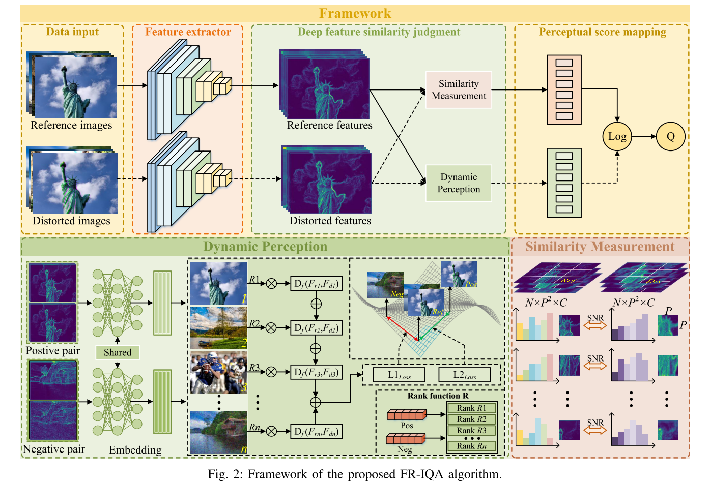
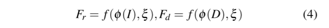
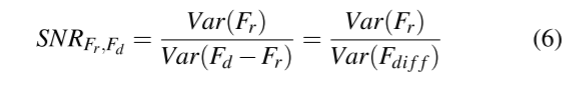
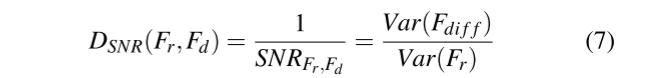
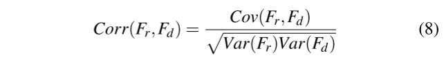
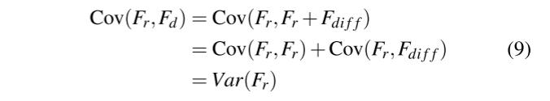
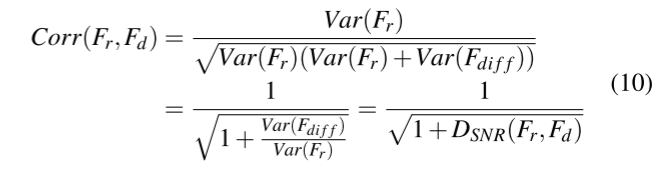
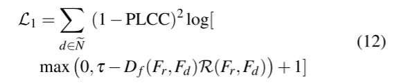
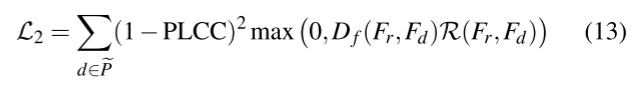
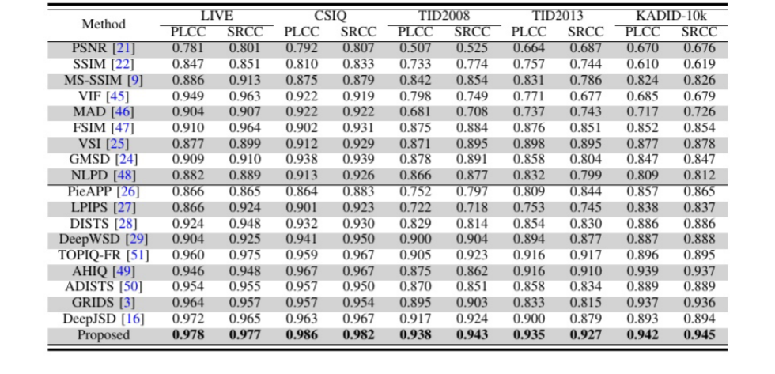

# 图像质量评估:通过信噪比距离在深度特征空间中的动态感知

## 研究背景
本文提出了一种融合深度特征空间动态感知分析的全参考图像质量评估框架(FR-IQA)。传统的基于深度学习的FR-IQA模型通常依赖于静态相似性指标，这无法完全捕捉人类在不同失真类型下的视觉感知。为了解决这个问题，我们引入了一个**信噪比(SNR)距离度量**，该度量通过分析从预训练的神经网络中提取的深度特征来测量感知差异。动态感知适应模块采用基于秩的度量学习策略，使模型能够自适应地调整感知距离，确保更准确地与人类的主观评估保持一致。这种动态调整过程对于有效处理各种类型的扭曲至关重要，使模型能够对感知退化表现出细粒度的敏感性。

## 研究方法
我们提出了一种用于深度特征空间质量评估的新型感知度量。与传统方法不同，我们的方法依赖于欧几里得距离或其他静态度量，我们的方法使用信噪比(SNR)分布度量进行精确的感知质量比较。该方法通过比较从预训练网络中提取的深度特征，有效捕获与HVS一致的退化模式。值得注意的是，尽管使用了预训练模型，但该指标始终与人类主观质量评级保持一致，证明了其在预测感知质量方面的鲁棒性。

总体框架如下：

该框架主要由相似性度量和动态感知映射两部分组成。旨在有效捕获深层特征空间中参考图像和失真图像之间的感知差异，同时通过学习的感知空间自适应地将感知距离与人类视觉分数对齐。使用预训练的骨干网络从参考图像和扭曲图像中提取分层深度特征。

在浅层中，深层特征之间的直接比较，允许模型感知局部细节退化;在更深的层中，特征图的空间分辨率较低，但语义更丰富，直接感知距离计算可能导致对语义噪声的过度敏感。因此将基于距离的相似性度量与动态感知适应相结合，以实现更准确的质量评估。

本文采用的是基于信噪比的相似性度量，在纹理丰富的区域，参考特征的方差较大，**相同水平的噪声产生较低的信噪比距离**。因此，信噪比度量有效地模拟了人类视觉系统的视觉掩蔽效应。**信噪比距离与特征相关性呈单调反比关系，信噪比距离越小，特征相似性越大**，这与高相似性意味着高视觉质量的直观概念一致。   

除了静态比较，该框架还包含一个动态感知模块，以根据主观质量判断调整相似性度量。这是通过一种基于等级的度量学习策略来实现的，该策略学习潜在度量空间中的特征分布。正负图像对根据它们的MOSs进行选择，并相应地将它们的距离推近或推远。动态感知模块由轻量级的全连接层组成，这些层将深层特征嵌入到一个感知上有意义的潜在空间中。使得模型能够学习失真感知的相似性表示，同时保持较低的计算复杂性。

### 基于距离的信噪比相似度模块
给定参考图像I和失真图像D，提取深度特征分别表示为$\phi(I)$和$\phi(D)$,进一步，在度量空间中学习到的深度特征的感知向量表示可以表示为:

ξ表示学习到的参数，f表示度量学习函数。我们将不受失真影响的感知参考特征Fr表示为信号，将受失真污染的感知失真特征Fd表示为噪声信号。Fd中的噪声可以表述为:
$$F_{diff}=F_d-F_r$$

**信噪比通常定义为信号方差与噪声方差之比**。因此，我们将参考特征Fr和失真特征Fd的信噪比定义如下:

在信息论中，方差是量化信息内容的关键指标。具体来说，信号方差反映了图像中的有用信息，而噪声方差则量化了无关信息。在FR-IQA的背景下，信噪比距离成为评估图像质量的关键工具，其中SNRFr,Fd表示深度特征对之间的信噪比。**增加的SNRFr,Fd表示相对于噪声有用信息的比例更大，这表明比较的特征与参考特征更相似。这对应于更低的失真和更高的感知图像质量。** 相反，减小的SNRFr,Fd意味着更大的噪声存在，放大了特征对之间的不相似性，并表明图像质量下降。
这里提出的信噪比是越大特征越相似，而在传统的距离度量中，更相似的特征对应该表现出更小的感知距离，因此为保持一致，基于信噪比的距离定义如下:

进一步分析，基于信噪比的距离与配对特征之间相关系数的关系，具体来说，在分析图像特征时，我们假设参考特征Fr的均值为零，并且噪声Fdiff在统计上独立于参考特征。在这些假设下，参考特征与失真特征之间的相关系数Corr(·，·)可以根据统计理论精确推导如下:

其中Cov(·，·)为协方差。由于Fr和Fdiff相互独立，故协方差计算
如下:

再次化简最终得到：

由上可知，参考图像与失真图像的深度特征之间的相关系数是其SNR距离的单调递减函数。**SNR距离的增加会降低特征对之间的相关性，而减少则会增强特征对之间的相关性。** 这一特性表明，在FR-IQA环境下，SNR距离可以有效地捕捉到原始图像与失真图像之间的特征差异。与传统的距离度量相比，它对与主观质量感知一致的细微变化更敏感，从而提高模型在复杂畸变情况下的精度和鲁棒性。而且，这一特性为动态感知模块提供了合适的距离度量。与其他度量不同，基于信噪比的动态感知模块可以联合学习特征的语义相似度和统计相关性。
### 动态感知模块
为了学习广义和判别的深度特征相似性，我们的动态感知模块的核心思想是利用转换后的度量空间中深度特征之间的信噪比距离，以及它们与MOS的等级相关性。为了实现这一目
标，我们首先从给定的minibatch中选择高质量的正对Pe和低质量的负对Ne，然后将选中的图像输入到模型中。为了确保特征相似度的可判别性，我们强制正集Pe中的图像对彼此保持接近，而负集Ne中图像对之间基于信噪比的距离被推开。因此，在变换后的度量空间中，高质量图像对之间的距离被减小，而低质量图像对之间的距离被增大。为了进一步增强度量空间捕捉感知差异的能力，我们引入了一个MOS排序函数R，它将等级信息集成到度量引导的学习过程中，定义如下:
$$R(y_r,y_d)=exp^{\frac{-(y_d-y_r)^2}{H^2}}$$
其中yd表示失真图像的MOS分数，yr表示参考图像的分数，参考图像在数据集中被赋予最高的理想值。变量H定义为最大和最小MOS值之差。

为了提高模型对感知差异的敏感性，我们引入了一个独立的正则化项，记为L1，它对深层特征空间施加了感知约束。该方法不仅考虑了特征距离和主观质量的差异，而且考虑了预测图像质量与主观得分之间的线性相关性，用皮尔逊相关系数(PLCC)衡量，并将其纳入优化目标。由于FRIQA数据集的评分标准不是统一的,而且评分的分布在不同的数据集之间差异很大,我们的目标是使该模型能够动态地感知和适应质量评分的分布，以区分不同程度的失真，而不是准确地预测每个失真图像的绝对分数。因此，在L1中引入PLCC的目的是为了增强模型的感知能力，同时提高其稳定性。具体地，L1被定义为

其中参数τ作为阈值来调整模型对动态感知距离的敏感性，而Df(·)表示要学习的动态感知度量空间。

同样，为了进一步优化模型的感知辨别能力，我们引入了第二个正则化项，表示为L2，旨在增强模型将感知上相似的高质量图像对在特征空间中更紧密地结合在一起的能力。L1通过学习负样本的判别表示来增强模型感知图像差异的能力，而L2旨在通过学习正样本的相似表示来提高模型感知图像相似性的能力。L2的公式可以表示为:

L1和L2不盲目动态调整感知距离;R用于调节模型在塑造特征空间时应优先考虑的感知差异程度。通过影响正则化的强度，R有助于在保持感知可分离性和学习深度特征表示中有意义的相似性和差异性之间取得平衡。对于高质量的图像对，图像质量越接近参考图像，其MOS分数越高，相应的R值也越大。在这种情况下，鼓励模型更积极地减少高质量对之间的感知距离，从而促进对细微质量差异的更大灵敏度。相反，当一幅图像保持在高质量范围内，但不如其他高质量图像时，R值就会变得相对较小。在这种情况下，模型更侧重于区分高质量和中等质量的图像，采用了更宽松的约束。这种自适应机制同样适用于低质量图像对，允许模型在相对质量排名的基础上灵活调整其对感知距离的敏感性，从而更好地将学习到的特征空间与人类的感知判断对齐。
## 实验
在训练过程中，除了动态感知网络的参数外，所有参数都被冻结，通过最小化损失函数L，对动态感知网络进行端到端优化，L的定义如下:
$$L=\lambda L_1+L_2$$
在实验中，我们经验地将λ设为0.5。在实验中，我们经验地将λ设为0.5。我们的优化策略采用Adam优化器，学习率设置为0.0001，权重衰减率设置为0。最大epoch数设置为100。对于以MOS为评分类型的数据集，我们将前20%的图像对包括在负集Ne中，将后20%的图像对包括在正集Pe中。对于以DMOS为评分类型的数据集，我们的选择策略正好相反。在L1中，τ设为200，影响图像对之间的感知差距。对于用于深度特征比较的patch大小，我们在前四层将其设置为40，以捕获纹理和边缘等详细的噪声信息。在最后两层，我们将其设置为8，以便为动态感知网络提供更精细的语义信息。在灵敏度参数分析中，我们深入分析了τ和patch大小对实验结果的影响。为了验证所提出方法的有效性，本研究通过五个广泛采用的IQA数据集进行了评估:LIVE、CSIQ[、TID2008、TID2013和KADID-10k。这些数据集包含了各种各样的失真类型和不同数量的参考图像。

为了全面评估我们的模型的性能，我们与几种最先进的FR-IQA方法进行了基准比较，包括PSNR、SSIM、MS-SSIM、VIF、MAD、FSIM、VSI、GMSD、NLPD、LPIPS、DISTS、DeepWSD、AHIQ、ADISTS、GRIDS、DeepJSD和TOPIQ。在整个数据集的一致设置下，通过其公开可用的实现对所有基线模型进行评估。对于绩效评估，我们采用PLCC和Spearman秩序相关系数(SRCC)来衡量预测分数与主观质量评分之间的相关性。特征
提取通过在ImageNet数据集上预训练的VGG网络进行。整个训练和测试过程在PyTorch中实现，并在配备NVIDIA GTX 4090GPU的系统上执行。
## 总结
本文介绍了一个动态和感知对齐的全参考FR-IQA模型，该模型解决了传统的基于静态度量的方法的局限性。通过在深度特征空间中提出信噪比距离并将其与基于秩的度量学习框架集成，该模型实现了与人类感知一致的上下文敏感相似度测量。由双正则化策略支持的动态感知模块，实现了高质量和低质量图像之间的细粒度区分。跨多个数据集的广泛评估表明，该模型在域内和跨域的强大性能始终超过最先进的FR-IQA方法。除了质量评估之外，我们的模型在图像恢复任务(如增强、去噪和运动去模糊)中被证明是有效的，在这些任务中，它指导了具有强感知相关性的优化。消融研究进一步验证了每个组件的贡献，特别是自适应度量学习在增强感知准确性方面的作用。

## 笔记
### 图像浅层特征
1.浅层特征：浅层网络提取的特征和输入比较近，包含更多的像素点的信息，一些细粒度的信息是图像的一些颜色、纹理、边缘、棱角信息。   

2.原理：浅层网络感受野较小，感受野重叠区域也较小，所以保证网络捕获更多细节。

3.优缺点：分辨率更高，包含更多位置、细节信息，但是由于经过的卷积更少，其语义性更低，噪声更多。

### 图像深层特征
1.高层信息：深层网络提取的特征离输出较近，一些粗粒度的信息，包含是更抽象的信息，即语义信息

2.原理：感受野增加，感受野之间重叠区域增加，图像信息进行压缩，获取的是图像整体性的一些信息

3.优缺点：具有更强的语义信息，但是分辨率很低，对细节的感知能力较差。

