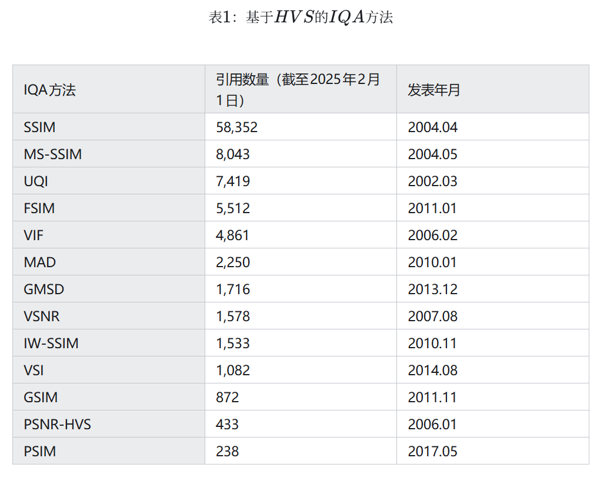
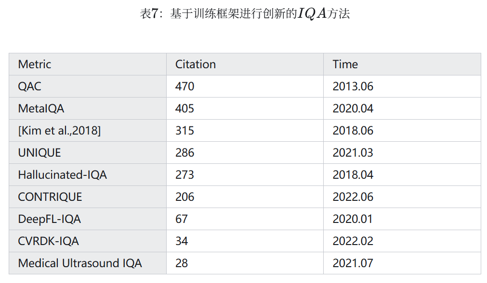

# 图像质量评价（IQA）
图像质量评价（Image Quality Assessment, IQA）是图像处理、计算机视觉和多媒体通信等领域的关键技术之一。IQA不仅被用于学术研究，更在影像相关行业内实现了完整的商业化应用，涉及影视、智能手机、专业相机、安防监控、工业质检、医疗影像等。IQA与图像如影随形，其重要程度可见一斑。

但随着算法侧的能力不断突破，AIGC技术发展火热，早期的IQA或已无法准确评估新技术的能力。另一方面，千行百业中各类应用对图像质量的需求也存在差异和变化，旧标准也面临着适应性不足的挑战。

**该IQA目录主要是跟随研究生导师研究方向，学习一些IQA知识，记录一些IQA论文中的方法和思路**

这部分内容重点参考了最新的综述文章《A Survey on Image Quality Assessment: Insights, Analysis, and Future Outlook》。文章总结得非常到位，给出了细致的分类和发展时间图。

# 主流的IQA方法

**主观评估（Subjective IQA）**：依赖人类观察者打分，结果符合人眼感知，但成本高、效率低，无法大规模应用。   
**客观评估（Objective IQA, OIQA）**：通过数学公式或AI模型自动评分，分为三类：    
* 全参考（Full-Reference IQA）：需参考图像（reference image）对比；   
* 半参考（Reduce-Reference IQA）：需要部分参考图像中的信息；   
* 无参考（No-Reference IQA）：直接评估单张图像质量，因为无需参考图像，因此也叫盲图像质量检测（Blind IQA，BIQA）。

客观评估中的参考图像应该如何理解呢？
* 图像在采集、传输、处理和存储过程中，可能会被噪声污染，出现失真现象。如果将对失真图像的IQA视作给一张试卷打分的过程，那么参考图像就是一张满分答卷，作为参考答案，帮助我们给试卷打分。

# 通用场景方法
许多IQA方法并不与特定的使用场景绑定，我们称这类方法为通用场景方法。

## 统计方法
### 基于人类视觉系统（Human Visual System，HVS）的方法
IQA方法中，最基本的方法有均方误差（Mean Squared Error，MSE）、信噪比（signal-to-noise ratio，SNR）、峰值信噪比（peak signal-to-noise ratio，PSNR）和universal image quality index（UQI）等。我们以均方误差为例，来看看这些基本的方法：

$$MSE=\frac{1}{n}\sum_1^n(y-\hat y)^2$$

关于此处所用的符号：假设参考图像和失真图像的像素数为n，image中像素值为y。则MSE表示两张图像之间的差距。两张图像间的差距越小，MSE就越小；差距越大，MSE就越大。因而可以使用MSE来衡量图像的质量。

这些方法虽然能根据统计特征评估图像噪声和保真度，但却只是从像素值的统计特征出发，并没有考虑 HVS 的特性，和人类的感知有较大差异。为了能够与HVS对齐，一些改进方法应运而生，**比如视觉信噪比（VSNR）、基于 HVS 的 PSNR（PSNR-HVS）** 等，将 HVS 的因素考虑了进去。又比如**Visual Saliency-induced Index（VSI）** 提出了这样一个观点：每个像素所蕴含的信息决定了该像素的重要性，我们不应该平等地关注每个pixel，而是关注隐藏在像素之后的图像结构与色彩信息，这些比每个像素值的大小更重要。从这一思想出发，Visual Information Fidelity（VIF）将图像质量与图像信息联系起来，通过信息论的框架来衡量失真对图像质量的影响。

在与HVS对齐的过程中，人们发现了许多HVS的特点，并将其用于设计IQA算法：

Gradient Magnitude Similarity Deviation（GMSD）观察到HVS对图像中形状的边缘很敏锐，而gradient magnitude（GM）可以用于表示边缘，所以用gradient magnitude预测质量。对边缘的运用不止于此：perceptual similarity（PSIM）先构造出图像的GM图，然后通过GM图之间宏观和微观的相似度来衡量图像质量；gradient similarity（GSIM），feature similarity（FSIM）同样使用了边缘来评价图像。

2002年，Why is image quality assessment so difficult?一文提出，HVS的主要功能是从视野内提取图像的结构信息。沿着此观点的思路，经久不衰的IQA方法SSIM出现了，其正是通过图像中的结构信息来评估图像。为了使SSIM应用更广泛、效果更好，MS-SSIM，IW-SSIM等SSIM的变体工作陆续被提出。

需要注意的是，HVS在处理不同质量的图像时，会使用不同的策略：处理高质量图像时，图像的结构大致清晰，所以HVS更关注像素间的细微差异，此时可以使用MSE，PSNR等方法；而在处理质量较差的图像时，图像的轮廓都十分模糊，遑论细微的差别，此时HVS更关心图像基本的结构信息是否还能保留。从这一点出发，Most Apparent Distortion（MAD）在处理图像时同时考虑两种策略，并根据图像质量决定两种策略所提供分数的权重。

### 基于域变换的方法
在评价图像质量时，许多基于域变换的方法可以派上用场，例如奇异值分解（SVD）、离散余弦变换（DCT）等，这些变换方法可以将图像从A域变换到B域内，许多在A域内不明显的特征，在B域内会变得易于识别和处理。这部分的代表工作有：

[Shnayderman et al., 2006](https://ieeexplore.ieee.org/document/1576815)使用SVD提取特征，从全局和局部两个尺度进行IQA；SFF，QASD等使用稀疏表示方法提取特征；[Wang and Simoncelli, 2005](https://ece.uwaterloo.ca/~z70wang/publications/JSTSP09.pdf)使用小波变换，巧妙利用小波系数随着图像失真发生的变化进行评估；BLIINDS-II利用图像在经过离散余弦变换后，图像的统计特征随图像失真变化的特性进行IQA。

### 基于自然场景统计的方法
除了可以使用人类视觉系统的观察图像的习惯，和图像在变换域中的特征之外，自然图像本身的一些特点也可以用于IQA。例如IFC通过分析自然图像的统计特性，可以判断图像是否失真，同时评估失真的程度；[Gabarda and Cristobal, 2007](https://www.researchgate.net/publication/5788132_Blind_image_quality_assessment_through_anisotropy)则利用了图像的各向异性，这种性质是指图像的内部结构决定了其在不同方向上会有不同的视觉效果，通过图像在不同方向上的信息含量差异进行IQA，从而达到与人类视觉偏好的高度一致。

自然图像的亮度范围也是一个值得关注的地方：高动态范围（high dynamic range，HDR）的图像是指那些最低亮度和最高亮度之间跨度非常大的图像，当这些图像在标准显示器上呈现时需要面临一个问题：标准显示器亮度范围较低。为了在标准设备上显示HDR图像，需要使用色调映射（Tone Mapping）算法将HDR图像转换为低动态范围（low dynamic range，LDR）图像，不同的色调映射算法会产生不同的结果。传统的FR-IQA方法通常只能处理动态范围相近的图像，当参考图像和失真图像的动态范围差别较大时，传统方法的效果就会变差。而DRIM通过引入HDR-VDP模型来预测对比度的可见性，从而能够有效处理参考图像与失真图像动态范围差异较大的问题，显著扩展了IQA的应用范围；基于SSIM和图像自然特性的TMQI方法同样达到了此效果。

## 机器学习方法

机器学习方法比起统计方法，可以更好地处理图像特征，因此迅速成为IQA研究领域的主流话题。我们在此将其分为基于模型的方法和基于框架的方法，前者指在模型架构方面有所创新的工作，后者指开创性地使用某种训练框架进行IQA的工作。

### 基于模型的方法
随着时间推移，机器学习方法中最受关注的话题一直发生着变化，从传统的经典机器学习模型，到黑盒卷积神经网络，再到力大砖飞的Transformer架构，机器学习领域的不同热点方法也催生了不同的IQA技术。我们将这三类基于机器学习的IQA方法总结如下：

### 传统机器学习方法
随着机器学习技术的发展，许多机器学习方法被用于IQA，例如支持向量回归（Support Vector Regression，SVR）方法可以将图像的特征回归到具体的分数或质量等级，从而进行IQA。使用SVR技术时，还可以像MMF, ParaBoost方法一样，考虑到针对不同类型的失真，不同的IQA方法各有优劣，所以首先获取多个质量指标，随后采用SVR来整合多个质量指标的得分。

同时，许多基于自然场景统计（Natural Scene Statistics，NSS）的机器学习方法被提出：例如DIIVINE算法首先提取自然场景特征，随后使用SVR来实现失真识别和质量评估；IL-NIQE使用从图像中提取的NSS特征学习一个多变量高斯模型，并将其用于IQA；BRISQUE则在进行NSS特征提取、失真类型分析与质量评估时，以多尺度的方式处理图像，以更好地捕捉局部和全局特征，同时还以极低的时间复杂度完成了实现。本节方法汇总在表4中。

### 基于卷积神经网络的方法
随着卷积神经网络（Convolutional Neural Network，CNN）所受的关注增加，从2014年使用CNN评估图像质量的IQA-CNN被提出后，越来越多人使用CNN来进行IQA。同时[Richard Zhang的工作](https://zhuanlan.zhihu.com/p/25680975953#ref_4)通过实验说明了使用神经网络提取的深度特征进行IQA，其效果远超其他方法。这一阶段值得关注的方法如下：

BIECON将一张图像分成不同的patch，每个patch对应图像中的一小块，不同patch的特征组成整张图像的特征，随后该特征被用来计算图像的分数。这种处理手段被广泛使用，启发了后来人的工作。值得关注的工作还有很多，[Bosse and et al., 2017](https://zhuanlan.zhihu.com/p/25680975953#ref_5)使用Siamese网络提取特征，提出一种纯粹数据驱动的方法；MEON实现了从图像到质量评估的端到端框架；RankIQA同样使用了siamese网络，同时关注到在一组数据集中，图像的相对排名比绝对分数更具有参考价值。

有一个HVS的特点很值得关注：人类通常使用自上而下的top-down视觉模型来处理视觉任务。这是指在进行下游任务IQA之前，应该先对图像内容进行理解。其原因在于：对于不同内容的图片，人们有着不同的评价方式；不同的全局特征中，哪些更值得重视，要在了解了图像内容后才知道。所以[Su et al., 2020](https://zhuanlan.zhihu.com/p/25680975953#ref_6)在抽取出图像的语义之后，构建了一个参数可随着语义而变的自适应的超网络，随后用该网络进行IQA。

IQA算法需要综合考虑全局与局部的失真情况，以此评估图像质量。[Varga, 2020](https://zhuanlan.zhihu.com/p/25680975953#ref_7)方法巧妙利用了卷积神经网络中Inception模块包含多种大小的卷积核，从而可以并行处理不同尺度视觉信息的特点。这种多尺度并行处理的思想十分有用——因为IQA算法需要同步考虑全局图像结构、局部纹理信息。自从2020年对抗生成网络（Generative Adversarial Networks，GAN）被广泛用于生成图像以来，许多GAN生成的图像通常具有明显的突兀的边缘、各种纹理噪声。这些噪声很容易被人眼感知，但对于传统的评估指标来说，却难以准确衡量，而并行考虑全局与局部特征的策略则可以解决此问题。这是因为大尺度的网络可以处理全局信息，从而覆盖纹理噪声；而小尺度的网络可以处理局部信息，从而捕捉图形的边缘。在IQA领域的知名竞赛NTIRE 2021 IQA中，公共排行榜上的冠军作品IQMA Network通过这一思想，提出一个双分支、多尺度的IQA网络。网络中的两个分支分别提取了参考图像和失真图像的多尺度特征，随后两分支中相同尺度的特征被送入各个尺度对应的特征融合模块，用于最终的质量评估。Re-IQA同样关注了这一点，其使用双编码器的混合专家结构，分别学习图像的全局和局部特征，值得注意的是，其中全局内容的编码创新地用到了对比学习。

在处理纹理信息时，大多基于CNN的FR-IQA方法对图像的纹理相似性过于敏感，这实际上是没有必要的，在一张草地的图像上，某个patch中的几根草向左还是向右偏根本无足轻重。DISTS作为第一个在纹理特征提取过程中对这些不重要的细节进行忽视的工作，基于VGG提取了纹理特征，将结构特征和纹理特征很好地结合了起来。本节工作总结在表5中。

### 基于transformer的方法
Transformer的问世开启了人工智能领域的新时代，也给IQA注入了新的动力，在使用CNN进行图像质量评估时，往往需要固定输入图片的尺寸，无法处理不同分辨率的图像。因此在处理实际图像时，要对初始图像进行缩放，这会导致原始信息丢失。而TRIQ使用可以处理不同分辨率图像的Transformer框架，因此用于评估图像质量非常有效，同时Transformer架构的多头注意力机制可以比CNN更好地关注全局特征；MUSIQ对这一点进行了深入研究，提出了一种全新的、基于哈希的2维空间嵌入方法，构成一种可以处理多尺度patch的方法。该方法在处理不同大小和纵横比的图片时，无需对其进行裁剪、强行调整大小，如此一来也就不会导致原始信息丢失。从而在对图像分辨率和纵横比较为敏感的图像进行IQA时，起到极佳效果。

当基于Transformer架构的Vision Transformer（ViT）架构出现后，许多基于ViT的方法取得了良好的效果：比如IQT方法使用Siamese架构提取了参考图像和失真图像的特征，并使用ViT评估质量。[Golestaneh et al., 2022](https://zhuanlan.zhihu.com/p/25680975953#ref_8)则在使用ViT的过程中引入两种新的loss，第一个loss：相对排序loss指出图像质量对应的相对分数比绝对分数更重要，更好地利用了相对排序的信息；后一个loss：自一致性loss则处理了这一问题：当我们想对图像进行水平翻转之类的等变变换时，NR-IQA模型的表现总是会变差。而Maniqa从ViT中提取特征，后送入Transposed Attention Block（TAB）和the Scale Swin Transformer Block（SSTB）。这两个模块分别跨通道和跨空间地使用了注意力机制，从而很好地对特征进行分析。

关注到IQA方向的专业赛事NTIRE 2021 Challenge on Perceptual IQA中，许多参赛队伍使用了Transformer框架，其中冠军队伍LIPT team首次将Transformer用于FR-IQA；次年的NTIRE 2022 Challenge on Perceptual IQA中，FR-IQA和NR-IQA两个赛道的冠军队伍都使用了**ViT框架**。这说明基于ViT的IQA方法效果受到了公众的肯定。本节的方法总结在表6中。

### 基于框架的方法
除了模型结构的创新之外，机器学习中许多工作有着基于训练框架的创新，这些工作试图解决IQA领域一些至关重要的问题，所以同样值得关注。

神经网络需要大量数据来训练，但许多细分领域的IQA任务面临着数据不足的困难。为了解决这一困难，**Medical Ultrasound IQA**使用了迁移学习，将其他领域数据集中的知识作为Medical Ultrasound IQA的基础，提高了模型的效果；MetalQA为了获得处理未知失真类型图像的能力，收集了大量不同失真类型的数据，通过元学习的方法，学习到了人类在评估不同失真类型图片质量时的元知识, 这些知识可以用于评估未知失真类型的图片，最后将包含许多元知识的模型进行微调之后进行IQA，从而可以处理那些数据不足的细分领域IQA任务；UNIQUE是一个具有跨失真类型泛化能力的BIQA模型，并且提出一种可以同时在多个IQA数据库上训练的方法，从而可以使得模型在一种失真数据上训练时，使用其他失真类型数据中的知识；DeepFL-IQA提出了一种基于弱监督学习的方法，在训练过程中使用大量的客观IQA指标打出的分数作为参考，再使用主观质量分数作为参考进行微调，以获得预测出符合HVS分数的能力，同时解决数据不足的问题；CONTRIQUE则从自监督学习的角度出发，使用自监督学习的训练方式从无标签数据中学习；与CONTRIQUE类似的，QAC也不需要人类的打分即可完成IQA；Hallucinated-IQA则使用了对抗学习以完成NR-IQA工作。这些方法都对数据不足的困难给出了自己的解决方案。

NR-IQA的研究存在一个致命的问题：使用CNN进行NR-IQA时，数据集的形式为一张图片对应一个分数。但CNN在处理图像时是逐像素处理的，却并不知道每个像素对应着的分数是多少——因为这个分数实际上并不存在。而在FR-IQA中，每个像素在参考图像都有着对应的像素作为参考。因此我们应该想办法将FR-IQA中学到的知识用于NR-IQA中，以实现让每个pixel都有所参考。[Kim et al., 2018](https://zhuanlan.zhihu.com/p/25680975953#ref_9)提出了一个两阶段训练框架，第一阶段通过比较参考图像和失真图像，使用CNN预测一个误差图，将这个误差图作为训练目标。这样可以增加训练数据集的标签数量，从而避免过拟合问题，随后在第二阶段，进一步训练模型以预测人类主观评分，从而将FR-IQA的知识用于NR-IQA；CVRDK-IQA通过知识蒸馏也做到了这一点：使用未对齐的参考（non-aligned reference，NAR）图像引入多种高质量图像的先验分布，此处的未对齐是指一对图像中，高质量的参考图像和低质量的失真图像并不匹配——参考图像并不是失真图像的高质量版本。因为高质量和低质量图像之间的分布差异比较有助于模型更好地评估图像质量，所以知识蒸馏将高低质量分布之间的差异在一对师生模型之间转换，从FR-teacher迁移到了NAR-student，从而让NAR student模型在评估图像质量时，知道高质量的图像应该是怎样的，这样也就解决了本段之初提出的问题。本节提到的方法总结在表7中。

# 专用场景方法
除了上述用于通用场景的IQA方法之外，还有许多IQA方法是针对特定应用场景的，这些方法为了满足特定场景的需求，做了特殊考虑，下面我们对其中的一些进行介绍。

## 医学场景下的IQA
在大脑成像的研究中，数据质量是一个重要的因素，尤其在脑发育研究中，脑的年龄与数据质量直接相关。[Rosen et al., 2018](https://zhuanlan.zhihu.com/p/25680975953#ref_10)研究评估了多种定量的图像质量指标，其中包括FreeSurfer提供的指标Euler number。在多种指标中，Euler number表现最好。原因在于许多指标（如信噪比）评估的是图像的全局特性，而Euler数评估的是局部的拓扑结构。局部的运动伪影或重建错误可能对全局指标的影响较小，但对Euler数的影响较大。例如，一个局部的运动伪影可能导致皮层表面出现孔洞或断裂，从而显著影响Euler数，但对信噪比的影响却并不明显。这表明在医学应用中，选择合适的质量评估指标，需要根据具体的研究需求和数据特点来决定。

## 去雾算法（Dehazing Algorithm，DHA）中的IQA
DHAs是一类用于改善在雾霾等恶劣天气条件下拍摄的图像质量的算法。这些算法的目标是去除图像中的雾气，恢复图像的清晰度、对比度和色彩，从而提高图像的视觉质量和可用性。这些算法的性能需要IQA技术来验证：能够在IQA算法评价下得到好的分数，才能说明该DHA算法是一个好算法。但现有的FR IQA方法不适用于DHA性能的评估，主要是因为去雾过程不仅仅是图像恢复，还涉及到对比度增强、色彩调整和结构恢复等多个方面，而普通的FR IQA方法根本没有考虑到这些特性，这些特性使得传统的FR IQA方法在评估去雾效果时存在局限性。

[Min et al., 2019](https://zhuanlan.zhihu.com/p/25680975953#ref_11)提出的去雾算法评估方法通过综合考虑图像恢复、色彩调整和对比度增强，更全面地评估去雾算法的效果。该方法不仅适应了去雾过程中的对比度增强和色彩调整，还通过针对航拍图像的改进，提高了评估方法的适用性和准确性。

## 人像质量评估
随着智能手机的普及，人像摄影变得普遍，但如何评估这种图像的质量是一个很大的挑战。在人像中，面部区域通常是视觉焦点，其质量对整体人像质量的影响远大于其他区域。传统IQA方法通常对整幅图像进行全局评估，难以捕捉到面部区域的重要性。同时，人像质量不仅取决于面部区域的质量，还与背景、构图等全局因素密切相关。传统IQA方法往往难以同时兼顾局部和全局的质量评估。因此需要提出专门的人像质量评估方法。

在[Chahine et al., 2024](https://zhuanlan.zhihu.com/p/25680975953#ref_12)NTIRE 2024 Challenge的人像质量评估赛道中，参赛队伍纷纷提出了自己的方法，例如PQE提出了一个两分支人像质量评估模型，分别对背景和面部组件进行建模，并提取两种特征用于评估图像质量；SAR提出了一种场景自适应的全局和面部感知网络，通过面部检测器精确定位面部区域，并使用ViT对面部区域和全局图像进行建模。这些方法对面部和背景分别进行处理，针对性地给出了IQA方案，很好地满足了该领域的需求。

## 特定失真场景下的IQA
图像去模糊（Image Deblurring）是计算机视觉和图像处理领域的一个重要任务，旨在从模糊图像中恢复出清晰的图像内容。模糊可能由多种因素引起，如相机抖动、物体运动或焦点不准确等。图像去模糊的目标是通过算法消除这些模糊，恢复出原始的清晰图像。虽然去模糊算法的目标是恢复出清晰的图像，但实际中很难恢复出理想的清晰图像，这是因为去模糊算法可能引入各种伪影，这些伪影对图像的质量有显著影响。例如，振铃伪影（在图形边缘附近出现的波纹状结构）是去模糊算法中最常见的伪影之一，它对人类视觉系统的干扰非常大。

不同的去模糊算法可能产生不同类型的伪影，这些伪影的特征各不相同。因此，需要一种能够专门针对这些伪影进行评估的方法。[Liu et al., 2013](https://zhuanlan.zhihu.com/p/25680975953#ref_13)设计了一系列专门针对去模糊伪影的特征，包括提出了一种新的无参考方法来检测大规模振铃伪影、使用多种方法来评估去模糊结果中的噪声水平、使用多种锐度度量方法来评估去模糊结果的清晰度。这些特征能够全面评估去模糊结果的质量，而不仅仅是单一类型的伪影。

模糊还会导致图像的高频分量发生衰减，进而使得Tchebichef moment大小随之改变。而BIBLE通过计算梯度去除了低频分量，使高频分量成为主导，从而更有效表示模糊；进而采用梯度图像计算Tchebichef moment，然后用Tchebichef moment评估图像的模糊情况。

针对某种特定图像退化相关因素的IQA技术还有很多，例如[Ferzli and Karam, 2009](https://zhuanlan.zhihu.com/p/25680975953#ref_14)基于Just Noticeable Blur(JNB)将HVS的感知特性直接融入到清晰度指标中，使得对清晰度的度量结果更接近人类的主观感受。又比如在JPEG压缩过程中，块效应（Blocking Effect）和模糊效应（Blurring Effect）是需要重点解决的问题，[Gore and Gupta, 2015](https://zhuanlan.zhihu.com/p/25680975953#ref_15) 针对这两种图像退化提出了评估JPEG压缩图像质量的方法，有效捕捉了这些失真情况，起到了比通用IQA方法更好的效果。专用场景下的IQA方法总结在表8中。

# NTIRE IQA赛道介绍

## NTIRE 2024 Quality Assessment of AI-Generated Content Challenge
NTIRE 2024 质量评估生成内容挑战赛，旨在推动针对人工智能生成图像（AI-Generated Images, AIGIs）和视频（AI-Generated Videos, AIGVs）的图像质量评估和视频质量评估方法的发展。挑战赛分为图像赛道和视频赛道，分别使用 **AIGIQA-20K** 和 **T2VQA-DB** 数据集，包含由多种流行生成模型产生的大量 AI 生成图像和视频，并邀请了多个人员进行主观质量评分（MOSs）。

其中IQA赛道使用了 **AIGIQA-20K 数据集**，包含 20,000 张由 15 种 T2I 模型生成的图像。    
同样采用了**SRCC**和**PLCC**作为打分依据。IQA赛道的baseline model为StairIQA，DBCNN和LIQE。

在图像赛道，9 支团队主分数超过 0.9，4 支团队超过 0.91，主观一致性总分相比前几年的方案有较大提升。最大的区别在于引入了多模态技术，将文本与图像特征深度结合，提升语义理解能力，还采用了模型集成技术和预训练大模型，最终提高了模型效果和泛化能力。可以看到MOS散点图的一致性也进一步提升了。

## NTIRE 2025 challenge on Text to Image Generation Model Quality Assessment
随着生成模型的快速发展，先进的 T2I 模型能够生成令人印象深刻的图像，但这些图像在与文本对齐和结构真实性方面仍面临挑战。目前常用的生成图像质量评估基准和方法主要关注使用MOS进行标注和预测图像质量，但难以精准定位文本中未在生成图像中反映的元素以及图像中结构失真的具体位置。因此，NTIRE 2025 T2I 生成模型质量评估挑战旨在推动生成图像质量预测方法的发展，实现对生成图像质量的细粒度评估，以指导生成模型性能的提升。

挑战分为对齐赛道和结构赛道，

* 对齐赛道（alignment track）：使用包含约 40,000 个 AI 生成图像（AIGIs）的 EvalMuse-40K 数据集，这些图像由 20 种流行的生成模型创建，旨在评估文本 - 图像对齐情况；
* 结构赛道（structure track）：使用包含 10,000 个 AI 生成图像及其对应结构失真掩码的 EvalMuse-Structure 数据集，用于评估图像结构失真检测。      

**评估标准：** 两个赛道都使用SRCC和PLCC来评估模型预测的对齐分数和结构分数，SRCC 测量预测的单调性，PLCC 测量预测的准确性。在对齐赛道，还使用模型确定提示元素是否出现在生成图像中的准确率（ACC）来衡量模型的细粒度对齐评估能力；在结构赛道，使用模型预测的结构失真掩码与人工标注的结构失真掩码之间的 F1 分数来评估模型的细粒度结构评估能力。

方法上采用了多模态大语言模型，ViT，LoRA，集成学习等技术。

>小结:  
近几年的IQA比赛，以衡量图像生成质量为主，注重视觉感知质量评价。   
均采用了SRCC\PLCC等相关性参数来判断主客观一致性。   
技术演进路线CNN->ViT->大模型->多模态，与图像复原、增强和生成的技术发展基本一致。

# IQA未来发展趋势
至此，相信大家应该已然清楚，没有绝对通用的评价指标。其实，IQA更像是由各种指标组成的一张网，覆盖了大部分图像应用，并朝更受关注的方向“编织”延伸。在AI技术的加持下，视觉感知应用将会更加广泛，IQA也必然会有新的发展。

基于上述内容，本节梳理了以下几个可能的发展方向（仅供参考）：

* 无参考IQA的鲁棒性和细粒度提升  
如今AI生成图像、Al生成内容和用户生成内容越来越普遍，且现实中绝大部分图像数据都缺乏真实参考，因此NR-IQA必然是研究重点之一。当前迫切需要有针对各种感知失真类型（如生成伪影、错误语义、不协调特征等内容）而设计的NR-1QA模型，以有效鉴别各类低质量Generation Image.

* 多模态IQA探索
即利用多种模态信息（如视觉、文本、语音等）来联合评估图像内容质量。可通过结合图像和描述该图像的文本来综合评价图像的美学、视觉保真度或语义一致性等。（图片+文字描述，如“这张风景照是否具备丰富的真实纹理，且构图是否合理？“）  
其核心在于利用不同模态间的互补性，突破传统单模态评价的局限性，给IQA模型赋予更多信息。在真实场景中，图像常伴有文字描述，故多模态評价更符合实际应用需求，且具有更强的灵活性。

* 可解释性IQA研究
可解释性一直非常重要但也很欠缺，纯靠算法或模型给出单一指标并不具备足够的可信度。若IQA模型能够同时输出例如视觉量著性图、归因分析解释等多形式质量评分依据，可让评价结果更令人信服。

* 垂直领域定制IQA深化
不同行业需求多样化，对视觉质量的要求自然不尽相同。例如工业质检，追求高精度，主要关注微小细节的表征质量；医疗影像，追求真实性，主要关注伪影问题和清晰度是否足够：自动驾驶，追求鲁棒性，主要关注动态环境中的图像自适应能力；文娱媒体，追求美学与内容，主要关注构图、色调和语义一致性等艺术表征。

还有其他一些细分方向值得探索，如轻量化实时在线IQA等。

[原文链接](https://blog.csdn.net/PixelMind/article/details/148371087)