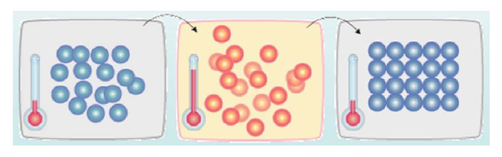
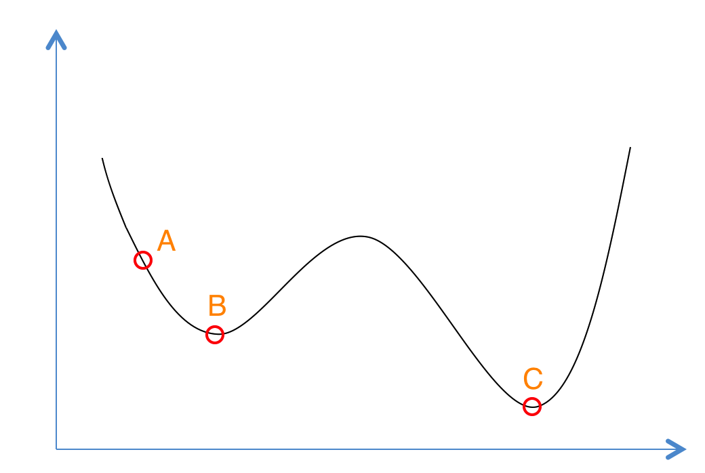
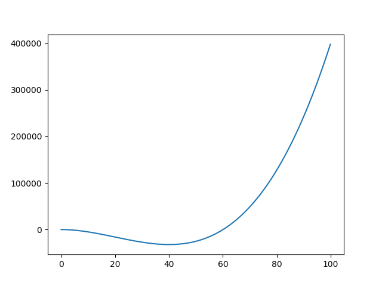

# 模拟退化算法(SimulatedAnnealing)
## 一、什么是模拟退火？
> 模拟退火算法是基于蒙特卡洛(Monte-Carlo)迭代求解策略的一种随机寻优算法,主要用于组合优化问题的求解。  

算法思想:从一个较高温度出发，不断降温，直到温度降低到满足热平衡条件为止。同时在每个温度下，进行n轮搜索，每轮搜索时对旧解添加随机扰动生成新解，并按一定规则接受新解。  

如下图所示，首先（左图）物体处于非晶体状态。我们将固体加温至充分高（中图），再让其徐徐冷却，也就退火（右图）。加温时，固体内部粒子随温升变为无序状，内能增大，而徐徐冷却时粒子渐趋有序，在每个温度都达到平衡态，最后在常温时达到基态，内能减为最小（此时物体以晶体形态呈现）。  


## 二、模拟退火  
如下图,我们有这样一个函数，想求函数的全局最优解。如果采用贪心(Greedy)策略，那么从A点开始试探，如果函数值继续减少，那么试探过程就会继续。而当到达点B时，显然我们的探求过程就结束了，此时无论朝那个方向，结果都会增大。最终我们只能得到局部最优解B。  
  
模拟退火其实也是一种Greedy算法，但是它的搜索过程引入了随机因素。模拟退火算法以一定的概率来接受一个比当前解要差的解，因此有可能会跳出这个局部的最优解，达到全局的最优解。以上图为例，模拟退火算法在搜索到局部最优解B后，会以一定的概率接受向右继续移动。也许经过几次这样的不是局部最优的移动后会到达B 和C之间的峰点，于是就跳出了局部最小值B。

根据Metropolis准则，粒子在温度T时趋于平衡的概率为exp(-ΔE/(kT))，其中E为温度T时的内能，ΔE为其改变数,k为Boltzmann常数。Metropolis准则常表示为:  

$$p=\begin{cases}  
1,E(x_{new})<E(x_{old}) \\  
exp(-\frac{E(x_{new})-E(x_{old})}{T}),E(x_{new})>=E(x_{old}) \\  
\end{cases}
$$  

Metropolis准则表明，在温度为T时，出现能量差为dE的降温的概率为P(dE)，表示为：P(dE) = exp( dE/(kT) )。其中k是一个常数，exp表示自然指数，且dE<0。所以P和T正相关。这条公式就表示：温度越高，出现一次能量差为dE的降温的概率就越大；温度越低，则出现降温的概率就越小。又由于dE总是小于0（因为退火的过程是温度逐渐下降的过程），因此dE/kT < 0 ，所以P(dE)的函数取值范围是(0,1) 。随着温度T的降低，P(dE)会逐渐降低。 
**总结来说:** 

* 若f( Y(i+1) ) <= f( Y(i) )  (即移动后得到更优解)，则总是接受该移动；  
* 若f( Y(i+1) ) > f( Y(i) )  (即移动后的解比当前解要差)，则以一定的概率接受移动，而且这个概率随着时间推移逐渐降低（逐渐降低才能趋向稳定）相当于上图中，从B移向BC之间的小波峰时，每次右移（即接受一个更糟糕值）的概率在逐渐降低。如果这个坡特别长，那么很有可能最终我们并不会翻过这个坡。如果它不太长，这很有可能会翻过它，这取决于衰减 t 值的设定。  

**冷却进度表:**  
冷却进度表是指从某一高温状态T向低温状态冷却时的降温函数,设时刻的温度为T(t)，则经典模拟退火算法的降温方式为：
$$ T(t)=\frac{T_0}{lg(1+t)} $$   
而快速模拟退化算法的降温方式为:  
$$T(t)=\frac{T_0}{1+t} $$  
当然还有很多降温函数，不多作介绍。
## 三、实例
求函数 $f(x)=x^3-60x^2-4x+6$ 在[0,100]范围内的最小值。  
**1、画图:**  
```python  
import numpy as np
import matplotlib.pyplot as plt
import math
from sympy import *

def fun(x):
    y = x**3-60*x**2-4*x+6
    return y

x = [i/10 for i in range(0,1000)]
y = []
for i in range(len(x)):
    y.append(fun(x[i]))
plt.plot(x,y)
plt.show()
```

可以看出最小值在横轴等于40左右。  
**2、求导:**  
```python  
import numpy as np
import matplotlib.pyplot as plt
import math
from sympy import *

x = symbols('x')
y = x**3-60*x**2-4*x+6
dify = diff(y,x)
ans = list(map(lambda x:round(x,4),solve(dify,x)))
lis = []
for i in ans:
    if i<100 and i>=0:
        lis.append(round(i**3-60*i**2-4*i+6,4)) 
        print(i)
print(min(lis))
```  
输出：
```
40.0333
-32154.1
```  
**3、SA,降温函数用T(t)=T0/(1+t):**  
```python  
import numpy as np
import matplotlib.pyplot as plt
import math
from sympy import *

def fun(x):
    y = x**3-60*x**2-4*x+6
    return y

T = 1000       #起始温度
Tmin = 10      #最小温度
x = np.random.uniform(low=0,high=100)  #起始x
k = 50  #设定内循环次数为50
y = 0   #初始结果
t = 0
while T >= Tmin:
    for i in range(k):
        y = fun(x)
        xnew = x + np.random.uniform(-0.055,0.055)*T
        if (0<=xnew and xnew<=100):
            ynew = fun(xnew)
            if ynew < y:
                x = xnew
            else:
                p = math.exp(-(ynew-y)/T)
                r = np.random.uniform(0,1)      #metropolis接受准则
                if r < p:
                    x = xnew
    t += 1
    #print(t)
    T = 1000/(1+t)
print(x,fun(x))
```
输出：
```  
40.38328639479239 -32146.66232993903
```