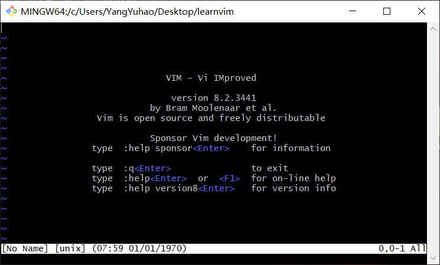
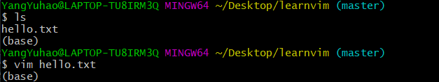
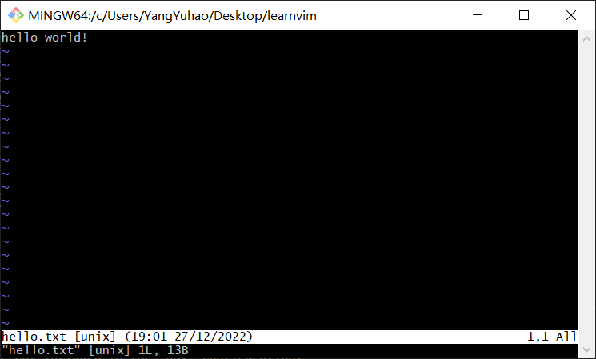
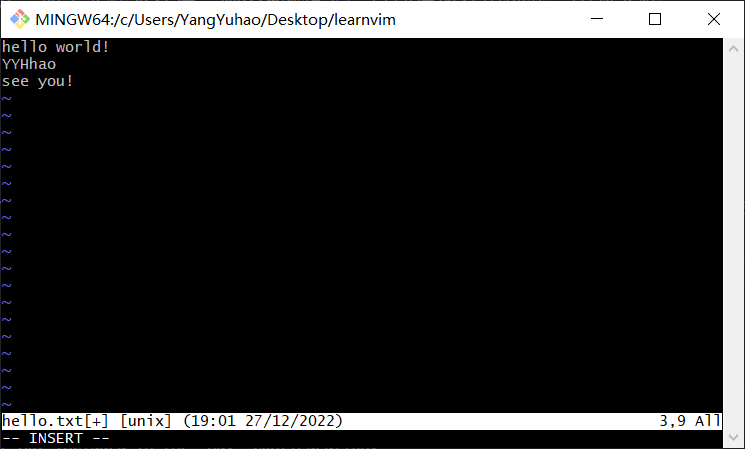
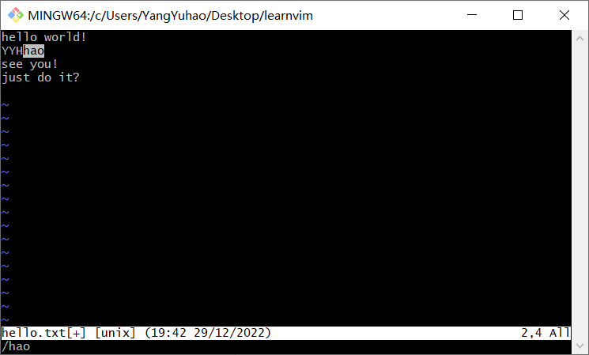
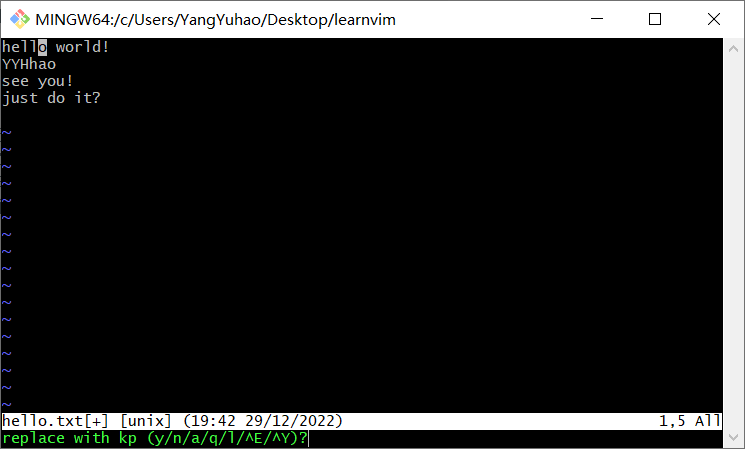
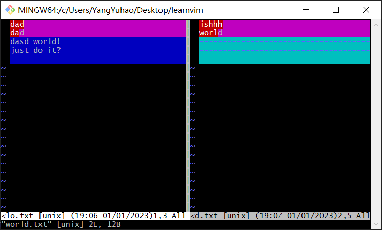
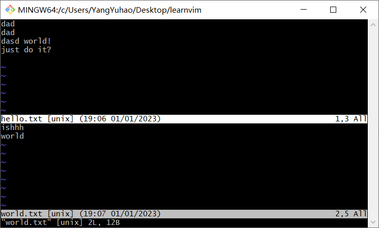

# 前言
git默认的编辑器是Vim，git-bash时也会使用到很多vim命令，不过最新版的git安装时已经可以选择默认编辑器了。Vim确实很强大，但许多Windows用户已经重度依赖GUI类的编辑器，这里有两种方法解决，一种方法是[修改git默认编辑器](https://zhuanlan.zhihu.com/p/363822727)，另一种方法就是掌握Vim编辑器的使用。   
# Vim编辑器
vi（visual editor）编辑器Linux和Unix系统上最基本的文本编辑器，类似于Windows 系统下的notepad（记事本）编辑器。而Vim(Vi improved)是vi编辑器的加强版，vi的命令几乎全部都可以在vim上使用，并且比vi更容易。Vim 代码补全、编译及错误跳转等方便编程的功能特别丰富，在程序员中被广泛使用。  
# 安装Vim  
Linux通常都已经默认安装好了 vi 或 Vim 文本编辑器，我们只需要通过vim命令就可以直接打开vim编辑器，如下图：   

     
也可以使用yum工具对vim编辑器进行安装：    
```
yum install -y vim
```  
# 为什么用Vim

* 每个系统管理员对于文本编辑器都有偏好，一些人会选择gedit，另一些则喜欢nano，还有人选用emacs。但只有vim是随Linux和UNIX系统分发的vi编辑器的改进版本，无论操作的系统是什么，此款编辑器都能可靠地安装使用。    

* Vim 是一个高效的编辑器，高效包含两层意思：Vim 打开或关闭非常快（秒开）；编辑者本人能高效操作，让我们双手不离开键盘的情形下，完成与编辑文档或写代码所有的相关操作（实现不用鼠标完成一系列操作）。

* 因为 Linux 服务器为了节省内存，提高效率等原因，大型网站的服务器一般是无图形化界面的Linux系统，当需要进行调试、远程处理问题的时候，只能调出terminal（终端窗口），然后用命令"vim index.html"这样的方式，调出vim编辑器，再进行更改。    

[Linux作为服务器操作系统的优势](https://www.zhihu.com/question/19738282)

# Vim的三种模式
基本上 vi/vim 共分为三种模式，分别是**命令模式（Command mode）**，**输入模式（Insert mode）**和**底线命令模式（Last line mode）**。   

>**命令模式**：控制屏幕光标的移动，字符、字或行的删除，移动复制某区段及进入Insert mode下，或者到 last line mode。   
**输入模式**：只有在Insert mode下，才可以做文字输入，按「ESC」键可回到命令行模式。   
**底线命令模式**：将文件保存或退出vim，也可以设置编辑环境，如寻找字符串、列出行号等。

# Vim的基本操作
**a)进入vim**       
在系统光标提示符后，输入vim及文件名后，回车，进入Vim编辑画面。进入vim之后，默认是处于「命令行模式（command mode）」，要切换到「插入模式（Insert mode）」才能够输入文字。    
>注意：使用vim打开文件，若文件已存在，则直接打开；如果文件不存在，则vim编辑器会自动在内存中创建一个新文件。   





**b)切换至插入模式（Insert mode）编辑文件**    
一般情况下，在「命令行模式（command mode）」下按一下字母「i」就可以进入「插入模式（Insert mode）」，这时候你就可以开始输入文字了。


**c)插入模式（Insert mode）切换到命令行模式（Command mode）** 
在插入模式下，按一下「ESC」键即可。也可以多按几次 Esc 键，保证顺利返回到命令模式。

**d) 退出vim及保存文件**  
在命令行模式（Command mode）下，按冒号「:」键，进入底线命令模式（Last Line mode）。   
>**常用的文件保存命令：**   
:w filename 文件以filename为文件名保存   
:wq 文件存盘并退出vim   
:q 文件不存盘并退出vim   
:q! 文件不存盘强制退出vim   

# 不同模式下Vim的常用命令
## 命令模式
在此模式下，可以使用上、下、左、右键进行光标移动，也可以键入不同的命令完成选择、复制、粘贴、删除等操作。  
注意：有些不同指令可以实现相同的效果，这里用" | "表示，同时指令需要区分大小写。  
**命令光标跳转：**
```
G (shift + g)      跳转光标至末尾    
gg                 跳转光标至开头    
Ngg                跳转光标至当前文件内的N行(N为数字)    
$                  将当前光标跳转至光标所在行的末端(尾部)    
^|0                将当前光标跳转至光标所在行的头部  <=> 数字0 可实现类似效果   
```
**复制、粘贴：**
```
yy                复制当前光标所在的行
Nyy|yNy           复制从当前光标所在行开始数向下的N行（N为数字）
p(小写)            粘贴至当前光标下一行   
P(大写)            粘贴至当前光标上一行
```
**删除、剪切：**
```
dd              删除当前光标所在的行   
Ndd|dNd         删除当前光标所在的行以及往下的N行(N为数字)
dG              删除当前光标所在及之后的所有行
D               删除当前光标所在行中光标之后的内容
x               删除当前光标标记往后的一个字符
X               删除当前光标标记往前的一个字符
ddp             先删除dd(或Ndd)，后粘贴p
```
**撤销、替换、回滚：**
```
u          撤销上一次的操作(类似windows下的ctrl+z) 
r          替换当前光标之后的单个字符(输入r后，再输入的单个字符就是替换后的内容)
R          进入REPLACE模式, 连续替换，ESC结束(实质还是单个字符的替换，只不过光标自动后移)
Ctrl+r     当你执行了撤销u的时候，发现撤销错了，回滚
```

## 编辑模式
在编辑模式下可以编辑文本内容。在命令模式下按 i、 a 、o等键可以进入编辑模式，在此模式下可以输入文本，但命令执行后的字符插入位置不同。
```
i   进入编辑模式，光标不做任何操作
I   进入编辑模式，并且光标会跳转至本行的头部
 
a   进入编辑模式，将当前光标往后一位
A   进入编辑模式，将光标移动至本行的尾部
 
o   进入编辑模式，并在当前光标下添加一行空白内容
O   进入编辑模式，并在当前光标上添加一行空白内容
 
s   进入编辑模式，并删除当前光标下的字符
S   进入编辑模式，并删除当前光标所在行
```

## 底线命令模式
命令模式下按" : "键进入底线命令模式。这时光标会移到屏幕底部，在这里可以输入相关指令保存修改或退出 Vim，也可以设置编辑环境、寻找字符串、列出行号等。指令执行后会自动返回命令模式。
```
:w          //保存当前状态
:w!         //强制保存当前状态
:q          //退出当前文档(文档必须保存才能退出)
:q!         //强制退出文档不会修改当前内容
:wq         //先保存，在退出
:wq!        //强制保存并退出
:x          //先保存，在退出
ZZ          //保存退出, shfit+zz
:number     //跳转至对应的行号,和普通模式Ngg一个意思
```
**查找和替换：**
```
查找  /string 输入需要搜索的内容string，回车进行下列操作
        n 按搜索到的内容依次往下进行查找
        N 按搜索到的内容依次往上进行查找

替换
    :1,5s#sbin#test#g          替换1-5行中包含sbin的内容为test
    :%s#sbin#test#g            替换整个文本文件中包含sbin的替换为test
    :%s#sbin#test#gc           替换内容时提示是否需要替换
    %表示所有行   s表示替换   g表示所有匹配到的内容     c表示提示
    
    替换提示时的相关操作：
        替换为 w (y/n/a/q/l/^E/^Y)？
        y:替换一次
        n:选中下一个
        a:全部替换
        q:退出
        l:替换一次并退出询问
 
另存
:w /root/test  将文件所有内容另存为/root/test
    
读入
:r  /etc/hosts  读入/etc/hosts文件至当前光标下面
:5r /etc/hosts  指定/etc/hosts文件当前文件的哪行下面
```
\string命令：


:%s#sbin#test#gc命令：


## vim视图模式
视图模式，是属于命令模式之下的一种模式

```
ctrl+v  进入VISUAL BLOCK 选中需要注释的行（可视块模式）
    1.插入:按shift+i进入编辑模式,输入#,结束按ESC键
    2.删除:选中内容后，按x或者d键删除
    3.替换:选中需要替换的内容, 按下r键,然后输入替换后的内容
  
  # 2.批量修改文件（添加注释）
  1)按Ctrl + v进入可视块视图模式
  2）移动光标-1.按下键-2.Ngg-3.G
  3)按 Shift + i 进入编辑模式
  4）输入"#"
  5）按ESC退出编辑模式

shift+v 进入VISUAL LINE 选中行内容（可视行模式）
    1.复制:选中行内容后按y键及可复制。
    2.删除:选中行内容后按d键删除
```
## 其它vim操作指令

**文件对比命令：**
```
vimdiff [FILE_1] [FILE_2]
```
vimdiff hello.txt world.txt命令：


**vim 同时编辑多个文件，即分屏，在Vim 命令行模式下输入：**
```
vim -On [FILE_1] [FILE_2] ...
vim -on [FILE_1] [FILE_2] ..
-o：水平分割（将多个文件上下分屏）
-O：垂直分割（将多个文件左右分屏）
n：表示分几个屏，可以缺省不写，默认按后面要分割的文件数来决定分几个屏
[FILE_1][FILE_2]： 需要打开文件
```
vim -o hello.txt world.txt命令：


**切换文件：**
当同时编辑多个文件时，实现不同文件间的来回切换
```
Ctrl + ww
```


[菜鸟教程：https://www.runoob.com/linux/linux-vim.html](https://www.runoob.com/linux/linux-vim.html)    
[Learn-Vim(the Smart Way)中文翻译](https://github.com/wsdjeg/Learn-Vim_zh_cn)    
[https://www.cnblogs.com/lwlw/p/16078287.html](https://www.cnblogs.com/lwlw/p/16078287.html)