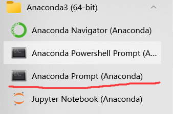
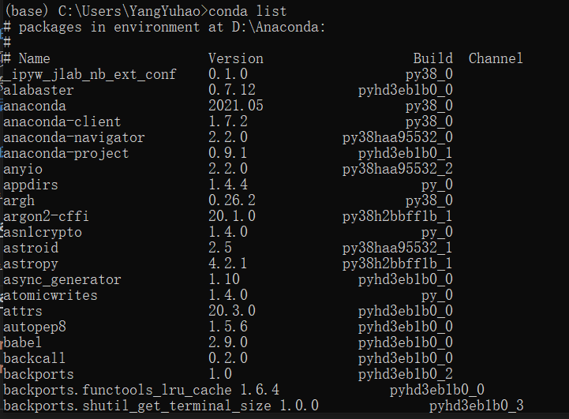
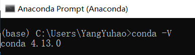
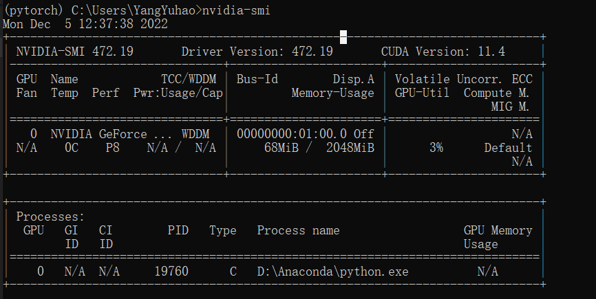
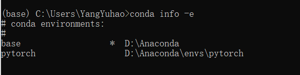

# Anaconda

Anaconda指的是一个开源的Python发行版本，其包含了Conda、Python等180多个科学包及其依赖项。支持 Linux, Mac, Windows系统，提供了**包管理与环境管理**的功能，可以很**方便地解决多版本python并存、切换以及各种第三方包安装问题。**       
Anaconda利用工具/命令Conda来进行package和environment的管理，并且已经包含了Python和相关的配套工具。   

* Conda可以理解为一个工具，也是一个可执行命令，其核心功能是包管理与环境管理。包管理与pip的使用类似，环境管理则允许用户方便地安装不同版本的python并可以快速切换。   
Conda的设计理念——Conda将几乎所有的工具、第三方包都当做package对待，甚至包括python和conda自身！因此，conda打破了包管理与环境管理的约束，能非常方便地安装各种版本python、各种package并方便地切换。     

* Anaconda则是一个打包的集合，里面预装好了conda、某个版本的python、众多packages、科学计算工具等等，所以也称为Python的一种发行版。其实还有Miniconda，顾名思义，它只包含最基本的内容——python与conda，以及相关的必须依赖项，对于空间要求严格的用户，可以选择文件较小的Miniconda（仅包Conda和Python）。

# 为什么用Anaconda中的python
Python易用，但用好却不易，其中比较头疼的就是包管理和Python不同版本的问题，特别是当我们使用Windows的时候，别的系统笔者还没用过，经常为了安装几个模块包折腾一上午甚至几天，比较麻烦。    
**Anaconda可以帮我们省去很多不必要的麻烦，Anaconda不是语言，它只是python的一个集成管理工具或系统，它把python做相关数据计算与分析所需要的包都集成在了一起，我们只需要安装Anaconda软件就行了，其它什么都不用装，包括python软件。**     


# 虚拟环境
它是一个虚拟化的概念，从电脑独立开辟出来的环境。通俗的来讲，虚拟环境就是借助虚拟机来把一部分内容独立出来，我们把这部分独立出来的东西称作“容器”，在这个容器中，我们可以只安装我们需要的依赖包，各个容器之间互相隔离，互不影响。    

# 虚拟环境的作用    
在一些项目开发中，我们需要一些项目的框架，但是可能每个项目使用的框架并不一样，或使用框架的版本不一样，这样需要我们根据需求不断的更新或卸载相应的库。这样显然会非常麻烦，大大降低工作的效率，而虚拟环境则很好的解决了这个问题，我们可以**将不同框架分别安装在不同的环境中，当需要时只需要我们切换环境**就可以了。   

# 虚拟环境下的基础指令
1、进入Anaconda命令行    


2、查看该环境下的包     


3、查看conda版本   


4、查看CUDA版本，显示GPU状态     


5、查看所有环境   


这里显示了两种环境，第一个base是默认下的，第二个pytorch是我自己创建的一个环境     

6、创建新虚拟环境      
```python
conda create -n env python==3.6(版本号)
```
其中env是虚拟环境名字，3.6是python版本号

7、切换到其它环境   
```python
conda activate env
```
其中env是目标虚拟环境名字

8、退出当前虚拟环境   
```python
conda deactivate
```

9、删除环境   
```
conda remove -n env --all
```
其中env是要删除的虚拟环境名字


[anaconda下载与虚拟环境创建](https://zhuanlan.zhihu.com/p/423809879)     
[anaconda介绍、安装与使用](https://zhuanlan.zhihu.com/p/32925500)