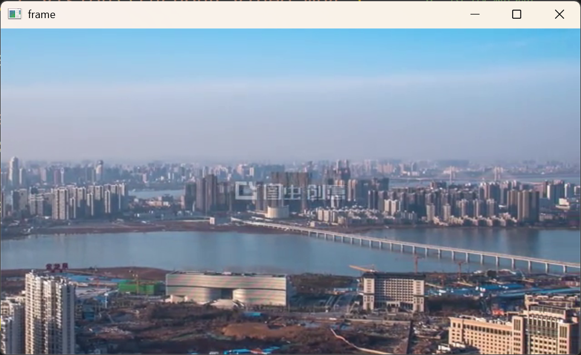

# 读取视频
```python
import cv2

cap = cv2.VideoCapture('c_vision\\tuchong_video.mp4')     # 读取视频
while cap.isOpened():               # 当视频被打开时：
    ret, frame = cap.read()         # 读取视频，读取到的某一帧存储到frame，若是读取成功，ret为True，反之为False
    if ret:                         # 若是读取成功
        cv2.imshow('frame', frame)  # 显示读取到的这一帧画面
        key = cv2.waitKey(25)       # 等待一段时间，并且检测键盘输入
        if key == ord('q'):         # 若是键盘输入'q',则退出，释放视频
            cap.release()           # 释放视频
            break
    else:
        cap.release()
cv2.destroyAllWindows()             # 关闭所有窗口
```
