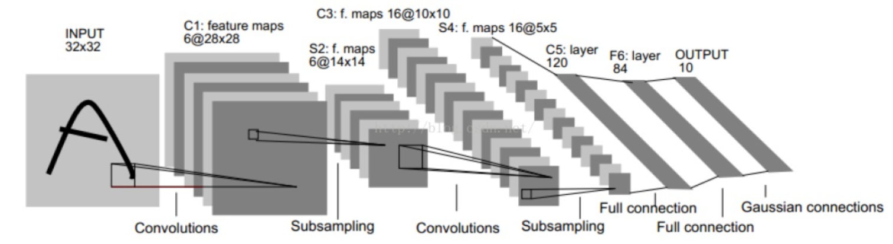

# LeNet-5
卷积神经网络是一种特殊的多层神经网络。与几乎所有其他神经网络一样，它们都使用一种反向传播算法进行训练。而LeNet-5是一个最基础的卷积神经网络(CNN)模型,它主要用于手写体的识别和机印字符识别。

# LeNet-5模型框图


先说明一下特征图大小计算公式：

$$\begin{split}
output=floor[(input+2*padding-kernel)/stride+1] \\
padding:输入图像边界填充数量;kernel:卷积核大小;stride:卷积操作的步长  
\end{split}
$$


**输入:32*32的手写体数字图片，其中包含0~9，也就相当于10个类别。**    
**输出:分类结果，0~9中的一个数，也就是一个类别。**

LeNet-5不包括输入层一共有七层，MNIST数据集是28x28的，是希望潜在的明显特征如笔画断点或角能够出现在最高层**特征检测子感受野（receptive field）**的中心。因此在训练之前需要对28x28的图像加上paddings=2。七层神经网络依次为：  

**1、C1卷积层：**    
这一层中，**输入就是32x32x1的原始图像**，该层使用的卷积核大小为5x5，使用6种不同参数的卷积核。因此，输出6个特征图(feature map)，每个特征图的大小为28x28，即**输出特征图大小为28x28x6**。该卷积层共有：5\*5\*1\*6+6=156个参数,加的6为卷积后的偏置项参数。本层所拥有的节点有28\*28\*6=4704个节点， 而本层的每一个节点都是经过一个5\*5的卷积和一个偏置项计算所得到的，5\*5+1=26，所以本层卷积层一共有4704*26 = 122304个连接。

**2、S2池化层：**       
该层的输入是C1层的输出，即是一个**28x28x6**的特征图,也就是一个矩阵。卷积神经网络中，常用的池化层有**最大池化**和**平均池化**，所使用的核大小为2\*2,卷积操作步长为2，也就是每四个相邻的元素经池化之后只会输出一个元素。因此经S2池化层之后，输出的特征图大小为**14x14x6**，池化层并不会改变输入特征图的通道数。

**3、C3卷积层**   
这一层的输入是一个**14x14x6**的矩阵，C3层一共有16卷积核，每一个卷积核的大小为5x5，默认卷积核深度和卷积对象是一致的，因此，输出特征图的尺寸为**10x10x16**。

**4、S4池化层**   
S4层的池化方式与S2层相同，输入是**10x10x16**，输出是**5x5x16**。所以，S4层一共有16\*2=32个参数，与S3层一共有（4+1）\*5\*5\*16=2000个连接。

**5、C5卷积层**   
输入特征图大小为**5x5x16**，C5层共有120个卷积核，每个卷积核的大小还是5x5,与输入特征图大小相同,因此输出120个特征图，每个特征图的大小为1x1，即输出特征图的尺寸为**1x1x120**。

**6、F6全连接层**    
将F6层与C5进行全连接，输入为**120x1**的向量，计算输入向量和权重向量之间的点积，再加上一个偏置，结果通过sigmoid函数输出。因为F6全连接层共有84个节点，因此输出为**84x1**的向量。

**7、输出层(全连接层)**   
输出层共有10个节点，分别代表数字0~9的10个类别。采用的是径向基函数(RBF)的网络连接方式。每一个输出对应一个RBF函数，每一个RBF函数都有84维的输入向量，RBF的函数公式如下。每一个RBF函数都会有一个输出，最后输出层会输出一个10维的向量。    

$$
y_i=\sum_j(x_j-w_{ij})^2
$$
其中i=0~9，j=0~83。$w_{ij}$代表F6层第j个节点与输出层第i个节点的连接权重。RBF的输出值越接近于0，则分类结果越接近于i,表示当前网络输入的识别结果是i。   

数据加载，load.py:
```python
# data loading
# train  image x    label y
# test   image x    label y

import struct
import numpy as np
import cv2
# read image  X
def load_image_fromfile(filename):
    with open(filename, 'br') as fd:
        # 读取图像的信息
        header_buf = fd.read(16)   # 16字节，4个int整数
        # 按照字节解析头信息（具体参考python SL的struct帮助）  解包
        magic_, nums_, width_, height_ = struct.unpack('>iiii', header_buf)  # 解析成四个整数：>表示大端字节序，i表示4字节整数
        # 保存成ndarray对象
        imgs_ = np.fromfile(fd, dtype=np.uint8)
        imgs_ = imgs_.reshape(nums_, height_, width_)
    return imgs_


# read labels  Y
def load_label_fromfile(filename):
    with open(filename, 'br') as fd:
        header_buf = fd.read(8) 
        magic, nums = struct.unpack('>ii' ,header_buf) 
        labels_ = np.fromfile(fd, np.uint8) 
    return labels_
```

lenet-5的构建，lenet5.py:
```python
import torch

# layer

class Lenet5(torch.nn.Module):
    # constructor function
    def __init__(self):
        super(Lenet5,self).__init__()
        self.layer1 = torch.nn.Conv2d(in_channels=1, out_channels=6, kernel_size=(5,5),padding=2)
        self.layer2 = torch.nn.Conv2d(in_channels=6, out_channels=16, kernel_size=(5,5),padding=0)
        self.layer3 = torch.nn.Conv2d(in_channels=16, out_channels=120, kernel_size=(5,5),padding=0)
        self.layer4 = torch.nn.Linear(120,84)  #通常用于设置网络中的全连接层
        self.layer5 = torch.nn.Linear(84,10)

    # 重写 父类的方法  calculation
    def forward(self,input):
        #   layer1
        o = self.layer1(input)                                # N*1*32*32====>N*6*28*28
        o = torch.nn.functional.relu(o)                         
        o = torch.nn.functional.max_pool2d(o,kernel_size=(2,2))   # N*6*28*28====>N*6*14*14

        # layer2
        o = self.layer2(o)                                     # N*6*14*14====>N*16*10*10
        o = torch.nn.functional.relu(o) 
        o = torch.nn.functional.max_pool2d(o,kernel_size=(2,2))   # N*16*10*100====>N*16*5*5

        # layer03
        o = self.layer3(o)                                     #N*16*5*5====>N*120*1*1                           
        o = torch.nn.functional.relu(o) 
        o = o.squeeze()                                        # N*120*1*1====>N*120

        # layer04
        o = self.layer4(o)                                     # N*120====>N*84
        o = torch.nn.functional.relu(o) 

         # layer05
        o = self.layer5(o)                                      # N*84====>N*10

        return o 
```

训练文件，train.py:
```python
# 加载数据
# 训练模型
# 保存模型
import torch
from lenet5 import Lenet5
import load

# train_data
train_x = load.load_image_fromfile('./第三次实训/L05/digit/data/train-images.idx3-ubyte')
train_y = load.load_label_fromfile('./第三次实训/L05/digit/data/train-labels.idx1-ubyte')

# test_data
test_x = load.load_image_fromfile('./第三次实训/L05/digit/data/t10k-images.idx3-ubyte')
test_y = load.load_label_fromfile('./第三次实训/L05/digit/data/t10k-labels.idx1-ubyte')

#####    N*28*28 #####    .view() change dim   #####    N*1*28*28 #####
x = torch.Tensor(train_x).view(train_x.shape[0],1,train_x.shape[1],train_x.shape[2])
y = torch.LongTensor(train_y)  

t_x = torch.Tensor(test_x).view(test_x.shape[0],1,test_x.shape[1],test_x.shape[2])
t_y = torch.LongTensor(test_y)

# DataLoader
train_dataset = torch.utils.data.TensorDataset(x,y)
test_dataset =  torch.utils.data.TensorDataset(t_x,t_y)
#  for in train_loader   2000 batch_size
train_loader = torch.utils.data.DataLoader(dataset=train_dataset,shuffle=True,batch_size=2000)
test_loader = torch.utils.data.DataLoader(dataset=test_dataset,shuffle=True,batch_size=10000)


model = Lenet5()

epoch = 60

cri = torch.nn.CrossEntropyLoss()
# 创建优化器（指定学习率）
opt = torch.optim.Adam(model.parameters(),lr=0.001)

# epoch
for e in range(epoch):
    # batch
    for data,target in train_loader:
        opt.zero_grad()    # 导数清零

        out = model(data)  # forward()
        loss = cri(out,target)
        loss.backward()
        # update weight
        opt.step()  # 更新权重

    with torch.no_grad():         #这里我们只是想看一下训练效果，不需要用来反向传播更新网络，节约内存
        for data,target in test_loader:
            y_ = model(data)
            y_ = torch.nn.functional.log_softmax(y_,dim=1)
            predict = torch.argmax(y_,dim=1)
            c_rate = (predict==target).float().mean()
            print(F"轮数：{e} ---- 准确率：{c_rate}")

    state_dict = model.state_dict()
    torch.save(state_dict,'./第三次实训/L05/digit/data/lenet.pth')  
```

测试手写体识别，recognize.py:
```python
import torch
from lenet5 import Lenet5
import numpy as np

model = Lenet5()
state = torch.load('./第三次实训/L05/digit/data/lenet.pth')
model.load_state_dict(state)

import cv2
# img = cv2.imread('./第三次实训/L05/digit/img.png')   # 中文路径会报错
img= cv2.imdecode(np.fromfile('./第三次实训/L05/digit/img.png', dtype=np.uint8), -1)
# imdecode读取的是rgb，如果后续需要opencv处理的话，需要转换成bgr，转换后图片颜色会变化
img = cv2.cvtColor(img, cv2.COLOR_RGB2BGR)  #cv2.imread读取的图片效果一致

img = cv2.cvtColor(img,cv2.COLOR_BGR2GRAY)
img = cv2.resize(img,(28,28))   #resize
img = torch.Tensor(img).view(1,1,img.shape[0],img.shape[1])

y_ = model(img)  #N[10]
y_ = torch.nn.functional.log_softmax(y_,dim=0)
predict = torch.argmax(y_,dim=0)
print(predict.numpy())
```

[https://zhuanlan.zhihu.com/p/179293801](https://zhuanlan.zhihu.com/p/179293801)     
[每层具体的参数量及其连接](https://blog.csdn.net/sinat_29957455/article/details/78597602)