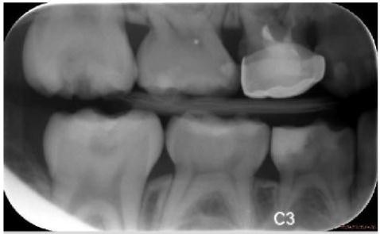
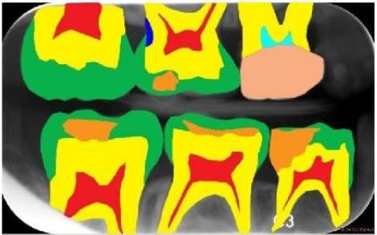

## 什么是语义分割？
### 目标
>将图像中的每个像素分配到对应的类别标签中，实现类别级别的理解。例如，将一张道路图片中的像素分为“汽车”、“行人”、“道路”、“天空”等类别。

### 与实例分割的区别：   
* 语义分割不区分同一类别的不同实例（如“所有汽车视为同一类”）。
* 实例分割需区分同一类别的不同对象（如“两辆不同的汽车”）。

### 应用场景
**自动驾驶（道路/障碍物识别），医疗影像（器官/组织定位），城市规划（土地分类），工业质检（产品缺陷检测）等。**

### 示例
输入：图片    

输出：同尺寸的分割标记（像素水平），每个像素会被识别为一个类别（category）

### 方法

#### ​1. 传统方法    
​**阈值法与区域生长**     
>​阈值法：基于像素 intensity 的阈值划分（如 Otsu 算法）。    
​区域生长：从种子点出发，根据相似性（如灰度、纹理）扩展区域。   
​局限性：依赖光照均匀性，无法处理复杂场景。

​**编码器-解码器结构**   
>​FCN（Fully Convolutional Network）​：将传统 CNN 的全连接层替换为卷积层，输出与输入分辨率相同的分割图。  
​跳跃连接（Skip Connection）​：融合多尺度特征（如 ResNet + FCN）。   
​问题：分辨率下降导致细节丢失。

​**U-Net**   
>​结构：编码器（下采样）→ 池化 → 解码器（上采样）+ 跳跃连接。   
​优势：保留医学影像中的精细细节，如肿瘤边缘。   
​应用：医学图像分割（如 MITOS 数据集上的细胞分割）。

#### ​2. 深度学习方法
​**两阶段模型**  
>​Mask R-CNN（语义分割变体）​：
在 Faster R-CNN 检测框基础上，增加一个分支预测类别掩码。  
​改进：Mask R-CNN++ 通过特征金字塔网络（FPN）增强小物体分割。

​**单阶段模型**
>​RetinaNet：
使用 FPN 多尺度预测，平衡速度与精度（FPS=140）。  
​损失函数：Focal Loss 解决类别不平衡问题。  
​DeepLab 系列：
​DeepLabv1：AttnModule 注意力机制聚焦关键区域。  
​DeepLabv3：结合空洞卷积（Dilated Conv）扩大感受野，提升小物体性能。  

​**Transformer-based 方法**   
>​ViT-Seg（Vision Transformer for Semantic Segmentation）​：
直接将图像划分为 patches，通过自注意力建模全局依赖。  
​挑战：需大规模数据（如 JFT-300M）预训练。  
​DETR（Detection Transformer）​：
同时处理检测和分割，用 Query 机制关联文本描述与图像区域。

#### 3.关键技术
​**特征金字塔网络（FPN）​**  
>​作用：融合多尺度特征（如 P3/P4/P5），捕捉小物体和高分辨率细节。    
​改进：PANet（Path Aggregation Network）通过横向连接增强特征传递。

​**注意力机制**  
>​Cross-Attention：在 Transformer 模型中，动态匹配查询（Query）与键值（Key/Value）。   
​Self-Attention：建模图像内像素间关系（如 Swin Transformer）。

​**数据增强**   
>​几何增强：随机旋转（±30°）、缩放（0.5~1.5倍）、水平翻转。    
​色彩增强：调整亮度、对比度、饱和度（CLAHE）。   
​Mixup：混合两张图像的像素和标签，提升模型鲁棒性。

#### 4.评估指标
**​mIoU（Mean Intersection over Union，平均交并比）​：**
$$
mIoU=\frac{1}{类别数}\sum_c \frac{预测掩码∩真实掩码}{预测掩码∪真实掩码}
$$
目标：mIoU > 70% 表示优秀性能（如 Cityscapes 数据集达到 85%）

**Pixel Accuracy（像素准确率）：**
$$
Pixel Acc=\frac{正确预测像素数}{总像素数}
$$
#### 5.代表模型与工具

|模型|​框架|​特点|​mIoU（Cityscapes）|  
|  ----  | ----  |  ----  | ----  |
|FCN|PyTorch/TensorFlow	|首个端到端语义分割模型|~50% (原始版本)|  
|U-Net|	PyTorch	|医学影像分割标杆|	~90% (医学数据)   |    
|DeepLabv3+	|PyTorch|	空洞卷积 + Xception 主干	|89.2% |   
|ViT-Hybrid	|PyTorch|	Vision Transformer + CNN 融合	|87.3% |    
|Mask R-CNN (语义模式)	|PyTorch	|两阶段实例分割可扩展为语义	|~85% |

### 主流数据集
​COCO：80 类语义分割标注（含 20k 张图片）。
​Cityscapes：19 类城市道路场景（5k 张图片，标注精细）。[https://blog.csdn.net/qq_41185868/article/details/82939959](https://blog.csdn.net/qq_41185868/article/details/82939959) 

​Ade20k：20 类语义分割（20k 张图片，适合训练）。 [https://ade20k.csail.mit.edu/](https://ade20k.csail.mit.edu/)

​Mapillary Vistas：60 类街景语义分割（百万级标注）。[https://blog.csdn.net/qq_41185868/article/details/100147245](https://blog.csdn.net/qq_41185868/article/details/100147245)

### 总结   
语义分割技术已从 FCN 的初步探索发展为结合 Transformer 的全局建模，未来将更注重效率与精度的平衡，并通过自监督学习和多模态融合进一步降低对标注数据的依赖。在自动驾驶、智慧城市等场景中，高实时性的语义分割模型（如 NanoDet）将持续推动落地应用。