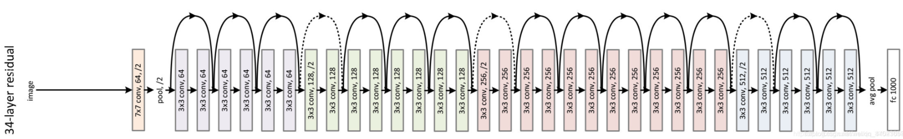

# ResNet
ResNet（Residual Neural Network）由微软研究院的Kaiming He等四名华人提出，通过使用ResNet Unit成功训练出了152层的神经网络，并在ILSVRC2015比赛中取得冠军，在top5上的错误率为3.57%，同时参数量比VGGNet低，效果非常突出。ResNet的结构可以极快的加速神经网络的训练，模型的准确率也有比较大的提升。同时ResNet的推广性非常好，甚至可以直接用到InceptionNet网络中。

**论文原文：** [https://arxiv.org/pdf/1512.03385](https://arxiv.org/pdf/1512.03385)

resnet34网络结构图：
   
根据模型层数不同对应如下结构：
  
resnet18、34对应左，resnet50、101、152对应右侧基础block。主要区别就是右侧先用了1*1卷积降维再通过3\*3卷积进行特征提取，再用1\*1卷积还原维度，主要就是减少参数量大小。   

