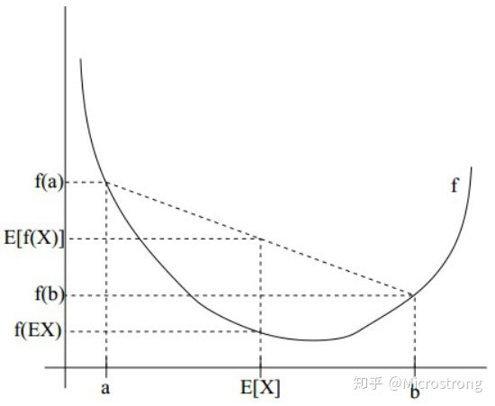
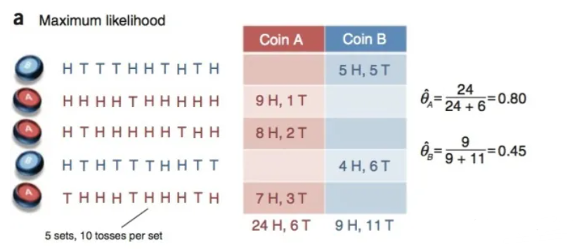
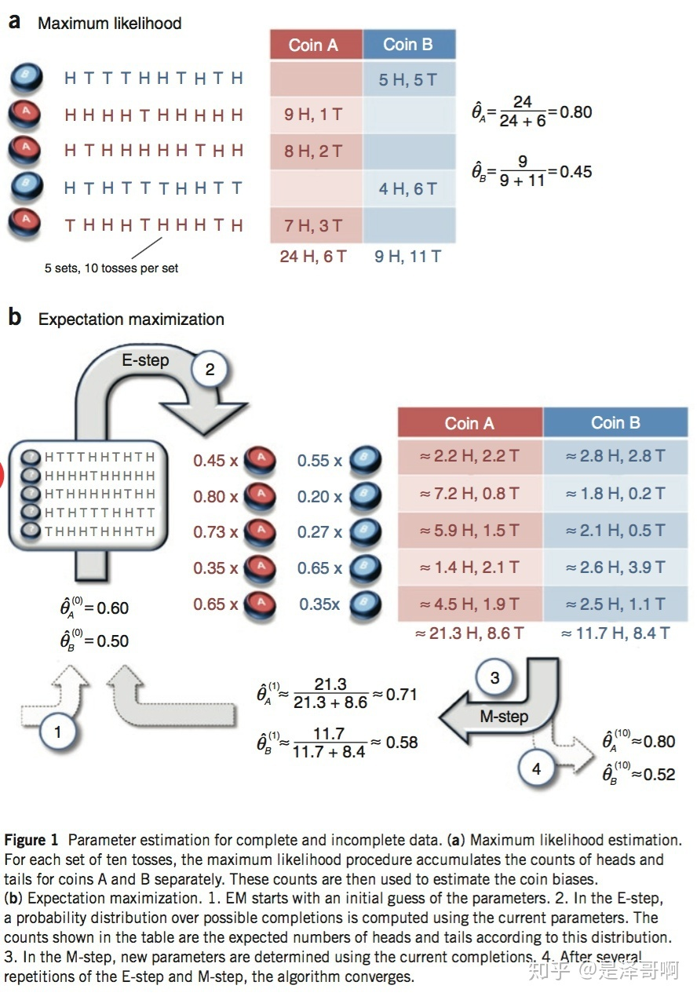

# EM算法
EM（Expectation-Maximum）算法也称期望最大化算法，曾入选“数据挖掘十大算法”中，可见EM算法在机器学习、数据挖掘中的影响力。EM算法是最常见的隐变量估计方法，在机器学习中有极为广泛的用途，例如常被用来学习高斯混合模型（Gaussian mixture model，简称GMM）的参数；隐式马尔科夫算法（HMM）、LDA主题模型的变分推断等等。      

一个最直观了解EM算法思路的是K-Means算法，见之前写的K-Means聚类算法原理。在K-Means聚类时，每个聚类簇的质心是隐含数据。我们会假设K个初始化质心，即EM算法的E步；然后计算得到每个样本最近的质心，并把样本聚类到最近的这个质心，即EM算法的M步。重复这个E步和M步，直到质心不再变化为止，这样就完成了K-Means聚类。    
# EM算法简介
我们经常需要从样本观察数据中，找出样本的模型参数，即模型的**参数估计**。最常用的方法就是**极大似然估计法(MLE)**。但是在一些情况下，我们得到的观察数据有未观察到的隐含数据，此时我们未知的有隐含数据和模型参数，因而无法直接用极大化对数似然函数得到模型分布的参数。**这时就用到了EM算法,对含有隐变量的概率模型参数进行极大似然估计或极大后验估计**。

EM算法是一种迭代优化策略，它的计算方法中**每一次迭代都分两步**，其中一个为**期望步**（E步），另一个为**极大步**（M步）。

EM算法解决这个的思路是使用启发式的迭代方法，既然我们无法直接求出模型分布参数，那么我们可以先猜想隐含数据（EM算法的E步），接着基于观察数据和猜测的隐含数据一起来极大化对数似然，求解我们的模型参数（EM算法的M步)。由于我们之前的隐藏数据是猜测的，所以此时得到的模型参数一般还不是我们想要的结果。不过没关系，我们基于当前得到的模型参数，继续猜测隐含数据（EM算法的E步），然后继续极大化对数似然，求解我们的模型参数（EM算法的M步)。以此类推，不断的迭代下去，直到模型分布参数基本无变化，算法收敛，找到合适的模型参数。

# 极大似然估计

* 参数估计(parametric estimation):已知概率密度函数的形式，但部分或全部参数未知，用样本来估计这些参数,利用极大似然估计和贝叶斯估计。     
* 非参数估计(nonparametric estimation):概率密度函数的形式也未知，用样本将概率密度函数数值化地估计出来。  

极大似然估计是建立在极大似然原理上的一种参数估计方法，其目的就是**利用已知的样本结果，反推最有可能导致这种结果的参数值。**简单说，就是通过若干次试验，观察其结果，利用试验结果得到某个参数值能够使样本出现的概率最大。注意要估计的参数是一个确定的量。

**极大似然估计一般步骤:**    

* 1、写出似然函数:估计参数$\theta$的似然函数，即各样本在$\theta$条件下出现的联合概率密度函数   

$$L(\theta)=P(x_1,x_2,\dots,x_n|\theta)=\prod_{i=1}^nP(x_i|\theta)$$

* 2、为方便计算，对似然函数取对数，将累乘计算转化成累加运算。     
* 3、对取对数后的似然函数求导，另导数为0，得到似然方程。    
* 4、求解似然方程，求得使似然函数最大的参数θ值

$$\hat \theta=\underset{\theta}{argmax}\quad ln(L(\theta))$$  

**极大似然估计的特点:**    
1、比其他估计方法更简单。       
2、收敛性：当样本数目较多时，收敛性质会更好。     
3、如果假设的类条件概率模型正确，则通常能获得较好的结果。但如果假设模型出现偏差，将导致非常差的估计结果。

[极大似然估计详解](https://blog.csdn.net/zengxiantao1994/article/details/72787849?depth_1-utm_source=distribute.pc_relevant.none-task&utm_source=distribute.pc_relevant.none-task)

# Jensen不等式     
1、定义     

设f是定义域为实数的函数，如果对所有的实数x，f(x)的二阶导数都大于0，那么f是凸函数。Jensen不等式定义如下：    
如果f是凸函数,X是随机变量，那么:$E[f(X)]\geq f(E[X])$。当且仅当X是常量时，该式取等号。其中E[X]表示X的数学期望。   
**注：**Jensen不等式应用于凹函数时，不等号方向反向。当且仅当x是常量时，该不等式取等号。    

2、举例    

图2中，实线f表示凸函数，X是随机变量，有0.5的概率是a，有0.5的概率是b。X的期望值就是a和b的中值，从图中可以看到$E[f(X)]\geq f(E[X])$成立。

# EM算法的推导
对于n个样本观察数据$x=(x_1,x_2,\dots,x_n)$，找出样本的模型参数θ, 极大化模型分布的对数似然函数如下：     

$$\hat \theta=argmax\sum_{i=1}^nlogp(x_i;\theta)$$

如果我们得到的观察数据有未观察到的隐含数据$z=(z_1,z_2,\dots,z_n)$，即上文中每个样本属于哪个分布是未知的，此时我们极大化模型分布的对数似然函数如下：   

$$\hat \theta=argmax\sum_{i=1}^nlogp(x_i;\theta)=argmax\sum_{i=1}^nlog\sum_{z_i}p(x_i,z_i;\theta)$$

上面这个式子是根据$x_i$的边缘概率计算得来，没有办法直接求出θ。因此需要一些特殊的技巧，使用Jensen不等式对这个式子进行缩放如下：    

$$
\begin{split}
\sum_{i=1}^nlog\sum_{z_i}p(x_i,z_i;\theta)=\sum_{i=1}^nlog\sum_{z_i}Q_i(z_i)\frac{p(x_i,z_i;\theta)}{Q_i(z_i)}\quad(1) \\
\geq\sum_{i=1}^n\sum_{z_i}Q_i(z_i)log\frac{p(x_i,z_i;\theta)}{Q_i(z_i)} \quad(2)
\end{split}
$$

(1)式是引入了一个未知的新的分布$Q_i(z_i)$，分子分母同时乘以它得到的。

(2)式是由(1)式根据Jensen不等式得到的。由于$\sum_{z_i}Q_i(z_i)\frac{p(x_i,z_i;\theta)}{Q_i(z_i)}$为$\frac{p(x_i,z_i;\theta)}{Q_i(z_i)}$的期望，且log(x)为凹函数，根据Jensen不等式可由(1)式得到(2)式。

上述过程可以看作是对$logl(\theta)$求了下界（$l(\theta)=\sum_{i=1}^nlogp(x_i;\theta)$）。对于$Q_i(z_i)$我们如何选择呢？假设θ已经给定，那么$logl(\theta)$的值取决于$Q_i(z_i)$和$p(x_i,z_i)$。我们可以通过调整这两个概率使(2)式下界不断上升，来逼近$logl(\theta)$的真实值。那么如何算是调整好呢？当不等式变成等式时，说明我们调整后的概率能够等价于$logl(\theta)$了。按照这个思路，我们要找到等式成立的条件。

如果要满足Jensen不等式的等号，则有：

$$\frac{p(x_i,z_i;\theta)}{Q_i(z_i)}=c,c为常数$$

由于$Q_i(z_i)$是一个分布，所以满足：$\sum_zQ_i(z_i)=1$，则$\sum_zp(x_i,z_i;\theta)=c$(联合上式变换得到)。     
由上面两个式子，我们可以得到：   

$$Q_i(z_i)=\frac{p(x_i,z_i;\theta)}{\sum_zp(x_i,z_i;\theta)}=\frac{p(x_i,z_i;\theta)}{p(x_i;\theta)}=p(z_i|x_i;\theta)$$

至此，我们推出了在固定其他参数θ后，$Q_i(z_i)$的计算公式就是后验概率，解决了$Q_i(z_i)$如何选择的问题。这一步就是E步，该步建立了$l(\theta)$的下界。   

如果$Q_i(z_i)=p(z_i|x_i;\theta)$，则(2)式是我们包含隐藏数据的对数似然函数的一个下界。如果我们能最大化(2)式这个下界，则也是在极大化我们的对数似然函数。即我们需要最大化下式：   

$$argmax\sum_{i=1}^n\sum_{z_i}Q_i(z_i)log\frac{p(x_i,z_i;\theta)}{Q_i(z_i)}$$

上式也就是我们的EM算法的M步。

# EM算法流程(总结)
**输入:**观察到的数据$x=(x_1,x_2,\dots,x_n)$，联合分布$p(x,z;\theta)$ ，条件分布$p(z|x,\theta)$，最大迭代次数J。   
**算法步骤:**    
（1）随机初始化模型参数θ的初值$\theta_0$。    
（2）j=1,2,...,J 开始EM算法迭代：   

* E步:计算联合分布的条件概率期望：

$$Q_i(z_i)=p(z_i|x_i,\theta_j)$$ 

$$l(\theta,\theta_j)=\sum_{i=1}^n\sum_{z_i}Q_i(z_i)log\frac{p(x_i,z_i;\theta)}{Q_i(z_i)}$$  

* M步:极大化$l(\theta,\theta_j)$得到$\theta_{j+1}$:

$$\theta_{j+1}=argmax \quad l(\theta,\theta_j)$$

* 如果$\theta_{j+1}$已经收敛，则算法结束。否则继续进行E步和M步进行迭代。

**输出:**模型参数θ。

# EM算法实例
硬币实验概述:    
1、首先要明确硬币实验本身的问题是:两块硬币A、B与我们熟知的硬币不同，它们形状不是均匀分布的，所以抛出正面的概率并不是简单的50%，现在我们想知道这两块硬币分别抛出正面的概率     
2、探究的方法:做实验将A硬币抛n次，记录正面的次数$n_h$,当n足够大时，硬币A抛出正面的概率为实验出现的频率，即$P_A=n_h/n$。B硬币同理。    
3、区分两种情况:a情况可以观测到实验数据中每次选择的是A还是B，b情况实验数据对A和B的选择是未知的。

## a情况
假设有两枚硬币 A 和 B，并已知实验数据属于A还是B，他们的随机抛掷的结果如下图所示：    
     
我们很容易估计出两枚硬币抛出正面的概率：    

$$\begin{split}
\theta_A=24/30=0.8 \\     
\theta_B=9/20=0.45
\end{split}$$

## b情况   
我们加入隐变量，抹去每轮投掷的硬币标记，即每次抛的硬币是A还是B未知。如下表:    

|Coin|Statistics|
|--|--|
|Coin*|5H,5T|     
Coin*|9H,1T  
Coin*|8H,2T  
Coin*|4H,6T  
Coin*|7H,3T  

碰到这种情况，我们该如何估计$\theta_A$和$\theta_B$的值？    
我们多了一个隐变量 $Z=(z_1,z_2,z_3,z_4,z_5)$，代表每一轮所使用的硬币，我们需要知道每一轮抛掷所使用的硬币这样才能估计$\theta_A$和$\theta_B$的值，但是估计隐变量 Z 我们又需要知道$\theta_A$和$\theta_B$的值，才能用极大似然估计法去估计出 Z。这就陷入了一个鸡生蛋和蛋生鸡的问题。

其解决方法就是先随机初始化$\theta_A$和$\theta_B$，然后用去估计 Z， 然后基于 Z 按照最大似然概率去估计新的$\theta_A$和$\theta_B$，循环至收敛。

**b情况计算:**    
随机初始化$\theta_A=0.6$和$\theta_B=0.5$     

对于第一轮来说，如果是硬币 A，得出的 5 正 5 反的概率为：$0.6^5*0.4^5$;如果是硬币 B，得出的 5 正 5 反的概率为：$0.5^5*0.5^5$。我们可以算出使用是硬币 A 和硬币 B 的概率分别为：  

$$\begin{split}
P_A=\frac{0.6^5*0.4^5}{(0.6^5*0.4^5)+(0.5^5*0.5^5)}=0.45  \\     
P_B=\frac{0.5^5*0.5^5}{(0.6^5*0.4^5)+(0.5^5*0.5^5)}=0.55   
\end{split}$$

可以得到1到5次实验数据属于A或B的概率如下表：     

No.|Coin A|Coin B
----|----|----
1|0.45|0.55
2|0.80|0.20
3|0.73|0.27
4|0.35|0.65
5|0.65|0.35

从期望的角度来看，对于第一轮抛掷，使用硬币 A 的概率是 0.45，使用硬币 B 的概率是 0.55。同理其他轮。这一步我们实际上是估计出了 Z 的概率分布，这部就是 E-Step。

结合硬币 A 的概率和上一张投掷结果，我们利用期望可以求出硬币 A 和硬币 B 的贡献。以第二轮硬币 A 为例子，计算方式为：

$$\begin{split}
H:0.80*9=7.2  \\     
T:0.80*1=0.8   
\end{split}$$

于是得到类似于不含隐变量的，已知A，B标记的实验数据表，如下：    

No.|Coin A|Coin B
----|----|----
1|2.2H,2.2T|2.8H,2.8T
2|7.2H,0.8T|1.8H,0.2T
3|5.9H,1.5T|2.1H,0.5T
4|1.4H,2.1T|2.6H,3.9T
5|4.5H,1.9T|2.5H,1.1T
total|21.3H,8.6T|11.7H,8.4T

然后用极大似然估计来估计新的$\theta_A$和$\theta_B$。

$$\begin{split}
\theta_A=\frac{21.3}{21.3+8.6}=0.71  \\     
\theta_B=\frac{11.7}{11.7+8.4}=0.58   
\end{split}$$

这步就对应了 M-Step，重新估计出了参数值。

**如此反复迭代，我们就可以算出最终的参数值。**

上述全部过程对应下图：   

# EM算法收敛性
EM算法可以保证收敛到一个稳定点，即EM算法是一定收敛的。     
EM算法可以保证收敛到一个稳定点，但是却不能保证收敛到全局的极大值点，因此它是局部最优的算法，当然，如果我们的优化目标$l(\theta,\theta_l)$是凸的，则EM算法可以保证收敛到全局最大值，这点和梯度下降法这样的迭代算法相同。

证明过程如下：   
[EM算法-刘建平](https://www.cnblogs.com/pinard/p/6912636.html)

