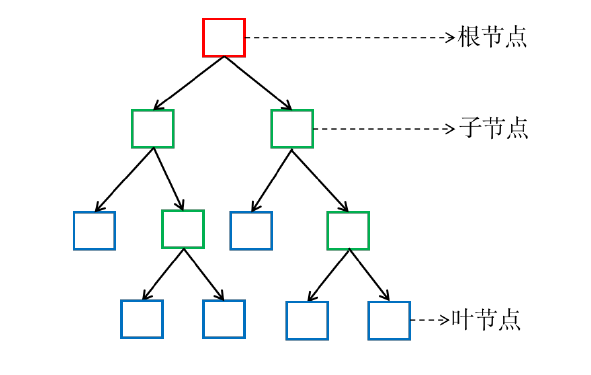

# 决策树
决策树(decision tree)是以一种基本的分类和回归算法。这里主要讲述分类决策树。决策树算法采用树形结构，使用层层推理来实现最终的分类。其主要优点是模型具有可读性，分类速度快。学习时，利用训练数据，根据损失函数最小化的原则建立决策树模型。预测时，对新数据，利用决策树模型进行分类。决策树学习通常包括三个步骤：**特征选择、决策树生成、决策树修剪**。主要包含三种典型的决策树算法：**ID3、C4.5、CART**。    

# 非数值特征

* 名义特征（nominal features）：如性别、民族、职业、字符串中的字符、DNA 序列中的核酸类型（A、C、G、T）等，只能比较相同或不相同，无法比较相似性，无法比较大小     
* 序数特征（ordinal features）：如序号、分级等，是一种数值，有顺序，但不能看作是欧式空间中的数值     
* 与研究目标之间呈非线性关系的数值特征：比如年龄、考试成绩、温度等      
* 区间（interval）数据：取值是实数，可以比较大小，但没有一个“自然的”零，如温度     
可以把非数值特征转换成**数值特征**进行模式分类，但引入这一额外步骤可能会损失数据中的信息，也可能引入人为的信息。    

# 基本结构

每个结点(根结点和子结点)代表一个特征和响应的决策规则。     
**根结点：**包含样本全集，经过根结点被划分到各个子结点中。      
**子结点：**每个子结点对应于一个属性测试, 子结点包含的样本集合根据属性测试的结果被划分到新的结点中或叶结点中。    
**叶结点：**每个叶结点只包含单纯的一类的样本，不需要再划分, 对应于决策结果。     

决策树的构建过程就是**选取特征**和**确定决策规则**的过程。    

# 决策树学习3个步骤
**特征选择：**特征选择决定了使用哪些特征来做判断。在训练数据集中，每个样本的属性可能有很多个，不同属性的作用有大有小。因而特征选择的作用就是筛选出跟分类结果相关性较高的特征，也就是分类能力较强的特征。

在特征选择中通常使用的准则是：**信息增益**。

**决策树生成：**选择好特征后，就从根节点触发，对节点计算所有特征的信息增益，**选择信息增益最大的特征作为节点特征**，根据该特征的不同取值建立子节点；对每个子节点使用相同的方式生成新的子节点，直到信息增益很小或者没有特征可以选择为止。

**决策树剪枝：**剪枝的主要目的是对抗“过拟合”，通过主动去掉部分分支来降低过拟合的风险。   

# ID3算法
ID3 是最早提出的决策树算法，他就是利用信息增益来选择特征的。   

**信息熵(Information Entropy):** 是度量样本集合纯度最常用的一种指标。   
假定当前样本集合$D$ 中第$k$ 类样本所占的比例为$p_k(k = 1, 2, \dots , |Y|)$, 则$D$ 的信息熵定义为:    
$$
Ent(D) = −\sum_{k=1}^{|Y|}p_klog_2p_k
$$
Ent(D) 的值越小, 则D 的纯度越高。     

假定离散属性$a$ 有$V$ 个可能的取之$a^1, a^2, · · · , a^V$, 若使用$a$ 来对样本集$D$ 进行划分, 则会产生$V$ 个分支结点, 其中第$v$ 个分支结点包含了$D$ 中所有在属性$a$ 上取值为$a^v$ 的样本, 记为$D^v$。    
考虑到不同分支结点所包含的样本数不同, 给分支结点赋予权重|Dv|/|D|, 即样本书越多的分支结点的影响越大, 则用属性a 对样本集D 进行划分所获得的**信息增益(infromation gain)**       

$$
Gain(D,a)=Ent(D)-\sum_{v=1}^{V}\frac{|D^v|}{|D|}Ent(D^v)
$$

一般而言, 信息增益越大, 则意味着使用属性$a$来进行划分所获得的**纯度提升**越大。     
ID3 决策树算法就是以**信息增益**为准则来选择划分属性。   

**ID3 算法流程:**  

* a. 计算当前结点包含的所有样本的信息熵，选取具有最大信息增益的特征
赋予当前结点；
* b. 如果后继结点只包含一类样本，则停止，该结点称为叶结点；如果后继
结点仍包含不同类样本，则再进行步骤a，直至每一枝都成为叶结点。

# C4.5算法
信息增益准则对可取值数目较多的属性有所偏好，为减少这种偏好可能带来的不利影响，C4.5 算法采用信息增益率代替信息增益。    
信息增益率：   

$$Gain\_ratio(D,a)=\frac{Gain(D,a)}{IV(a)}$$

其中：   

$$IV(a)=-\sum^V_{v=1}\frac{|D^v|}{|D|}log_2\frac{|D^v|}{|D|}$$

称为属性a 的“固有值”。   
属性a 的可能取值数目越多（即V 越大），则IV(a) 的值通常会越大。

# CART 算法
使用“基尼指数”来选择划分属性，结点的纯度可用基尼值来度量：    

$$Gini=\sum_{k=1}^{|y|}\sum_{k'\not = k}p_kp_k'=1-\sum_{k=1}^{|y|}p_k^2$$

基尼值反映了从结点中随机抽取两个样本，其类别标记不一致的概率，因此，G 越小，则结点的纯度越高。   
基尼指数：    

$$Gini_index(D,a)=\sum_{v=1}^{V}\frac{|D^v|}{|D|}Gini(D^v)$$

因此，选择使得划分后基尼指数最小的属性作为最优划分属性。

# 优缺点
**优点：**   

* 决策树易于理解和解释，可以可视化分析，容易提取出规则；   
* 可以同时处理标称型和数值型数据；  
* 比较适合处理有缺失属性的样本；
* 能够处理不相关的特征；
* 测试数据集时，运行速度比较快；
* 在相对短的时间内能够对大型数据源做出可行且效果良好的结果。

**缺点：**

* 容易发生过拟合（随机森林可以很大程度上减少过拟合）；
* 容易忽略数据集中属性的相互关联；
* 对于那些各类别样本数量不一致的数据，在决策树中，进行属性划分时，不同的判定准则会带来不同的属性选择倾向；信息增益准则对可取数目较多的属性有所偏好（典型代表ID3算法），而增益率准则（CART）则对可取数目较少的属性有所偏好，但CART进行属性划分时候不再简单地直接利用增益率尽心划分，而是采用一种启发式规则）（只要是使用了信息增益，都有这个缺点，如RF）。
* ID3算法计算信息增益时结果偏向数值比较多的特征。

[决策树项目实例](https://aistudio.baidu.com/aistudio/projectdetail/2501305?channelType=0&channel=0)