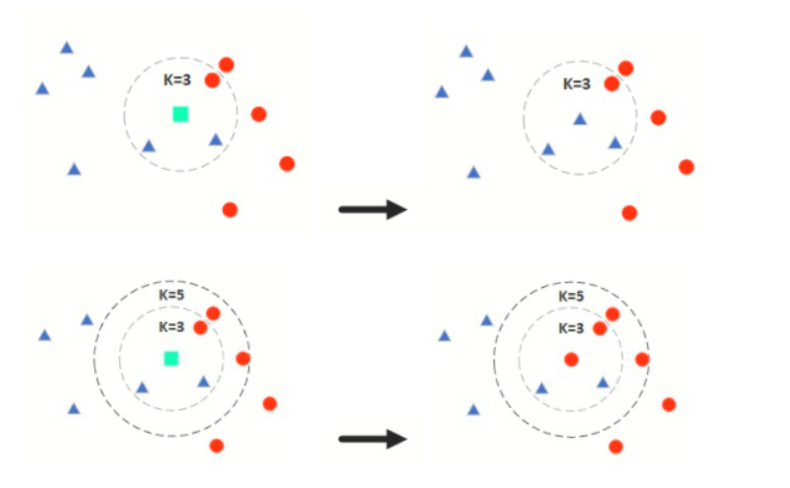

# KNN（k近邻分类器）   
k近邻法(k-nearest neighbor, kNN)是1967年由Cover T和Hart P提出的一种基本分类与回归方法。它的工作原理是：存在一个样本数据集合，也称作为训练样本集，并且样本集中每个数据都存在标签，即我们知道样本集中每一个数据与所属分类的对应关系。输入没有标签的新数据后，将新的数据的每个特征与样本集中数据对应的特征进行比较，然后算法提取样本最相似数据(最近邻)的分类标签。一般来说，我们只选择样本数据集中前k个最相似的数据，这就是k-近邻算法中k的出处，通常k是不大于20的整数。最后，选择k个最相似数据中出现次数最多的分类，作为新数据的分类。
　　所谓K最近邻，就是k个最近的邻居的意思，说的是每个样本都可以用它最接近的k个邻居来代表。kNN算法的核心思想是如果一个样本在特征空间中的k个最相邻的样本中的大多数属于某一个类别，则该样本也属于这个类别，并具有这个类别上样本的特性。该方法在确定分类决策上只依据最邻近的一个或者几个样本的类别来决定待分样本所属的类别。 kNN方法在类别决策时，只与极少量的相邻样本有关。由于kNN方法主要靠周围有限的邻近的样本，而不是靠判别类域的方法来确定所属类别的，因此对于类域的交叉或重叠较多的待分样本集来说，kNN方法较其他方法更为适合。    
**通俗来讲就是设定k值，取样本点范围最近的k个点，其中哪类数量最多则预测的点就为那一类**，如下图：

 

# kNN算法步骤    
**1、准备数据，对数据进行预处理**

对有序变量，数据范围标准化：    
min-max标准化：   
$$
x^* =\frac{x-x_{min}}{x_{max}-x_{min}} 
$$

z-score标准化：
$$
x^* =\frac{x-\bar x}{\sigma}
$$

对无序分类变量：
哑变量编码分类变量数值化，例：男女属性转为0，1数值。

**2、计算测试样本点（也就是待分类点）到其他每个样本点的距离**

要度量空间中点距离的话，有好几种度量方式，比如常见的曼哈顿距离计算、欧式距离计算等等。
二维空间两个点的欧式距离计算公式如下：
$$
dist = \sqrt{(x_2-x_1)^2+(y_2-y_1)^2}
$$

二维空间的曼哈顿距离计算公式：
$$
dist = |x_1-x_2|+|y_1-y_2|
$$

通常 KNN 算法中使用的是欧式距离。

**3、确定k值**    
KNN算法中只有一个超参数k，k值的确定对KNN算法的预测结果有着至关重要的影响。接下来，我们讨论一下k值大小对算法结果的影响以及一般情况下如何选择k值。
如果k值比较小，相当于我们在较小的领域内训练样本对实例进行预测。这时，算法的近似误差（Approximate Error）会比较小，因为只有与输入实例相近的训练样本才会对预测结果起作用。但是，它也有明显的缺点：算法的估计误差比较大，预测结果会对近邻点十分敏感，也就是说，如果近邻点是噪声点的话，预测就会出错。因此，**k值过小容易导致KNN算法的过拟合。**
同理，如果k值选择较大的话，距离较远的训练样本也能够对实例预测结果产生影响。这时候，模型相对比较鲁棒，不会因为个别噪声点对最终预测结果产生影响。但是缺点也十分明显：算法的近邻误差会偏大，距离较远的点（与预测实例不相似）也会同样对预测结果产生影响，使得预测结果产生较大偏差，此时模型容易发生欠拟合。
因此，在实际工程实践中，我们一般**采用交叉验证的方式选取k值**。通过以上分析可知，一般k值选得比较小，我们会在较小范围内选取k值，同时把测试集上准确率最高的那个确定为最终的算法超参数k。

**4、对每个距离进行排序，然后选择出距离最小的k个点，统计前k个点所在的类别出现的频率，返回前k个点出现频率最高的类别作为当前点的预测分类**

# 对鸢尾花分类
```python
from sklearn import datasets
from sklearn.model_selection import train_test_split
from sklearn.neighbors import KNeighborsClassifier
from sklearn.preprocessing import StandardScaler

irs = datasets.load_iris()
transfer = StandardScaler()
X = transfer.fit_transform(irs.data)   #数据标准化
y = irs.target
X_train,X_test,y_train,y_test = train_test_split(X,y,test_size=0.3)
#训练模型
knn = KNeighborsClassifier()
knn.fit(X_train,y_train)
p = knn.predict(X_test)
print(knn.score(X_test,y_test))  #模型得分
```

# 乳腺癌数据分类
[数据集介绍](https://blog.csdn.net/m0_54510474/article/details/124581706)  

```python
from sklearn.datasets import load_breast_cancer
from sklearn import neighbors
import matplotlib.pyplot as plt
from sklearn.decomposition import PCA
from sklearn.model_selection import train_test_split,GridSearchCV
from sklearn.preprocessing import StandardScaler
cancer = load_breast_cancer()
X = cancer.data
y = cancer.target
X = PCA(2).fit_transform(X) #方便可视化
X_train,X_test,y_train,y_test = train_test_split(X,y,test_size=0.3)
#数据处理
std = StandardScaler()
std.fit(X_train)  #训练，获取方差和均值
X_train_std = std.transform(X_train)  #归一化处理
X_test_std = std.transform(X_test)
#k值选择、权重计算方式、选择计算公式
parameters={'n_neighbors':[i for i in range(3,10)],'weights':['distance','uniform'],'p':[i for i in range(1,6)]}
knn = neighbors.KNeighborsClassifier()  #实例化分类器
gc = GridSearchCV(knn,param_grid=parameters,cv=3,n_jobs=1) #实例化网格搜素交叉验证  
knn.fit(X_train_std,y_train)
y_pred = knn.predict(X_test)
print('预测值精度：',knn.score(X_test_std,y_test))
plt.figure(figsize=(10,6))
plt.scatter(X_test[:,0],X_test[:,1],c = y_pred)
plt.show()
```
