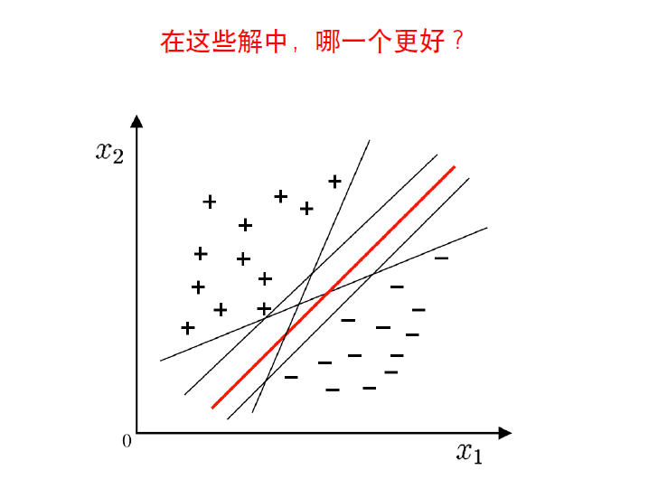
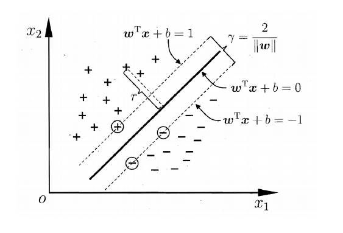
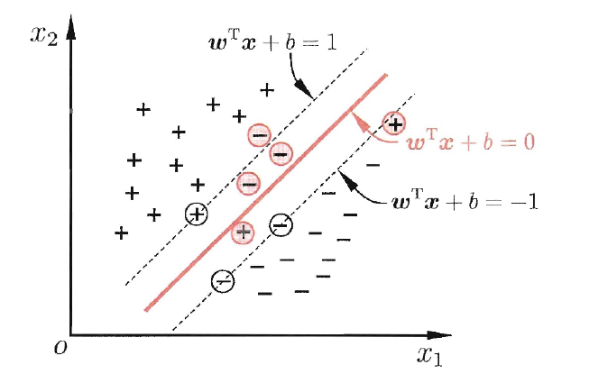
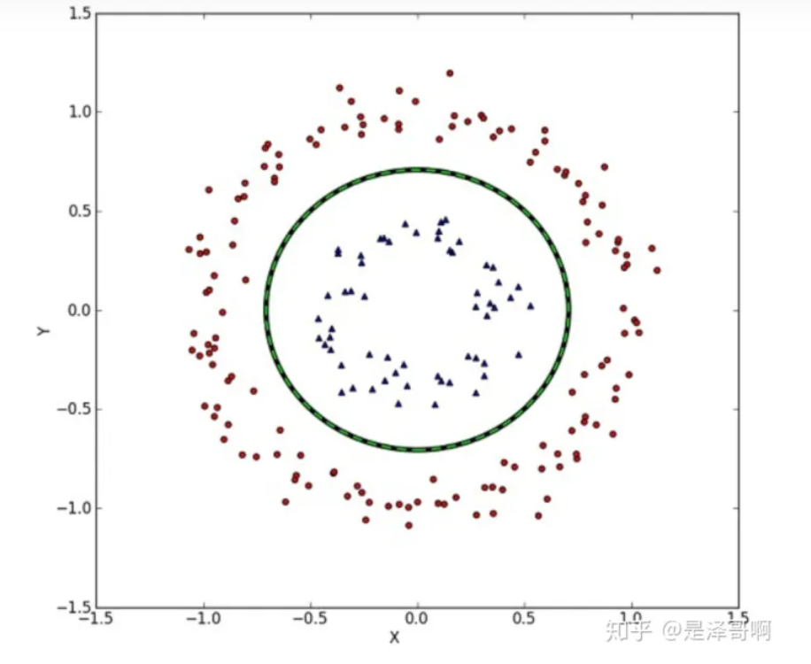
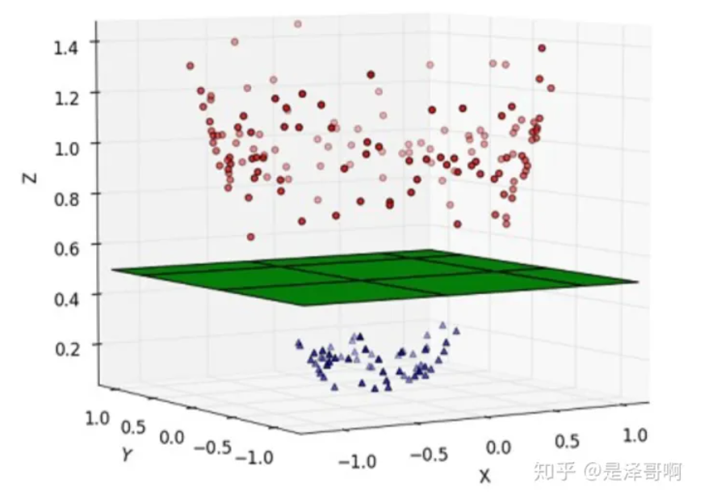
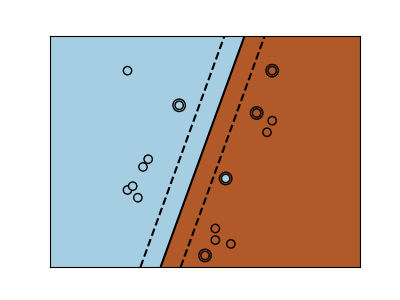
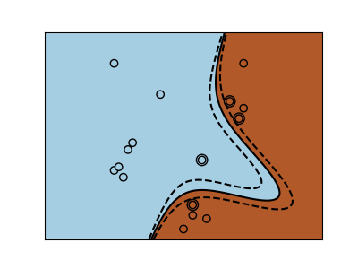
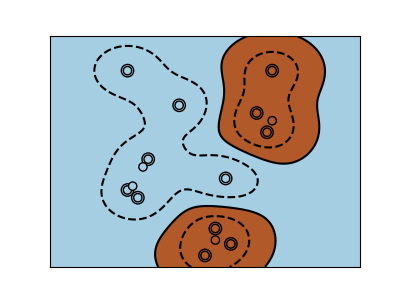

# 支持向量机(SVM)
SVM是机器学习中一类有监督的分类算法，可以认为是一个二类分类器。将假设样本空间上有两类点，它的基本思想就是**寻找一个超平面对样本点进行划分，使得该超平面的泛化能力是最好的，也就是使两类样本中样本点与该超平面的距离最大**。其具体来讲有三种情况：  

* 当训练样本**线性可分**时，通过硬间隔最大化，学习一个线性分类器，即线性可分支持向量机。
* 当训练样本**近似线性可分**时，引入松弛变量，通过软间隔最大化，学习一个线性分类器，即线性支持向量机。
* 但训练样本数据**线性不可分**时，通过使用核技巧及软间隔最大化，学习非线性支持向量机。

# SVM为什么要间隔最大化？(与感知机的区别)
当训练样本数据**线性可分**时，存在无数个分类超平面可以将两类数据正确分开。感知机利用误分类最小策略，求得分离超平面，但此时的解有无穷多个。线性可分支持向量机利用间隔最大化求得**最优分离超平面**，这时，**解是唯一的**。除此之外，此时的分隔超平面所产生的**分类结果是最鲁棒的**，对未知数据的**泛化能力最强**。
   

**应选择“正中间”, 容忍性好, 鲁棒性高, 泛化能力最强的分类平面。**    


# 硬间隔SVM
**最优分类超平面：**一个超平面，如果能够将训练样本没有错误地分开，且**两类训练样本中离超平面最近的样本与超平面的距离是最大**的，这个超平面为最优分类超平面，简称最优超平面，也称作最大间隔超平面。    

SVM 想要的就是找到各类样本点到超平面的距离最远，也就是找到最大间隔超平面。任意超平面可以用下面这个线性方程来描述：  
$$
g(x)=w^Tx+b=0
$$  

二维空间点$(x,y)$到直线$Ax+By+C=0$的距离公式为：   
$$
\frac{|Ax+By+C|}{\sqrt{A^2+B^2}}
$$

扩展到 n 维空间后，点$x=(x_1,x_2,\dots,x_n)$ 到直线$w^Tx+b=0$的距离为：   
$$
\frac{|w^Tx+b|}{||w||}
$$
其中$||w||=\sqrt{w_1^2+\dots+w_n^2}$

所有样本可以被超平面正确地分开，即对所有样本:   

$$\begin{cases}
w^Tx_i+b>0,&y_i=+1 \\
w^Tx_i+b<0,&y_i=-1 \\
\end{cases}
$$

尺度可以调整，可以把离分类面最近的样本的决策函数值归一化为1，如下：   

$$\begin{cases}
w^Tx_i+b\geqslant 1,&y_i=+1 \\
w^Tx_i+b\leqslant 1,&y_i=-1 \\
\end{cases}
$$



将方程合并，简写为：    
$$
y_i(w^Tx_i+b)\geqslant 1,i=1,2,\cdots,m
$$

用此条件约束分类超平面的权值尺度变化，这种超平面称作**规范化的分类超平面**。并且$g(x) = 1$ 和 $g(x) = −1$ 是过两类中各自离分类面最近的样本且与分类面平行的两个边界分类面。

最优分类面，在线性可分的情况下，要求分类面不但能将两类无错误地分开，而且使两类的**分类间隔最大**。分类间隔表示为：
$$
d=\frac{2}{||w||}
$$

## 对偶问题
最大化$d=\frac{2}{||w||}$等价于最小化$\frac{1}{2}||w||^2$      

求最优超平面就转化为：   

$$\begin{equation}
\begin{split}
&\underset{w,b}{min} \quad \frac{1}{2}||w||^2 \\     
&s.t.  \quad y_i(w^Tx_i+b)-1\geqslant 0,i=1,2,\dots,N  \\
\end{split}
\end{equation}
$$

采用拉格朗日算法求解：
对每个样本引入一个拉格朗日系数
$$
\alpha_i \geqslant0,\quad i=1,2,\dots,m
$$

则该问题的拉格朗日函数为：   
$$
L(w,b,\alpha)=\frac{1}{2}||w||^2-\sum_{i=1}^{m}\alpha_i[y_i(w^Tx_i+b)-1]
$$
其中$\alpha={\alpha_1,\alpha_2,\cdots,\alpha_m}$

分别对$w$和$b$求偏微分并令它们等于0，可得：   

$$\begin{equation}
\begin{split}
&w=\sum_{i=1}^{m}\alpha_iy_ix_i  \\
&且\quad \sum_{i=1}^{m}y_i\alpha_i=0 \\
\end{split}
\end{equation}
$$

代入上述拉格朗日函数$L(w,b,\alpha)$得到最优超平面的对偶问题    

$$\begin{equation}
\begin{split}
&\underset{\alpha}{max}\quad Q(\alpha)=\sum_{i=1}^{m}\alpha_i-\frac{1}{2}\sum_{i,j=1}^{m}
\alpha_i\alpha_jy_iy_jx_i^Tx_j   \qquad (1)\\
&s.t.\quad \sum_{i=1}^{m}y_i\alpha_i=0 \\
&且\quad \alpha_i\geqslant 0,i=1,\dots,m
\end{split}
\end{equation}
$$

解出$\alpha$后，求出$w$与$b$即可得到模型。   
通过对偶问题的解$\alpha_i^*,i=1,\dots,m$,可得   

$$
w^*=\sum_{i=1}^{m}\alpha_i^*y_ix_i       \qquad (2)
$$

**即最优超平面的权值向量等于训练样本以一定的系数加权后进行线性组合。**

**求解b^\***:   
上述过程需要满足库恩-塔克（KKT）条件，即要求    

$$\begin{cases}
\alpha_i \geqslant 0    \\
y_i(w^Tx_i+b)-1 \geqslant 0 \\
\alpha_i[y_i(w^Tx_i+b)-1]=0
\end{cases}
$$

**注：**  

* 优化问题是凸优化的话，KKT 条件就是极小值点（而且是全局极小）存在的充要条件。
* 不是凸优化的话，KKT 条件只是极小值点的必要条件，不是充分条件，KKT 点是驻点，是可能的极值点。也就是说，就算求得的满足KKT 条件的点，也不一定是极小值点，只是说极小值点一定满足KKT 条件。

于是，对任意样本$(x_i,y_i)$,总有$\alpha_i=0$或$y_i(w^Tx_i+b)-1=0$    

* 当$y_i(w^Tx_i+b)-1 > 0$ 时，$\alpha_i=0$,该样本不会在上式(2)的求和中出现，也就不会对w产生任何影响。
* 当$y_i(w^Tx_i+b)-1=0$时，&\alpha_i>0&,距离分类面最近的样本，决定了最终的最优超平面的位置。$w^*=\sum_{i=1}^{m}\alpha_i^*y_ix_i$中也只有这些$\alpha_i>0$的样本参与求和。

只有很少一部分样本对应的$\alpha_i$不为0，这些样本被称为**支持向量(support vector)**。

**重要性质：**模型训练完后，大部分的训练样本都不需要保留，最终模型仅与支持向量有关。  

因此支持向量满足：   

$$
y_i(w^{*T}x_i+b^*)-1=0
$$

将任意支持向量代入，即得到 $b^{*}$。   

为了更具鲁棒性，我们可以求得支持向量的均值代入求$b$。

# 序列最小优化算法算法(Sequential Minimal Optimization,简称SMO)

**核心思想：**每次只优化一个参数，其他参数先固定住，仅求当前这个优化参数的极值。    
SMO的基本思路是先固定$\alpha_i$之外的所有参数，然后求$\alpha_i$上的极限。由于存在约束$\sum_{i=1}^m\alpha_iy_i=0$,若固定$\alpha_i$之外的其它变量，则$\alpha_i$可由其它变量导出。于是SMO每次选择两个变量$\alpha_i$和$\alpha_j$并固定其它参数，这样，在参数初始化后，SMO不断执行如下两个步骤直至收敛：   

* 选取一对需更新的$\alpha_i$和$\alpha_j$
* 固定$\alpha_i$和$\alpha_j$以外的参数，求解式子(1)获得更新后的$\alpha_i$和$\alpha_j$

仅考虑$\alpha_i$和$\alpha_j$时，对偶问题的约束变为    

$$
\alpha_iy_i+\alpha_jy_j = -\sum_{k\ne i,j}\alpha_ky_k, \quad \alpha_i \geqslant 0,\alpha_j \geqslant 0
$$

用一个变量表示另一个变量, 回代入对偶问题可得一个单变量的二次规划, 该问题具有闭式解。  
偏移量b：通过支持向量来决定。

SMO 变量选择原则     

* 第一个变量是在KKT 条件不满足的变量中间选择，直观来看，KKT 条件违背的程度越大，则变量更新后可能会使得目标函数的增幅越大，从而选择违背KKT 条件程度越大的变量       
* 第二个变量应选择使得目标函数增长最快的变量；常用启发式，也就是使选取的两变量所对应样本之间的间距最大   

# 软间隔SVM
现实中, 很难确定合适的核函数使得训练样本在特征空间中线性可分; 同时一个线性可分的结果也很难断定是否是有过拟合造成的。线性不可分情况下，最优超平面不存在，不等式$y_i(w^Tx_i + b) − 1 ≥ 0$不可能对所有样本同时满足。    

因此，允许支持向量机在一些样本上出错，引入"软间隔"的概念。


假定某个样本xi 不满足以上条件，即$y_i(w^Tx_i + b) − 1 < 0$，总可以在不等式的左侧加上一个正数 $\xi_i$ 使得新的不等式 $y_i(w^Tx_i + b)−1+ \xi_i ≥ 0$ 成立。    
线性不可分情况下，引入非负松弛变量 $\xi_i,i=1,\dots,m$ 使$y_i(w^Tx_i + b) − 1 ≥ 0$变为    
$$
y_i(w^Tx_i + b) − 1+\xi_i \geqslant 0,i=1,2,\dots,m
$$
样本$x_i$满足$y_i(w^Tx_i + b) − 1 ≥ 0$，则 $\xi_i=0$ ;样本 $x_i$ 不满足$y_i(w^Tx_i + b) − 1 ≥ 0$，则$\xi_i>0$。    

$\sum_{i=1}^m\xi_i$反映整个训练样本集上不满足$y_i(w^Tx_i + b) − 1 ≥ 0$ 约束的程度。   

**目标函数：最大化间隔的同时, 让不满足约束的样本应尽可能少,如下式**   

$$
\underset{w,b}{min} \frac{1}{2}||w||^2+C(\sum_{i=1}^m\xi_i)
$$    

* 对满足约束的样本，希望分类间隔尽可能大；   
* 希望不满足约束的样本尽可能少且不满足约束的程度尽可能低；

**C 是常数，反映在二者之间的折中，需要人为选择：**   

* 选择较小的C，表示对不满足的程度比较容忍而更强调样本的分类间隔；
* 选择较大的C，更强调对不满足约束的样本的惩罚；

给定训练样本集$D={(x_i,y_i),(x_2,y_2),\dots,(x_m,y_m)}$,$x_i\in{R^d},y_i\in {\{+1,-1\}}$  
求解,得到常用的**软间隔支持向量机**：       

$$\begin{equation}
\begin{split}
&\underset{w,b,\xi_i}{min}\quad \frac{1}{2}||w||^2+C(\sum_{i=1}{m}\xi_i)\\
&s.t.\quad y_i(w^Tx_i+b)-1+\xi_i \geqslant 0,i=1,2,\dots,m \\
&且\quad \xi_i\geqslant 0,i=1,\dots,m
\end{split}
\end{equation}
$$


# 非线性支持向量机
我们刚刚讨论的硬间隔和软间隔都是在说样本的完全线性可分或者大部分样本点的线性可分。   
但我们可能会碰到的一种情况是样本点不是线性可分的，比如：

这种情况的解决方法就是：将二维线性不可分样本映射到高维空间中，让样本点在高维空间线性可分，比如：  


对于在有限维度向量空间中线性不可分的样本，我们将其映射到更高维度的向量空间里，再通过间隔最大化的方式，学习得到支持向量机，就是非线性 SVM。

我们用 x 表示原来的样本点，用 $\phi(x)$ 表示 x 映射到特征新的特征空间后到新向量。那么分割超平面可以表示为:$f(x)=w\phi(x)+b$  。

对于非线性 SVM 的对偶问题就变成了：   

$$\begin{equation}
\begin{split}
&\underset{\lambda}{min}\quad [\frac{1}{2}\sum_{i=1}^n\sum_{j=1}^n\lambda_i\lambda_jy_iy_j\phi(x_i)^T\phi(x_j)-\sum_{j=1}^n\lambda_i]\\
&s.t.\quad \sum_{i=1}^n\lambda_iy_i=0,\quad\lambda_i\geqslant 0,\quad C-\lambda_i-u_i=0\\
\end{split}
\end{equation}
$$

与线性 SVM 唯一的不同就是：之前的$x_i^Tx_j$变成了 $\phi(x_i)^T\phi(x_j)$。

## 核函数
在特征空间类并不总是线性可分的。解决办法就是构建一个不是线性的但能是多项式的函数做代替。这要使用 核技巧(kernel trick)，它可以被看作通过设置 kernels 在观察样例上创建决策力量。    

SVM常用的核函数：   

* linear：线性核函数，只能解决线性问题
* ploy：多项式核函数，解决非线性问题和线性问题，但是偏线性
* rbf：高斯径向基核函数，解决线性和非线性问题，偏非线性
 
**1、线性核**    

```python
svc = svm.SVC(kerner='linear')
```

**2、多项式核**   

```python
svc = svm.SVC(kerner='poly',degree=3)
```

**3、RBF内核(径向基函数，高斯核函数)**   

```python
svc = svm.SVC(kerner='rbf')
```

[核函数详解及具体公式](https://blog.csdn.net/Beyond_2016/article/details/81668414)    
[sklearn.svm.SVC参数详情](https://scikit-learn.org/stable/modules/generated/sklearn.svm.SVC.html)   

**支持向量机的优点:**   

* 在高维空间中非常高效
* 即使在数据维度比样本数量大的情况下仍然有效
* 在决策函数（称为支持向量）中使用训练集的子集,因此它也是高效利用内存的
* 通用性: 不同的核函数与特定的决策函数一一对应.常见的 kernel 已经提供,也可以指定定制的内核

**支持向量机的缺点:**   

* 如果特征数量比样本数量大得多,在选择核函数时要避免过拟合, 而且正则化项是非常重要的
* 支持向量机不直接提供概率估计,这些都是使用昂贵的五次交叉验算计算的

>**注：上述主要写了支持向量分类(SVC),而支持向量回归(SVR)也可以在该基础上进行修改使用。**

# 鸢尾花SVM分类(多分类，3种)
```python
import matplotlib.pyplot as plt
from sklearn import svm
from sklearn import datasets
from sklearn.model_selection import train_test_split
from sklearn.multiclass import OneVsRestClassifier  #多分类器
from sklearn.decomposition import PCA
import numpy as np
import mpl_toolkits.mplot3d  
#SVMs可以用于回归：SVR(支持向量回归)，或者分类SVC(支出向量分类)

def plot_hyperplane(clf,min_x,max_x,linestyle,label):
    w = clf.coef_[0]
    a = -w[0]/w[1]
    xx = np.linspace(min_x - 5, max_x + 5)  # make sure the line is long enough
    yy = a * xx - (clf.intercept_[0]) / w[1]
    plt.plot(xx, yy, linestyle, label=label)

iris = datasets.load_iris()
X = iris.data[:,:2]
y = iris.target
min_x = np.min(X[:, 0])
max_x = np.max(X[:, 0])
min_y = np.min(X[:, 1])
max_y = np.max(X[:, 1])   

X_train,X_test,y_train,y_test = train_test_split(X,y,test_size=0.1)
classif = OneVsRestClassifier(svm.SVC(kernel="linear"))
classif.fit(X_train,y_train)
p = classif.predict(X_test)
print(classif.score(X_test,y_test))

plt.scatter(X[:,0],X[:,1],c=y,cmap=plt.cm.Set1,edgecolors='k')  #cmp颜色映射集，edgcolors边框色彩
plt.xlabel('sepal length')
plt.ylabel('sepal width')
plot_hyperplane(classif.estimators_[0], min_x, max_x, "k--", "Boundary\nfor class 1")
plot_hyperplane(classif.estimators_[1], min_x, max_x, "k-.", "Boundary\nfor class 2")
plt.xticks()
plt.yticks()
plt.show()
```
输出：
```
0.9333333333333333
```


[参考链接:https://zhuanlan.zhihu.com/p/77750026](https://zhuanlan.zhihu.com/p/77750026)   
[https://www.sklearncn.cn/5/](https://www.sklearncn.cn/5/)