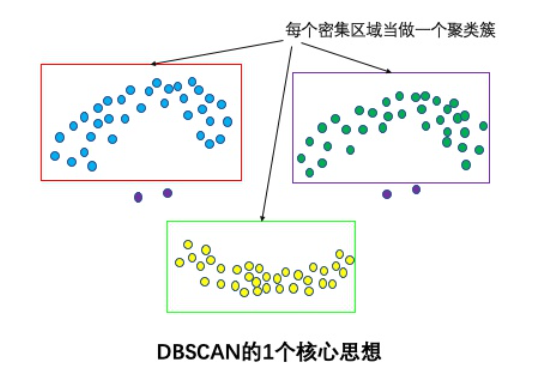
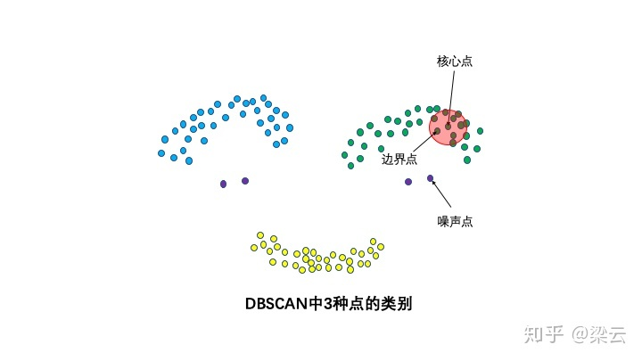
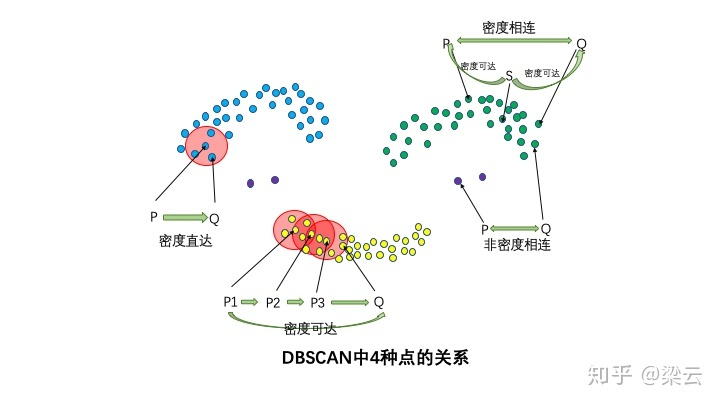
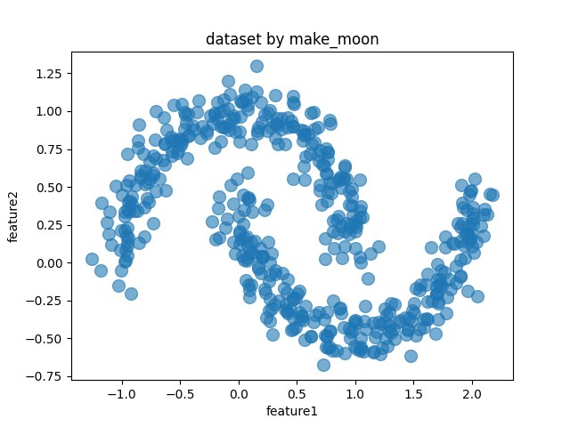
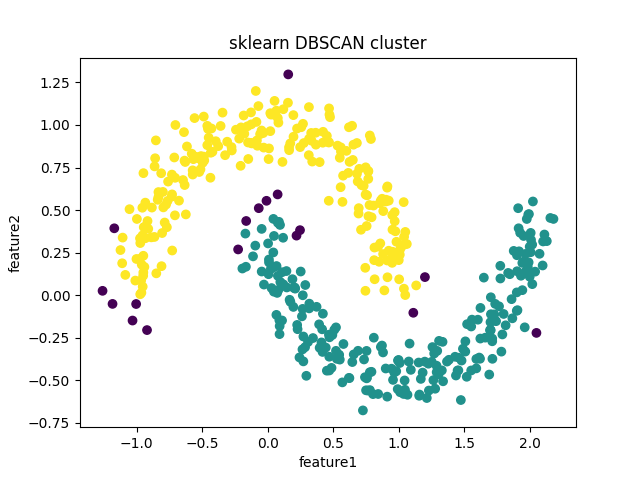
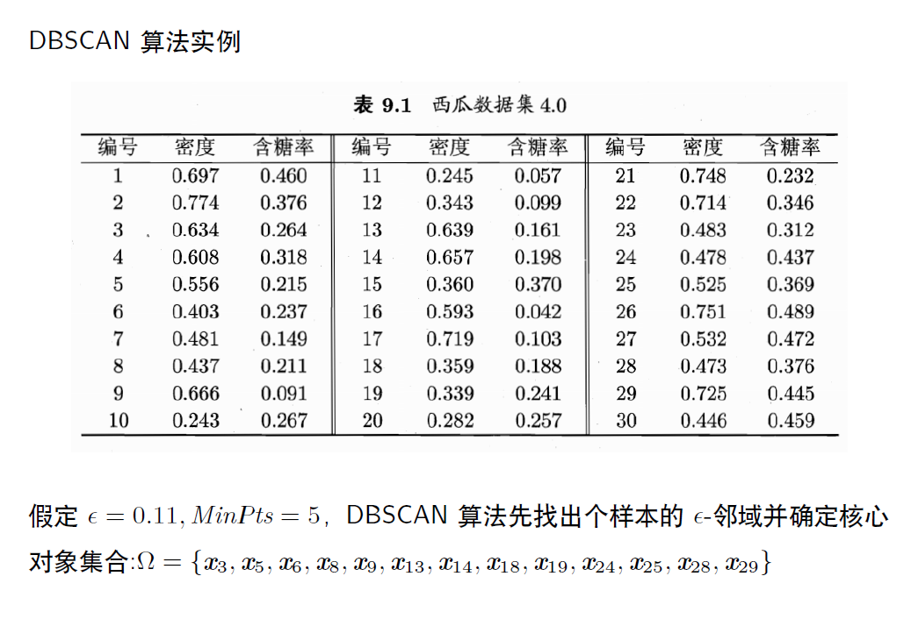
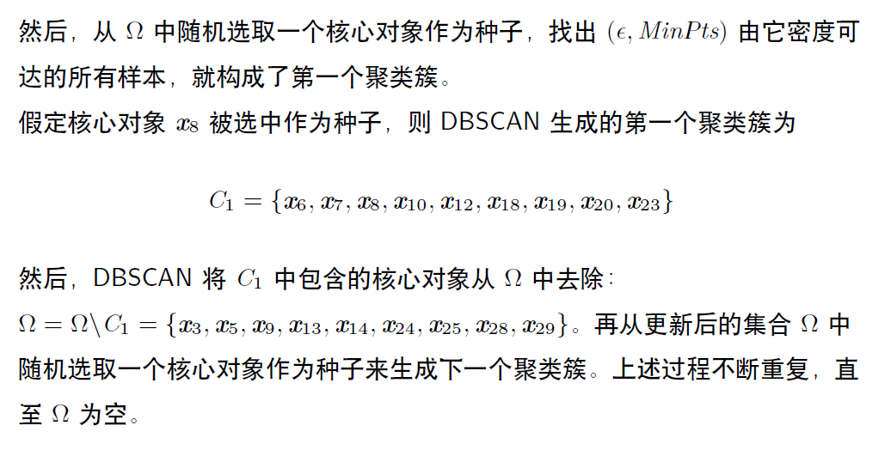
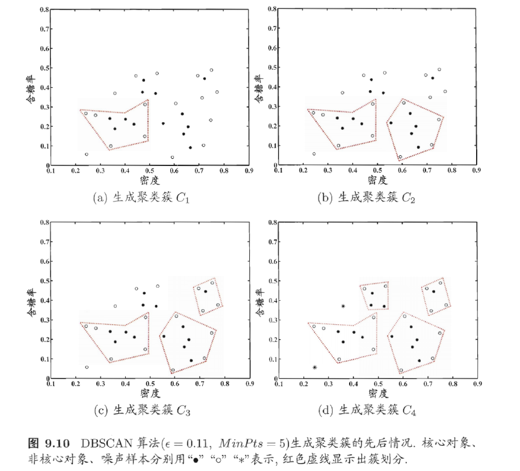

# DBSCAN简介
DBSCAN是一种基于密度的聚类算法，英文全称是 Density-Based Spatial Clustering of Applications with Noise，意即：一种基于密度，对噪声鲁棒的空间聚类算法。直观效果上看，DBSCAN算法可以找到样本点的全部密集区域，并把这些密集区域当做一个一个的聚类簇。    
   

# 概念
密集：DBSCAN基于一组“邻域”参数(R,MinPoints)来刻画样本分布的紧密程度。**邻域半径R**和**最少点数目MinPoints**。这两个算法参数实际可以刻画什么叫密集：当邻域半径R内的点的个数大于最少点数目MinPoints时，就是密集。       
3种点的类别：核心点，边界点和噪声点。**邻域半径R内样本点的数量大于等于MinPoints的点叫做核心点**。不属于核心点但在某个核心点的邻域内的点叫做边界点。既不是核心点也不是边界点的是噪声点。    


4种点的关系：密度直达，密度可达，密度相连，非密度相连。

* **密度直达:**如果**P为核心点**，Q在P的R邻域内，那么称P到Q密度直达(或称Q由P密度可达)。任何核心点到其自身密度直达，密度直达**不具有对称性**，如果P到Q密度可达，那么Q到P不一定密度可达。    

* **密度可达:**如果存在核心点P2，P3,...,Pn，且P1到P2密度直达，P2到P3密度直达,...,P(n-1)到Pn密度直达，Pn到Q密度直达，则P1到Q密度可达。密度可达也**不具有对称性。**     

* **密度相连:**如果存在核心点S，使得S到P和Q都密度可达，则P和Q密度相连。**密度相连具有对称性**，如果P和Q密度相连，那么Q和P也一定密度相连。密度相连的两个点属于同一个聚类簇。

* **非密度相连:**如果两个点不属于密度相连关系，则两个点非密度相连。非密度相连的两个点属于不同的聚类簇，或者其中存在噪声点。



# 算法步骤   
1、寻找核心点形成临时聚类簇。如果某个样本点R半径范围内点数目>=MinPoints，则将其纳入核心点列表L。     
2、从L中随机选取一个核心点作为种子，找出(R,MinPoints)由它**密度可达**的所有样本，就构成第一个聚类簇$C_1$。        
3、然后将$C_1$中包含的核心对象从核心点列表L中去除。再从更新后的集合L中随机选取一个核心点作为种子来生成下一个聚类簇。上述过程不断重复，直至核心点列表L为空。     


# 优缺点

* 不需要知道聚类簇数量，可以发现任意形状的聚类簇，而k-means之类算法一般只适用于凸数据集       
* 样本集的密度不均匀、聚类间距差相差很大时，聚类质量较差，这时用 DBSCAN 算法一般不适合   
* 调试参数比较复杂时，主要需要对距离阈值 Eps，邻域样本数阈值 MinPts 进行联合调参，不同的参数组合对最后的聚类效果有较大影响      
* 对于整个数据集只采用了一组参数。如果数据集中存在不同密度的簇或者嵌套簇，则DBSCAN算法不能处理。为了解决这个问题，可以使用OPTICS算法      
* DBSCAN算法可过滤噪声点，这同时也是其缺点，这造成了其不适用于某些领域，如对网络安全领域中恶意攻击的判断

# sklearn中的DBSCAN
1、利用make_moons函数生成数据集 [函数详情](https://scikit-learn.org/stable/modules/generated/sklearn.datasets.make_moons.html)      
```python
import pandas as pd
from sklearn import datasets
import matplotlib.pyplot as plt

X,y = datasets.make_moons(500,noise = 0.1,random_state=1)   #X是样本，维度[n,2];y是标签(0、1)，维度[n,1]
df = pd.DataFrame(X,columns = ['feature1','feature2'])
df.plot.scatter('feature1','feature2', s = 100,alpha = 0.6, title = 'dataset by make_moon')
plt.show()
```


2、利用dbscan方法进行聚类
```python
import pandas as pd
from sklearn import datasets
import matplotlib.pyplot as plt
from sklearn.cluster import dbscan

X,y = datasets.make_moons(500,noise = 0.1,random_state=1)   #X是样本，维度[n,2];y是标签(0、1)，维度[n,1]

# eps为邻域半径，min_samples为最少点数目,cluster_ids代表其属于的簇标签
core_samples,cluster_ids = dbscan(X, eps = 0.2, min_samples=20) 
# cluster_ids中-1表示对应的点为噪声点
plt.scatter(X[:,0],X[:,1],c=cluster_ids)
plt.title('sklearn DBSCAN cluster')
plt.xlabel('feature1')
plt.ylabel('feature2')
plt.show()
```
     

# 实例




[https://zhuanlan.zhihu.com/p/336501183](https://zhuanlan.zhihu.com/p/336501183)