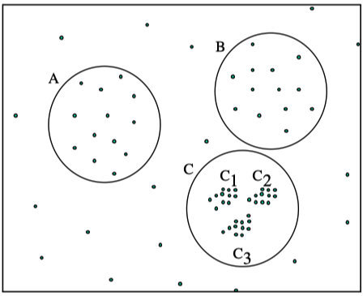
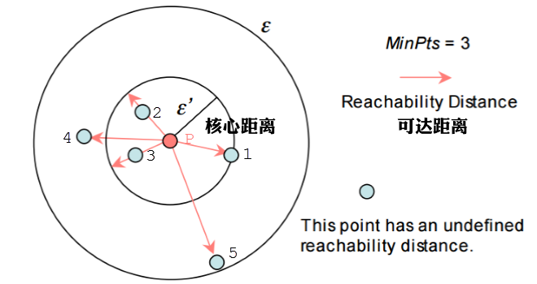
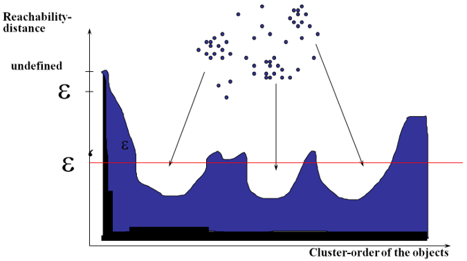
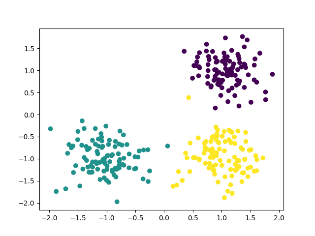
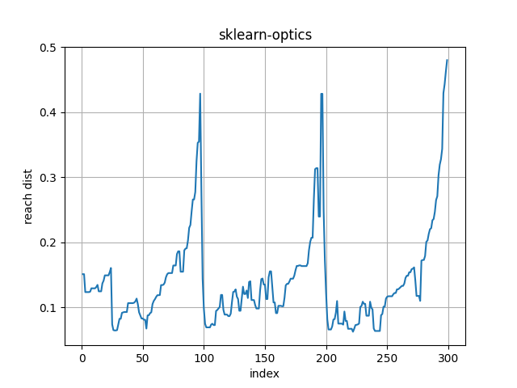
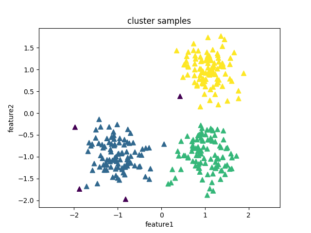

# OPTICS简介
在DBSCAN算法中，手动设置了两个初始参数$\epsilon$(邻域半径)和MinPts($\epsilon$邻域最少点数目)，当数据密度不均匀的时候，如果设置了较小的$\epsilon$值，则较稀疏的cluster中的节点密度会小于M，会被认为是边界点而不被用于进一步的扩展；如果设置了较大的值，则密度较大且离的比较近的cluster容易被划分为同一个cluster，如下图所示。

    

**如果设置较大的$\epsilon$，将会获得A,B,C这3个簇。如果设置较小的$\epsilon$，将会只获得C1、C2、C3这3个簇。**              
对于密度不均的数据选取一个合适的是很困难的，对于高维数据，由于维度灾难(Curse of dimensionality),的选取将变得更加困难。    
OPTICS(Ordering Points To Identify the Clustering Structure, OPTICS)实际上是DBSCAN算法的一种有效扩展，**主要解决对输入参数敏感的问题。**即选取有限个邻域参数$\epsilon_i$($0 \leq \epsilon_i \leq \epsilon$)进行聚类，这样就能**得到不同邻域参数下的聚类结果。**     

# 实质
**OPTICS算法并不能直接得到样本点的所属类别**，而是得到一个根据最小可达距离排序的样本序列，从这个队列中可以获取任意密度的聚类。即OPTICS可以在minPts固定的前提下，对于任意的$\epsilon_i$(其中$0 \leq \epsilon_i \leq \epsilon$)都可以直接经过简单的计算得到新的聚类结果。

# 概念      

* 直接密度可达(密度直达):如果**P为核心点**，Q在P的$\epsilon$邻域内，那么称P到Q密度直达(或称Q由P密度可达)。任何核心点到其自身密度直达，密度直达**不具有对称性**，如果P到Q密度可达，那么Q到P不一定密度可达。   

* 核心距离(core-distance):样本$x \in X$,根据给定的$\epsilon$和MinPts，使得x成为核心点的最小邻域半径称为的核心距离$cd(x)$(也就是核心点x按距离大小到第MinPts个密度直达点的距离)。**如果x不是核心点，其核心、可达距离无意义。**                

* 可达距离(reachability-distance):设$x,y \in X$,对于给定的参数$\epsilon$和M，y关于x的可达距离定义为:    

$$rd(y,x)= \begin{cases}
无意义，|N_{\epsilon}(x)| < M \\
max \{cd(x),d(x,y)\},|N_{\epsilon}(x)| \geq M \\
\end{cases}
$$

其中，$N_{\epsilon}^i$表示在集合$N_{\epsilon}$中与节点$x$第$i$近邻的节点，如$N_{\epsilon}^1$表示$N_{\epsilon}$中与$x$最近的节点，如果$x$为核心点，则必然会有$cd(x)\leq\epsilon$。     

>可达距离的意义在于衡量所在的密度，密度越大，他从相邻节点直接密度可达的距离越小，如果聚类时想要朝着数据尽量稠密的空间进行扩张，那么可达距离最小是最佳的选择。   

举例，下图中假设minPts=3，半径是ε。那么P点的核心距离是d(1,P)，点2的可达距离是d(1,P)，点3的可达距离也是d(1,P)，点4的可达距离则是d(4,P)的距离。   


# 算法步骤
输入:样本集D, 邻域半径ε, 给定点在ε领域内成为核心对象的最小领域点数MinPts       
输出:具有可达距离信息的样本点输出排序     

相对比较复杂，可以参考: [https://www.biaodianfu.com/optics.html#OPTICS%E9%82%BB%E5%9F%9F%E5%8D%8A%E5%BE%84%CE%B5](https://www.biaodianfu.com/optics.html#OPTICS%E9%82%BB%E5%9F%9F%E5%8D%8A%E5%BE%84%CE%B5)       

该算法最终获取知识是一个输出序列，该序列按照密度不同将相近密度的点聚合在一起，而不是输出该点所属的具体类别，如果要获取该点所属的类型，需要再设置一个参数$\epsilon_i$(一般取最低峰值偏下一点的y值)提取出具体的类别。如下图所示:     
     

# 核心思想

* 较稠密簇中的对象在簇排序中相互靠近
* 一个对象的最小可达距离给出了一个对象连接到一个稠密簇的最短路径
* 每个团簇的深浅代表了团簇的紧密程度，我们可以在这基础上采用DBSCAN（选取最优的Eps）或层次聚类方法对数据进行聚类。

# 实例
1、用sklearn中的make_blobs函数生成数据集    
sklearn.datasets.make_blobs(n_samples=100, n_features=2, centers=3, cluster_std=1.0, center_box=(-10.0, 10.0), shuffle=True, random_state=None)    

该函数常常用来生成聚类算法的测试数据，其中:    

* n_features表示每一个样本有多少特征值
* n_samples表示样本的个数
* centers是聚类中心点的个数，可以理解为label的种类数
* random_state是随机种子，可以固定生成的数据
* cluster_std设置每个类别的方差

```python
import matplotlib.pyplot as plt
import numpy as np
from sklearn.cluster import OPTICS
from sklearn.datasets import make_blobs

center = [[1, 1], [-1, -1], [1, -1]]  #聚类中心个数，这里给出了坐标
cluster_std = 0.35
X, Y = make_blobs(n_samples=300, centers=center,
                        n_features=2, cluster_std=cluster_std, random_state=1)
plt.scatter(X[:,0],X[:,1],c=Y)
plt.show(
```


2、利用OPTICS方法进行聚类 [参数详情](https://scikit-learn.org.cn/view/390.html)        
```python
import matplotlib.pyplot as plt
import numpy as np
from sklearn.cluster import OPTICS
from sklearn.datasets import make_blobs
from sklearn.cluster import dbscan

center = [[1, 1], [-1, -1], [1, -1]]  #聚类中心个数，这里给出了坐标
cluster_std = 0.35
X, Y = make_blobs(n_samples=300, centers=center,
                        n_features=2, cluster_std=cluster_std, random_state=1)

# plt.scatter(X[:,0],X[:,1],c=Y)
# plt.show()

#max_eps相当于初始eps，eps是根据上可达距离图确定，采用"dbscan"时才用到
model = OPTICS(max_eps=np.inf,eps=0.4,min_samples=5,cluster_method="dbscan")  
model.fit(X)
#按照可达距离从小到大排序的样本点索引列表
list_index = model.ordering_
# 按聚类顺序访问每个样本的可达距离。
rdist = model.reachability_[list_index]
#返回聚类标签
labels = model.labels_  
# print(labels)

#也可以根据可达距离选取合适的eps，直接利用dbscan函数
# from sklearn.cluster import dbscan
# c,labels = dbscan(X,eps=0.4,min_samples=5)   

plt.plot(range(X.shape[0]),rdist,markeredgewidth=3,linestyle='-')
plt.title("sklearn-optics")
plt.grid()
plt.xlabel("index")
plt.ylabel("reach dist")

plt.figure()
plt.scatter(X[:,0],X[:,1],s=50,c=labels,marker="^")
plt.title("cluster samples")
plt.xlabel("feature1")
plt.ylabel("feature2")
plt.axis("equal")
plt.show()
```
    



     
[optics简单实例](https://blog.csdn.net/weixin_45228198/article/details/114807401)