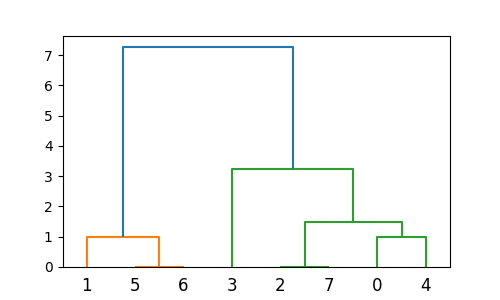
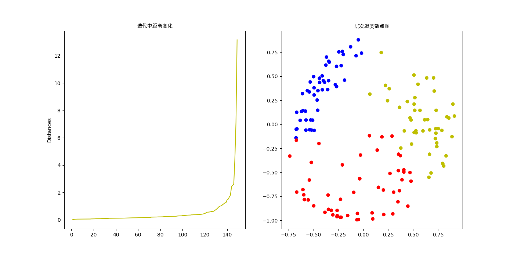

# 层次聚类简介 
层次聚类（Hierarchical clustering）是聚类算法的一种，通过计算不同类别数据点间的相似度来创建一棵有层次的嵌套聚类树。  
在聚类树中，不同类别的原始数据点是树的最低层，树的顶层是一个聚类的根节点。    
属于无监督学习。       
属于贪心算法（又称贪婪算法）：在对问题求解时，总是做出在当前看来是最好的选择。也就是说，不从整体最优上加以考虑，算法得到的是在某种意义上的局部最优解。        
层次聚类可以弥补Kmeans聚类的不足，**层次聚类不需要提前确定K值**，而且层次聚类**可以处理不规则的散点图**。        


# 两种方式
 
* Agglomerative 层次聚类：又称自底向上（bottom-up）的层次聚类，每一个对象最开始都是一个 cluster，每次按一定的准则将最相近的两个 cluster 合并生成一个新的 cluster，如此往复，直至最终所有的对象都属于一个 cluster。这里主要关注此类算法。  
* Divisive 层次聚类： 又称自顶向下（top-down）的层次聚类，最开始所有的对象均属于一个 cluster，每次按一定的准则将某个 cluster 划分为多个 cluster，如此往复，直至每个对象均是一个 cluster。  

# 基本流程
以Agglomerative为例,首先把每个对象作为一个簇，然后通过计算簇与簇的距离，合并距离最小的两个簇，也就是说每次结果的总簇数将减一，直到只有一个簇为止。   
采用平均距离的层次聚类算法流程：   
(1) 将每个对象看作一类，计算两两之间的距离；  
(2) 将距离最小的两个类合并成一个新类；  
(3) 重新计算新类与所有类之间的距离；  
(4) 重复(2)、(3)，直到所有类最后合并成一类。  

# 实例
1、利用scipy库中方法进行层次聚类    
**注意:**linkage方法返回一个矩阵,一共有8个元素，需要进行7次聚类，所以Z有7行。每一行有四个元素，前两个是进行cluster操作的向量的索引值，第三个是dist，第四个是该类目前有几个元素。在生成新的cluster后，其会被赋予索引值8,9,10等，一点一点往上加，这也是为什么只有8个元素但是最后几行的索引值有10+。    

```python
from scipy.cluster.hierarchy import dendrogram, linkage
from matplotlib import pyplot as plt

X = [[i] for i in [2, 8, 0, 4, 1, 9, 9, 0]]
Z = linkage(X, 'average')   
fig = plt.figure(figsize=(5, 3))
dn = dendrogram(Z)  # 系统树图
plt.show()
print(Z)
```
```
[[ 5.          6.          0.          2.        ]
 [ 2.          7.          0.          2.        ]
 [ 0.          4.          1.          2.        ]
 [ 1.          8.          1.          3.        ]
 [ 9.         10.          1.5         4.        ]
 [ 3.         12.          3.25        5.        ]
 [11.         13.          7.26666667  8.        ]]
```
     

[scipy.cluster.hierarchy方法及参数](https://blog.csdn.net/Petersburg/article/details/121981388)    

2、利用鸢尾花数据进行层次聚类分析，Iris 鸢尾花数据集内包含 3 类分别为山鸢尾（Iris-setosa）、变色鸢尾（Iris-versicolor）和维吉尼亚鸢尾（Iris-virginica），共 150 条记录，每类各 50 个数据，每条记录都有 4 项特征：花萼长度（sepal length）、花萼宽度（sepal width）、花瓣长度（petal length）、花瓣宽度（petal width）。    

```python
from sklearn.datasets import load_iris
import matplotlib.pyplot as plt
from sklearn.cluster import AgglomerativeClustering
from sklearn.preprocessing import normalize,StandardScaler

iris = load_iris()
X = iris.data
# print(iris.keys()) #查看数据标签
target = iris.target
scaler = StandardScaler()
X_scaled = scaler.fit_transform(X)  #标准化
X_normalized = normalize(X_scaled)  #正则化
model = AgglomerativeClustering(n_clusters=None,distance_threshold=5) #距离阈值高于该阈值(5)，聚类将不会合并。
model = model.fit(X_normalized)
labels = model.fit_predict(X_normalized)
 
distances = model.distances_
x = range(1,len(distances)+1)

colors = ['r','b','y','k','m']
plt.figure(figsize=(14,7))
ax1 = plt.subplot(1,2,1)
ax2 = plt.subplot(1,2,2)
ax1.plot(x,distances,color='y',linewidth=1.5,linestyle='-')
ax1.set_ylabel('Distances')
ax1.set_title("迭代中距离变化",fontproperties='SimHei')    #相当于所在迭代次数的根节点，对应子节点(两类)的距离
ax2.scatter(X_normalized[:,0],X_normalized[:,1],color=[colors[i] for i in labels])
ax2.set_title('层次聚类散点图',fontproperties='SimHei')
plt.show()
```


[https://zhuanlan.zhihu.com/p/451202437](https://zhuanlan.zhihu.com/p/451202437)
[AgglomerativeClustering参数](http://www.manongjc.com/detail/31-uycwwsgdefbcmua.html)