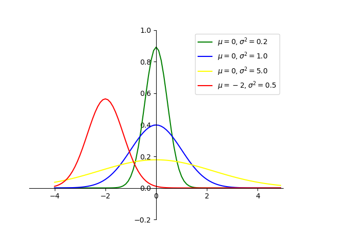

# 高斯混合模型(Gaussian Mixture Model,GMM)
顾名思义，高斯混合模型就是多个高斯分布的混合（叠加），其可作为无监督学习中的一个聚类算法，与k-means算法类似，但GMM属于软分类，k-means算法属于硬分类。通俗来讲，GMM不光告诉我们哪个数据点属于哪个群集，而且为我们提供给定数据点属于每个可能群集的概率。
>基本思想：用多个高斯分布函数去近似任意形状的概率分布，所以GMM就是由多个单高斯密度分布（Gaussian）组成的，每个Gaussian叫一个"Component"，这些"Component"加权平均即为 GMM 的概率密度函数。将待聚类的数据点看成是分布的采样点，通过采样点利用类似极大似然估计的方法估计高斯分布的参数，求出参数（用EM算法求解）即得出了数据点对分类的隶属函数。

## 高斯模型
正态分布（Normal Distribution）,也称常态分布，又名高斯分布（Gaussian Distribution）,又是一个常见的连续概率分布。   
若随机变量X服从一个数学期望$\mu$,方差为$\sigma^2$的正态分布，期望值$\mu$决定了其位置，其标准差$\sigma$决定了分布的幅度。正态分布的概率密度函数曲线呈钟形，因此又称之为钟形曲线。当$\mu=0$,标准差$\sigma=1$时的正态分布是标准正态分布。

任意正态分布x~N($\mu$,$\sigma^2$)，其中$\mu$为均值，$\sigma$为标准差，概率密度函数展开式为：
$$
p(x)=\frac {1}{\sqrt{2\pi}\sigma}e^{-\frac{(x-\mu)^2}{2\sigma^2}}
$$
 

# 高斯混合聚类
GMM 的概率密度函数:
$$
p(x)=\Sigma_{k=1}^Kp_kp(x|k)=\Sigma_{k=1}^K\alpha_kp(x|\mu_k,\Sigma_k)
$$
* K：模型的个数，即Component的个数（聚类的个数）
* $\alpha_k$为属于第k个高斯的概率（也称为先验分布），其需要满足大于零，且对一个x而言 
$\alpha_k$之和等于1
* p(x|k)为第k个高斯模型的概率密度，其均值向量为$\mu_k$,$\Sigma_k$为协方差矩阵   
**K是人工给定，其他参数都需要通过EM算法进行估计**

聚类过程：

1) 设置k的个数，即初始化高斯混合模型的成分个数。（随机初始化每个簇的高斯分布参数（均值和方差）。也可观察数据给出一个相对精确的均值和方差）

2) 计算每个数据点属于每个高斯模型的概率，即计算后验概率。（点越靠近高斯分布的中心，则概率越大，即属于该簇可能性更高）

3) 计算 
 参数使得数据点的概率最大化，使用数据点概率的加权来计算这些新的参数，权重就是数据点属于该簇的概率。

4) 重复迭代2和3直到收敛。

**注：**  
高斯模型，主要是由方差和均值两个参数决定，对均值和方差的学习,采取不同的学习机制，将直接影响到模型的稳定性、精确性和收敛性。
前提假设数据集服从高斯混合分布
K-Means是GMM的特例，即方差在所有维度上都接近于0时簇就会呈现出圆形
聚类评估，并选择最优k个数，模型中封装了Akaike information criterion (AIC) 、Bayesian information criterion (BIC)两种评价方法。最佳的聚类数目是使得AIC或BIC最小化的值。


**优点：**  
GMM使用均值和标准差，簇可以呈现出椭圆形，优于k-means的圆形
GMM是使用概率，故一个数据点可以属于多个簇   

**缺点：**   
容易收敛到局部最优解。对于 K-means，通常是重复多次然后取最好的结果，但GMM 每次迭代的计算量比 K-means 要大很多，一般是先用 K-means（重复并取最优值），然后将聚类中心点（cluster_centers_）作为GMM的初始值进行训练。

# 代码
## make_blobs函数
**make_blobs函数是为聚类产生数据集，产生一个数据集和相应的标签**

sklearn.datasets.make_blobs(n_samples=100,n_features=2,centers=3, cluster_std=1.0,center_box=(-10.0,10.0),shuffle=True,random_state=None)

* n_samples:表示数据样本点个数,默认值100
* n_features:是每个样本的特征（或属性）数，也表示数据的维度，默认值是2
* centers:表示类别数（标签的种类数），默认值3
* cluster_std:表示每个类别的方差，例如我们希望生成2类数据，其中一类比另一类具有更大的方差，可以将cluster_std设置为[1.0,3.0]，浮点数或者浮点数序列，默认值1.0
* center_box：中心确定之后的数据边界，默认值(-10.0, 10.0)
* shuffle ：将数据进行洗乱，默认值是True
* random_state:官网解释是随机生成器的种子，可以固定生成的数据，给定数之后，每次生成的数据集就是固定的。若不给定值，则由于随机性将导致每次运行程序所获得的的结果可能有所不同。在使用数据生成器练习机器学习算法练习或python练习时建议给定数值。

```
import matplotlib.pyplot as plt
import numpy as np
from sklearn.datasets import make_blobs
#样本数300，样本含四个特征(属性)，即样本标签y=4
x, y = make_blobs(n_samples=300, centers=4, cluster_std=0.60, random_state=0)
print(x.shape)
print(y.shape)
#以第一个样本特征(x[:,0])为x轴,以第二个样本特征(x[:,1])为y轴
plt.scatter(x[:,0],x[:,1],c=y,s=30)
plt.show()
```

```
(300, 2)
(300,)
```
 

## scikit-learn中的GaussianMixture函数

sklearn.mixture.GaussianMixture(n_components=1, covariance_type='full', tol=0.001, max_iter=100, init_params='kmeans')   
* n_components ：高斯模型的个数，即聚类个数
* covariance_type : 通过EM算法估算参数时使用的协方差类型：‘full’,‘tied’, ‘diag’, ‘spherical’，默认"full"
>full：每个模型使用自己的一般协方差矩阵  
tied：所有模型共享一个一般协方差矩阵  
diag：每个模型使用自己的对角线协方差矩阵   
spherical：每个模型使用自己的单一方差   
* tol：EM 迭代停止阈值，默认为 1e-3    
* reg_covar：协方差对角非负正则化，保证协方差矩阵均为正，默认为 0   
* max_iter：最大迭代次数，默认为100
* n_init：初始化次数，用于产生最佳初始参数，默认为 1
*init_params：初始化参数类型：‘kmeans’, ‘random’，默认用 kmeans 实现，也可选择随机产生

## 返回函数
aic(X)：输入 X 上当前模型的 aic（X）Akaike 信息标准。   
bic(X)：输入 X 上当前模型的 bic（X）贝叶斯信息准则。   
fit(X[, y])：使用 EM 算法估算模型参数。   
get_params([deep])：获取此估算器的参数。   
predict(X)：预测（X）使用训练模型预测 X 中数据样本的标签。    
predict_proba(X)：预测给定数据的每个组件的后验概率。   
sample([n_samples])：从拟合的高斯分布生成随机样本。   
score(X[, y])：计算给定数据 X 的每样本平均对数似然。   
score_samples(X)：计算每个样本的加权对数概率。   
set_params(**params)：设置此估算器的参数。

## 高斯混合聚类代码
```
import numpy as np
from sklearn.datasets import make_blobs
from sklearn.mixture import GaussianMixture
from matplotlib import pyplot as plt
import seaborn as sns

X, y = make_blobs(n_samples=300, centers=4, cluster_std=0.60, random_state=0)
n_components = np.arange(1, 21)
models = [GaussianMixture(n, covariance_type='full', random_state=0).fit(X) for n in n_components]
plt.plot(n_components, [m.bic(X) for m in models], label='BIC')
plt.plot(n_components, [m.aic(X) for m in models], label='AIC')
plt.legend(loc='best')
plt.xlabel('n_components')

# 由上图可知，群集的最佳数量（K）的值为4，即使Akaike信息标准（AIC）或贝叶斯信息标准（BIC）最小的值。
gmm = GaussianMixture(n_components=4)
gmm.fit(X)
labels = gmm.predict(X)  #返回所属类别列表[1,2,0,2...]
plt.scatter(X[:, 0], X[:, 1], c=labels, s=50, cmap='viridis')
plt.show()
```


**由上图可知，群集的最佳数量（K）的值为4，即使Akaike信息标准（AIC）或贝叶斯信息标准（BIC）最小的值。**


参考链接：  
[如何通俗的理解高斯混合模型（Gaussian Mixture Models）](https://zhuanlan.zhihu.com/p/151671154)    
[通俗易懂解释高斯混合聚类原理](https://blog.csdn.net/lotusng/article/details/79990724)  
[sklearn官方文档GaussianMixture](https://scikit-learn.org/stable/modules/generated/sklearn.mixture.GaussianMixture.html)