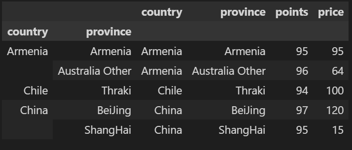
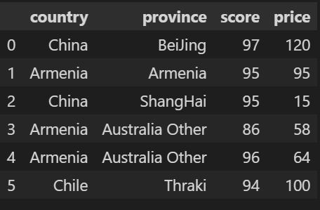
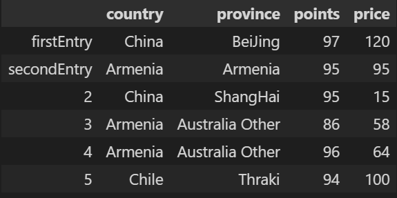
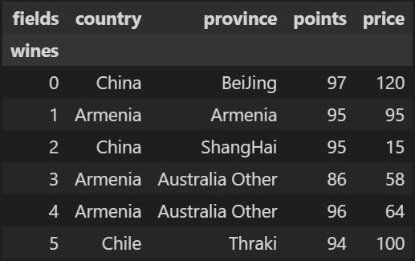

# 建立数据集
```python
import pandas as pd

reviews = pd.DataFrame({'country':['China','Armenia','China','Armenia','Armenia','Chile'],
'province':['BeiJing','Armenia','ShangHai','Australia Other','Australia Other','Thraki'],
'points':[97,95,95,86,96,94],'price':[120,95,15,58,64,100]})
```

   index |country	|province|	points|	price
--|--|--|--|--
0	|China	|BeiJing	|97	|120
1	|Armenia|	Armenia|	95	|95
2	|China|	ShangHai	|95|	15
3	|Armenia	|Australia Other	|86|	58
4	|Armenia	|Australia Other	|96	|64
5	|Chile	|Thraki	|94	|100

# pandas中describe()

>1、count：返回数组的个数，如上述为4个元素，所以返回为4；   
2、mean：返回数组的平均值，1 3 5 9的平均值为4.5；  
3、std：返回数组的标准差；  
4、min：返回数组的最小值；   
5、25%，50%，75%：返回数组的三个不同百分位置的数值，也就是统计学中的四分位数，其中50%对应的是中位数。   
6、max：返回列表的最大值。  

```python
reviews.describe()
```

  index |points|	price
--|--|--
count|	6.000000|	6.000000
mean|	93.833333|	75.333333
std|	3.970726|	37.574814
min|	86.000000|	15.000000
25%|	94.250000|	59.500000
50%|	95.000000|	79.500000
75%|	95.750000|	98.750000
max|	97.000000|	120.000000

```python
# 也可以具体到某个列属性
reviews.points.describe()
```

```python
reviews.country.unique()
```
```
array(['China', 'Armenia', 'Chile'], dtype=object)
```

# groupby()
实现分组操作，直接使用会得到一个DataFrameGroupBy对象。其就是将原有的DataFrame按照groupby的字段，划分为若干个分组DataFrame，被分为多少个组就有多少个分组DataFrame。**所以说，在groupby之后的一系列操作（如agg、apply等），均是基于子DataFrame的操作**。     

按points值进行分组    
```python
reviews.groupby('points')
```
```
<pandas.core.groupby.generic.DataFrameGroupBy object at 0x000002C5A488FD30>
```

统计每组非None，NaN，NaT,numpy.inf值个数    
```python
reviews.groupby('points').points.count() 
```
```
points
86    1
94    1
95    2
96    1
97    1
Name: points, dtype: int64
```

## apply
按country分组，返回每组的province数据
```python
reviews.groupby('country').apply(lambda df:df.province.iloc[:])  #若iloc[0]，则返回每组第一个province
```
```
country   
Armenia  1            Armenia
         3    Australia Other
         4    Australia Other
Chile    5             Thraki
China    0            BeiJing
         2           ShangHai
Name: province, dtype: object
```

以country和province两个值进行分组，返回points最大的行
```python
reviews.groupby(['country','province']).apply(lambda df:df.loc[df.points.idxmax()])
```



## agg聚合操作
常用的函数：    
min:最小值；max:最大值；sum:求和；mean:平均值；median:中位数；std:标准差；var:方差；count:计数     


以country进行分组，返回每组的个数，以及price的最小值，最大值   
```python
countries_reviewed = reviews.groupby(['country']).price.agg([len,min,max])
countries_reviewed
```

# sort_values()
[参数详情](https://blog.csdn.net/MsSpark/article/details/83154128)    

以country进行分组，利用聚合操作得到每组包含的样本个数，并根据len进行排序
```python
countries_reviewed1 = reviews.groupby(['country']).price.agg([len])
countries_reviewed1 = countries_reviewed1.reset_index()
countries_reviewed1.sort_values(by='len',ascending=True)  #默认升序
```
```
    country	len
1	Chile	1
2	China	2
0	Armenia	3
```

# 练习
1、选取分数(points)和价格(price)比率最大的数据     
```python
bargain_idx = (reviews.points/reviews.price).idxmax(axis=0)  #axis=0按列计算，idxmax返回对应索引
reviews.loc[bargain_idx]
```
```
country        China
province    ShangHai
points            95
price             15
Name: 2, dtype: object
```

# rename
修改points列名     
```python
reviews.rename(columns={'points':'score'})      
```



修改行名
```python
reviews.rename(index={0:'firstEntry',1:'secondEntry'})
```


给行、列索引进行命名    
```python
# reviews.rename_axis('wine',axis=1).rename_axis('filed',axis=0)
reviews.rename_axis('wines',axis='rows').rename_axis('fields',axis='columns') #给行列索引命名,rows可以替换为1，columns替换为0
```
  

[groupby:https://zhuanlan.zhihu.com/p/101284491](https://zhuanlan.zhihu.com/p/101284491)