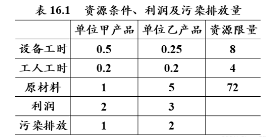

# 多目标规划
多目标规划就是多个目标函数在给定区域上的最优化。又称多目标最优化。我们需要衡量出尽量满足所有需求而得出使得目标最优（如收益最大）的方案。    
**一般都是用LINGO求解优化问题。**

**方法一，线性加权法：**     
该方法应用的关键是要确定每个目标的权重，它反映不同目标在决策者心中的重要程度，重要程度高的权重就大，重要程度低的权重就小。权重的确定一般由决策者给出，因而具有较大的主观性，不同的决策者给的权重可能不同，从而会使计算的结果不同。

**方法二，理想点法：**    
以每个单目标最优值为该目标的理想值，使每个目标函数值与理想值的差的加权平方和最小。

**方法三，优先级法：**    
根据目标重要性分成不同优先级，先求优先级高的目标函数的最优值，在确保优先级高的目标获得不低于最优值的条件下，再求优先级低的目标函数。该方法适用于目标有明显轻重之分的问题，也就是说，各目标的重要性差距比较大，首先确保最重要的目标，然后再考虑其他目标。在同一等级的目标可能会有多个，这些目标的重要性没有明显差的距，可以用加权方法求解。

# 实例
某公司考虑生产两种光电太阳能电池：产品甲和产品乙。这种生产会引起空气放射性污染。因此，公司经理有两个目标：极大化利润与极小化总的放射性污染。已知在一个生产周期内，每单位产品的收益、放射性污染排放量、机器能力(小时)、装配能力（人时）和可用的原材料（单位）的限制如表16.1所示。假设市场需求无限制，两种产品的产量和至少为10，则公司该如何安排一个生产周期内的生产。  

  

**分析：**设甲乙两种产品在一个生产周期内的产量分别为$x_1$和$x_2$,则该问题的目标函数为利润极大化：$max:f_1=2x_1+3x_2$,并且污染极小化：$min: f_2=x_1+2x_2$得：  

$$min\{-f_1(x),f_2(x)\}$$

$$
s.t. = \begin{cases}
0.5x_1+0.25x_2\leqslant 8 \\
0.2x_1+0.2x_2\leqslant 4\\
x_1+5x_2\leqslant 72\\
x_1+x_2\geqslant 10\\
x_1,x_2\geqslant 0\\
\end{cases}
$$

**方法一求解：**两个目标函数的权重都取0.5，把上述多目标规划问题转化为如下线性规划问题：       

$$min\quad 0.5(-2x_1-3x_2)+0.5(x_1+2x_2)$$

$$
s.t. = \begin{cases}
0.5x_1+0.25x_2\leqslant 8 \\
0.2x_1+0.2x_2\leqslant 4\\
x_1+5x_2\leqslant 72\\
x_1+x_2\geqslant 10\\
x_1,x_2\geqslant 0\\
\end{cases}
$$

结果：$x_1=7,x_2=13,f_1=53,f_2=33$

**方法二求解：**   
先使利润最大化    

$$min\quad -2x_1-3x_2$$

$$
s.t. = \begin{cases}
0.5x_1+0.25x_2\leqslant 8 \\
0.2x_1+0.2x_2\leqslant 4\\
x_1+5x_2\leqslant 72\\
x_1+x_2\geqslant 10\\
x_1,x_2\geqslant 0\\
\end{cases}
$$

结果：$x_1=7,x_2=13,f_1=2x_1+3x_2=53$

再使污染最小化    

$$min\quad x_1+2x_2$$

$$
s.t. = \begin{cases}
0.5x_1+0.25x_2\leqslant 8 \\
0.2x_1+0.2x_2\leqslant 4\\
x_1+5x_2\leqslant 72\\
x_1+x_2\geqslant 10\\
x_1,x_2\geqslant 0\\
\end{cases}
$$

结果：$x_1=10,x_2=0,f_2=x_1+2x_2=10$

构造每个目标与最优值的差的平方和，作为新的目标函数，转化为求解二次规划问题：  

$$min\quad (-2x_1-3x_2+53)^2+(x_1+2x_2-10)^2$$

$$
s.t. = \begin{cases}
0.5x_1+0.25x_2\leqslant 8 \\
0.2x_1+0.2x_2\leqslant 4\\
x_1+5x_2\leqslant 72\\
x_1+x_2\geqslant 10\\
x_1,x_2\geqslant 0\\
\end{cases}
$$

结果：$x_1=13.36,x_2=5.28,f_1=42.56,f_2=23.92$

**方法三求解：**由理想点解知，第一个目标函数的最优值为-53。以第二个目标函数作为目标函数，问题的原始约束条件再加第一个目标函数等于其最优值的约束条件，构造如下的线性规划模型：   

$$min\quad x_1+2x_2$$

$$
s.t. = \begin{cases}
0.5x_1+0.25x_2\leqslant 8 \\
0.2x_1+0.2x_2\leqslant 4\\
x_1+5x_2\leqslant 72\\
x_1+x_2\geqslant 10\\
-2x_1-3x_2=-53\\
x_1,x_2\geqslant 0\\
\end{cases}
$$

结果：$x_1=7,x_2=13,f_1=53,f_2=33$

#python代码  
```python
import numpy as np
import cvxpy as cp
 
c1 = np.array([-2, -3])
c2 = np.array([1, 2])
a = np.array([[0.5, 0.25], [0.2, 0.2], [1, 5], [-1, -1]])
b = np.array([8, 4, 72, -10])
x = cp.Variable(2, pos=True)
 
# 1.线性加权法求解
obj = cp.Minimize(0.5*(c1+c2)@x)
con = [a@x <= b]
prob = cp.Problem(obj, con)
prob.solve(solver='GLPK_MI')
print('\n======1.线性加权法======\n')
print('解法一理想解：', x.value)
print('利润：', -c1@x.value)
print('污染排放：', c2@x.value)
 
# 2.理想点法求解
obj1 = cp.Minimize(c1@x)
prob1 = cp.Problem(obj1, con)
prob1.solve(solver='GLPK_MI')
v1 = prob1.value  # 第一个目标函数的最优值
obj2 = cp.Minimize(c2@x)
prob2 = cp.Problem(obj2, con)
prob2.solve(solver='GLPK_MI')
v2 = prob2.value  # 第二个目标函数的最优值
print('\n======2.理想点法======\n')
print('两个目标函数的最优值分别为：', v1, v2)
obj3 = cp.Minimize((c1@x-v1)**2+(c2@x-v2)**2)
prob3 = cp.Problem(obj3, con)
prob3.solve(solver='CVXOPT')  # GLPK_MI 解不了二次规划，只能用CVXOPT求解器
print('解法二的理想解：', x.value)
print('利润：', -c1@x.value)
print('污染排放：', c2@x.value)
 
# 3.序贯法求解
con.append(c1@x == v1)
prob4 = cp.Problem(obj2, con)
prob4.solve(solver='GLPK_MI')
x3 = x.value  # 提出最优解的值
print('\n======3.序贯法======\n')
print('解法三的理想解：', x3)
print('利润：', -c1@x3)
print('污染排放：', c2@x3)
```
输出：
```
======1.线性加权法======

解法一理想解： [12.  8.]
利润： 47.99999999999999
污染排放： 27.999999999999993

======2.理想点法======

两个目标函数的最优值分别为： -53.0 10.0
解法二的理想解： [13.3598425   5.28031523]
利润： 42.560630693008314
污染排放： 23.92047296333103

======3.序贯法======

解法三的理想解： [ 7. 13.]
利润： 53.0
污染排放： 33.0
```

[Matlab代码](https://blog.csdn.net/herry57/article/details/125702575)    
[python线性规划](https://blog.csdn.net/dashbaani/article/details/126334427)