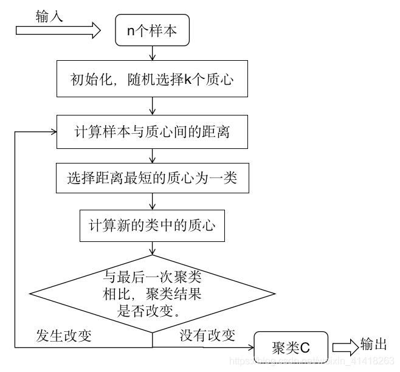
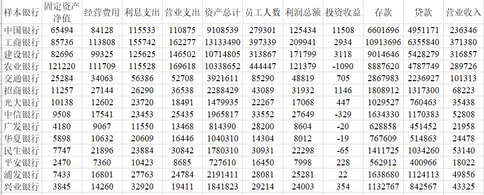

# K-means聚类    
K均值聚类（k-means）是基于样本集合划分的聚类算法。K均值聚类将样本集合划分为k个子集，构成k个类，将n个样本分到k个类中，每个样本到其所属类的中心距离最小，每个样本仅属于一个类，这就是k均值聚类，同时根据一个样本仅属于一个类，也表示了k均值聚类是一种硬聚类算法。
# 基本步骤   
假设有n个样本，m表示样本维度(指标变量)，k表示聚类个数。  

**1、**一般情况下，为消除数据量纲的影响，会对数据先进行标准化处理  

$$b_{ij}=\frac{a_{ij}-\bar a_j}{s_j}$$  

其中$i=1,2,3,\dots,n$; $j=1,2,3,\dots,m$; $\bar a_j=\frac{1}{n}\sum_{i=1}^{n}a_{ij}$; $s_j=\sqrt{\frac{1}{n-1}\sum_{i=1}^n(a_{ij}-\bar a_j)^2}$  

**2、**在n个样本中随机选取K个，对应的m个指标值做初值向量。记为K个初值聚类中心${\{u_1,u_2,\dots,u_k}\}$。   

其中$u_k={b_{i1},b_{i2},\dots,b_{im}}$,i为所选K个初始聚类中心所在的行索引。  

**3、**针对初始化选择的聚类中心，计算所以样本到每个中心的距离，按照最小距离原则分配到最邻近聚类，一般采用欧氏距离。  

$$d(x_i,u_k)=\sqrt{\sum_{k=1}^n(x_{ik}-u_k)^2}$$   

其中$x_i$代表任意一个样本，计算出的距离越小，说明它与聚类中新$u_k$的相似性越高，反之距离越小，差异度较大。   

**4、**计算每个聚类中所有点坐标的平均值，并将这个平均值作为新的聚类中心。    

$$\bar x_i=\frac{1}{|u_i|}\sum_x\in u_ix$$  

其中$i=1,2,\dots,k$

**5、**反复执行上述步骤，直到聚类中心不再发生变化或达到设定的迭代次数，距离误差相对较小，最终得到聚类结果。
计算样本到最近聚类中心的距离总和，做为误差准则。  

$$E=\sum_{i=1}^k\sum_{x\in u_i}||x-\bar x_i||$$

**具体流程图：**  
  

# 实例   
已知2010年14家银行信息，对其进行K-means聚类。  
   

**1、**为提高聚类结果的准确性，可以先利用**肘部法**或**轮廓系数法**确定最优聚类簇数k。下文采用肘部法。  

**inertias:**其是K均值模型对象的属性，表示样本距离最近的聚类中心的总和，它是作为在没有真实分类标签下的非监督式评估指标，
该值越小越好，值越小证明样本在类间的分布越集中，即类内的距离越小。

```python
import pandas as pd
import numpy as np
import matplotlib.pyplot as plt
from sklearn.preprocessing import StandardScaler
from sklearn.cluster import KMeans
from sklearn.decomposition import PCA

df = pd.read_excel('/数学建模/暑假培训/三年数据.xlsx',sheet_name='2010年',index_col=0)
columns = df.columns
index = df.index
data = np.array(df)
data_mean = np.mean(data,axis=0)
data_std = np.std(data,axis=0)   #计算每一列的标准差
data1 = (data-data_mean)/data_std
# pca = PCA(n_components=2)
# pca_data = pca.fit_transform(data1)
# print(data1)
# print(StandardScaler().fit_transform(data)) 标准化结果相同，对列标准化，对行用转置
# 确定k值
k = np.arange(1,8)
jarr = []
fig = plt.figure()
for i in k:
    model = KMeans(n_clusters=i)
    model.fit(data1)
    jarr.append(model.inertia_)
plt.plot(k,jarr,'bx-')
plt.xlabel('K值',fontproperties='SimHei')
plt.ylabel('聚类误差E',fontproperties='SimHei')
plt.title('K均值聚类肘部图',fontproperties='SimHei')
plt.show()
```    
 

**2、**进行K均值聚类。
```python
import pandas as pd
import numpy as np
import matplotlib.pyplot as plt
from sklearn.preprocessing import StandardScaler
from sklearn.cluster import KMeans

df = pd.read_excel('/数学建模/暑假培训/三年数据.xlsx',sheet_name='2010年',index_col=0)
columns = df.columns
index = df.index
data = np.array(df)
data_mean = np.mean(data,axis=0)
data_std = np.std(data,axis=0)   #计算每一列的标准差
data1 = (data-data_mean)/data_std

K = 4
model1 = KMeans(n_clusters=K)
model1.fit(data1)
Muk = model1.cluster_centers_
print(Muk)   #聚类中心坐标
ui = model1.predict(data1)
u1,u2,u3,u4 = [],[],[],[]
for i,j in enumerate(ui):
    if j==0:
        u1.append(index[i])
    elif j==1:
        u2.append(index[i])
    elif j==2:
        u3.append(index[i])
    elif j==3:
        u4.append(index[i])
print("第一类:",*u1)
print('第二类:',*u2)
print('第三类:',*u3)
print('第四类:',*u4)
plt.figure()
plt.scatter(data1[:,0],data1[:,1],c=ui,cmap=plt.cm.Paired)
plt.scatter(Muk[:,0],Muk[:,1],marker='*',s=60)
#给这几个点打标
for i in range(K):
    plt.annotate(f'第{i+1}类',(Muk[i,0],Muk[i,1]),fontproperties='SimHei')
plt.show()

```
  

```
[[ 2.35207782  1.77651927  1.25672422  1.90687569  1.41346835  2.09315217
   0.93586501 -0.8058846   1.52747097  1.23693717  1.40644991]
 [-0.60020674 -0.61485892 -0.60708853 -0.60797648 -0.61144243 -0.61179814
  -0.59506333 -0.36483604 -0.60722762 -0.60999079 -0.60854734]
 [ 0.88895831  1.07910013  1.25682796  0.88760693  1.12157491  1.0070794
   0.99843684  3.35024509  0.88022714  1.31631523  0.96357678]
 [ 1.38051564  1.6464849   1.77866656  1.64264107  1.7896905   1.50887493
   2.00816572  0.55199997  1.83228906  1.77332772  1.85772336]]

第一类: 农业银行
第二类: 交通银行 招商银行 光大银行 中信银行 广发银行 华夏银行 民生银行 平安银行 浦发银行 兴业银行
第三类: 中国银行
第四类: 工商银行 建设银行
```
