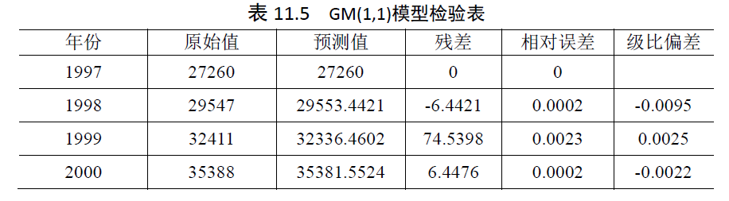
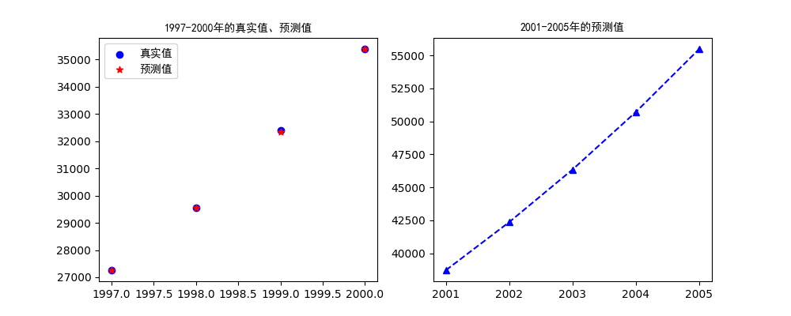

# 灰色预测模型(Grey Prediction Model)   
## 简介
灰色预测模型是通过少量的、不完全的信息，建立数学模型并作出预测的一种方法。常用的预测方法如回归分析和神经网络，需要较大容量的样本，若样本容量较小，常造成很大的误差，从而使得预测目标失效。  
灰色预测的主要特点是模型使用的不是原始数据序列，而是生成的数据序列。其核心体系是灰色模型（Grey Model，简称GM），**即对原始数据作累加生成、累减生成、均值生成、极比生成等，得到近似的指数规律再进行建模的方法。**    
## 优缺点   
**优点**：是不需要很多的数据，一般只需要4个数据就够，能解决历史数据少、序列的完整性及可靠性低的问题；能利用微分方程来充分挖掘系统的本质，精度高；能将无规律的原始数据进行生成得到规律性较强的生成序列，运算简便，易于检验，具有不考虑分布规律，不考虑变化趋势。   
**缺点**：是只适用于中短期的预测，只适合指数增长的预测。    

## 生成数据序列方法
(1)累加生成   

$$
\begin{equation}
\begin{split}
x^{(1)}&=(x^{(1)}(1),x^{(1)}(2),\dots,x^{(1)}(n))\\
&=(x^{(0)}(1),x^{(0)}(1)+x^{(0)}(2),\dots,x^{(0)}(1)+\cdots+x^{(0)}(n))
\end{split}
\end{equation}
$$  

(2)加权邻值生成    

$$
z^{(1)}=(z^{(1)}(2),z^{(1)}(3),\dots,z^{(1)}(n))
$$  

其中

$$
z^{(1)}(n)=\alpha x^{(1)}(n)+(1-\alpha)x^{(1)}(n-1)
$$

$\alpha$为加权值,当$\alpha=0.5$时，就称为均值生成，也称等权邻值生成。   

## GM(1,1)模型    
**GM:**灰色模型；
**(1,1):**只含有一个变量的一阶微分方程；   
  
已知原始数据序列$x^{(0)}=(x^{(0)}(1),x^{(0)}(2),\dots,x^{(0)}(n))$   

**1、级比检验**   
级比的计算： 

$$
\lambda(k)=\frac{x^{(0)}(k-1)}{x^{(0)}(k)},k=2,3,\dots,n
$$

级比分析用来判断灰色模型GM(1,1)能否解决某个问题，如果所有级比$\lambda(k)$都落在区间$(e^{(-\frac{2}{n+1})},e^{(\frac{2}{n+1})})$内，则序列$x^{(0)}$可以作为模型GM(1,1)的数据进行灰色预测。否则需要对数据进行线性变化，使其级比$\lambda_y(k)$满足要求。   
即取适当的常数c，做平移变化:   

$$
y^{(0)}(k)=x^{(0)}(k)+c ,k=1,2,\dots,n
$$

**2、建立模型**    
(1)对原始数据进行累加，得到$x^{(1)}$,其中$x^{(1)}(k)=\sum_{i=1}^kx^{(0)}(i)$    
(2)对累加生成之后的序列进行均值生成,得到$z^{(1)}$,其中$z^{(1)}(k)=0.5x^{(1)}(k-1)+0.5x^{(1)}(k)$    
(3)建立灰微分方程:     

$$
x^{(0)}(k)+az^{(1)}(k)=b,k=2,3,\dots,n
$$  

相应的白化微分方程为:      

$$
\frac{dx^{(1)}}{dt}+ax^{(1)}(t)=b
$$

记发展系数a和灰作用量b:   

$$
u = \begin{bmatrix}
a\\
b\\
\end{bmatrix}
$$

(4)构造数据矩阵B，及数据向量Y    

$$B=
\begin{bmatrix}
-z^{(1)}(2)\\
-z^{(1)}(3)\\
\vdots\\
-z^{(1)}(n)\\
\end{bmatrix}
=\begin{bmatrix}
-\frac{1}{2}(x^{(1)}(1)+x^{(1)}(2))&1\\
-\frac{1}{2}(x^{(1)}(2)+x^{(1)}(3))&1\\
\vdots&\vdots\\
-\frac{1}{2}(x^{(1)}(n-1)+x^{(1)}(n))&1\\
\end{bmatrix}
$$

$$
Y=\begin{bmatrix}
x^{(0)}(2)\\
x^{(0)}(3)\\
\vdots\\
x^{(0)}(n)\\
\end{bmatrix}
$$

由最小二乘法，求得使$J(u)=(Y-Bu)^T(Y-Bu)$达到最小值的u的估计值，即：  

$$
\hat u=\begin{bmatrix}
\hat a\\
\hat b\\
\end{bmatrix}
=(B^TB)^{-1}B^TY
$$

(5)建立模型求解时间响应函数并进行预测    
根据上述GM(1,1)灰微分方程对应的白化微分方程，利用如下时间响应函数，得到生成序列预测值      

$$
\hat x^{(1)}(k+1)=(x^{(0)}(1)-\frac{\hat b}{\hat a})e^{-\hat ak}+\frac{\hat b}{\hat a}\quad,k=1,2,\dots,n-1
$$

计算原始数据预测值   

$$
\hat x^{(0)}(k+1)=\hat x^{(1)}(k+1)-\hat x^{(1)}(k)\quad,k=1,2,\dots,n-1
$$

(6)检验预测值   
**残差检验**  
令残差为$\varepsilon(k)$,计算

$$
\varepsilon(k)=\frac{x^{(0)}(k)-\hat x^{(0)}(k)}{x^{(0)}(k)}\quad,k=1,2,\dots,n
$$
其中$\hat x^{(0)}(1)=x^{(0)}(1)$,如果$\varepsilon(k)<0.2$,则认为达到一般要求；$\varepsilon(k)<0.1$，则认为达到较高的要求。

**级比偏差值检验**   
首先由参考数据$x^{(0)}(k),x^{(0)}(k-1)$计算出级比$\lambda(k)$,再用发展系数a求出相应的级比偏差  

$$
\rho(k)=1-(\frac{1-0.5a}{1+0.5a})\lambda(k)
$$
如果$\rho(k)<0.2$,则认为达到一般要求；$\rho(k)<0.1$，则认为达到较高的要求。   

## 实例
预测1997到2005年产值   

年份|产值/万元
--|--
1997|27260
1998|29547
1999|32411
2000|35388

最终得到检验表：  


## 代码
```python
import numpy as np
import matplotlib.pylab as plt

data = np.array([27260,29547,32411,35388]) 
n = len(data)
# 计算级比
lambdas = data[:n-1]/data[1:]
#确定级比范围
min_la = np.exp(-2/(n+1))
max_la = np.exp(2/(n+1))
flag = True
for la in lambdas:
    if (la>max_la or la<min_la):
        flag = False
if flag==False:
    print('数据检验不通过')
else:
    print('数据检验通过')

# GM(1,1)
data1 = np.cumsum(data) #累加数据,多行时设置axis=1
#求B和Y
B = np.zeros((n-1,2))
for i in range(n-1):
    B[i,0] = -1/2*(data1[i]+data1[i+1])   #累加后的数据平均
    B[i,1] = 1
Y = data[1:].reshape(-1,1)  #一列
a,b = np.dot(np.dot(np.linalg.inv(np.dot(B.T,B)),B.T),Y)
print('a=',a)
print('b=',b)

#预测
X = [i for i in range(1997,2001)]       #已知年份
X_p = [i for i in range(2001,2006)]  #预测年份
cumsum_p = []   #累加预测值
cumsum_p.append(data[0])
for k in range(1,len(X)+len(X_p)):
    cumsum_p.append((data[0]-b/a)*np.exp(-a*k)+b/a)
data_p = []   #真实预测值
data_p.append(cumsum_p[0])
for i in range(1,len(cumsum_p)):
    data_p.append(cumsum_p[i]-cumsum_p[i-1])
data_p = list(map(float,data_p))
print(np.round(data_p,4))

#检验预测值
#残差
datap1 = data_p[:len(X)]
e = data - datap1
print(np.round(e,4))
#相对误差
delta = abs(e/data)
print(np.round(delta,4))
#级比偏差
rho = 1-(1-0.5*a)/(1+0.5*a)*lambdas
print(np.round(rho,4))

plt.figure(figsize=(10,4))
plt.subplot(1,2,1)
plt.title('1997-2000年的真实值、预测值',fontproperties='SimHei')
plt.scatter(X,data,color='blue',label='真实值')
plt.scatter(X,data_p[:len(X)],color='r',marker='*',label='预测值')
plt.legend(prop='SimHei')
plt.subplot(122)
plt.title('2001-2005年的预测值',fontproperties='SimHei')
plt.plot(X_p,data_p[len(X):],'b--',marker='^')
plt.show()
```
输出:   
```
数据检验通过
a= [-0.08999517]
b= [25790.28384245]
[27260.     29553.4421 32336.4602 35381.5524 38713.3978 42358.9998
 46347.9045 50712.4404 55487.9803]
[ 0.     -6.4421 74.5398  6.4476]
[0.     0.0002 0.0023 0.0002]
[-0.0095  0.0025 -0.0022]
```

